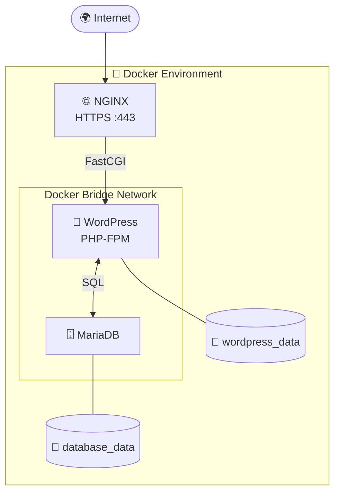

This project has been created as part of the 42 curriculum by elel-m-b

## Description

**Inception** is a system administration and DevOps project from the 42 curriculum that introduces containerization using Docker.

The objective is to build a complete web infrastructure composed of multiple isolated services running inside Docker containers. Each service has its own responsibility and communicates with the others through a dedicated Docker network.

The project teaches how to deploy and manage applications in a reproducible, portable, and maintainable environment without relying on virtual machines.
---

## 📦 Project Architecture



---

## Docker Services

### NGINX

Responsibilities:

- Reverse Proxy
- HTTPS termination
- SSL/TLS certificate
- Serves WordPress

---

### WordPress

Responsibilities:

- PHP application
- Blog/CMS
- Connects to MariaDB
- Stores uploaded files inside a Docker Volume

---

### MariaDB

Responsibilities:

- Stores users
- Stores posts
- Stores configuration
- Persistent database

---

## Docker Components Used

### Dockerfiles

Each service is built from its own Dockerfile.

Purpose:

- Install packages
- Configure software
- Copy configuration files
- Define startup commands

---

### Docker Compose

Docker Compose defines the entire infrastructure inside one YAML file.

It specifies:

- Services
- Networks
- Volumes
- Dependencies
- Environment variables
- Restart policies

Instead of manually creating every container, Docker Compose creates the complete infrastructure automatically.

---

### Docker Network

A dedicated bridge network allows containers to communicate securely.

Example:

```
WordPress -----> MariaDB
```

Containers communicate using service names instead of IP addresses.

Example:

```
DB_HOST=mariadb
```

Docker automatically resolves:

```
mariadb
```

to the correct container IP.

---

### Docker Volumes

Volumes are used to preserve data after containers are deleted.

Example:

```
wordpress_data
```

stores uploaded files.

```
database_data
```

stores the MariaDB database.

Without volumes:

```
docker compose down
```

would destroy all stored data.

---

# Design Choices

The following design decisions were made during the implementation of the project.

## One Process Per Container

Each container runs a single primary service.

Examples:

- NGINX container → NGINX only
- MariaDB container → MariaDB only
- WordPress container → PHP-FPM only

Benefits:

- Easier maintenance
- Better scalability
- Better isolation
- Simpler debugging

---

## Custom Docker Images

Instead of using official images directly, custom images are built from Dockerfiles.

Benefits:

- Full control
- Better understanding
- Reproducibility
- Subject compliance

---

## Dedicated Docker Network

Services communicate only through an isolated bridge network.

Benefits:

- Better security
- Service isolation
- Automatic DNS resolution

---

## Persistent Storage

Persistent data is stored using Docker Volumes.

Benefits:

- Survives container recreation
- Easy backup
- Data integrity

---

# Comparisons

## Virtual Machines vs Docker

| Virtual Machine | Docker |
|-----------------|--------|
| Includes a full guest operating system | Shares the host kernel |
| Heavy | Lightweight |
| Slower startup | Starts in seconds |
| Higher resource usage | Lower resource usage |
| Larger disk usage | Smaller images |
| Strong isolation | Process-level isolation |
| Hypervisor required | Docker Engine required |

### Why Docker for this project?

Docker provides:

- Fast deployment
- Lightweight containers
- Easy reproducibility
- Simplified service orchestration

which perfectly matches the goals of the project.

---

## Secrets vs Environment Variables

### Environment Variables

Environment variables store configuration values.

Examples:

```
MYSQL_DATABASE
MYSQL_USER
DOMAIN_NAME
```

Advantages:

- Easy to configure
- Portable
- Supported everywhere

Disadvantages:

- Visible inside the container
- Can accidentally appear in logs
- Not intended for highly sensitive information

---

### Docker Secrets

Secrets are encrypted pieces of data intended for sensitive information.

Examples:

- Database password
- API keys
- SSL private keys

Advantages:

- More secure
- Not exposed as environment variables
- Better suited for production

For this project, environment variables are generally sufficient, but Docker Secrets are the preferred solution for production deployments.

---

## Docker Network vs Host Network

### Bridge Network

Characteristics:

- Containers have private IP addresses
- Built-in DNS
- Isolation between services
- Most commonly used

Advantages:

- Security
- Isolation
- Easy communication

---

### Host Network

Characteristics:

- Container shares the host network stack
- No network isolation
- No port mapping

Advantages:

- Slightly better performance

Disadvantages:

- Reduced security
- Port conflicts
- Less isolation

For this project, the bridge network is the preferred solution because it provides isolation and service discovery.

---

## Docker Volumes vs Bind Mounts

### Docker Volumes

Managed by Docker.

Example:

```
volumes:
  - wordpress_data:/var/www/html
```

Advantages:

- Docker manages storage
- Portable
- Better performance
- Easy backup

Recommended for:

- Databases
- Production data

---

### Bind Mounts

Maps a host directory directly into the container.

Example:

```
./website:/var/www/html
```

Advantages:

- Easy development
- Live file editing

Disadvantages:

- Depends on host filesystem
- Less portable
- Possible permission issues

Recommended for:

- Development
- Testing

---

# Instructions

## Requirements

- Docker
- Docker Compose

---

## Build the project

```bash
make
```

or

```bash
docker compose up --build
```

---

## Start the infrastructure

```bash
docker compose up
```

---

## Stop the infrastructure

```bash
docker compose down
```

---

## Stop and remove volumes

```bash
docker compose down -v
```

---

## Rebuild images

```bash
docker compose build --no-cache
```

---

## Check running containers

```bash
docker ps
```

---

## Display logs

```bash
docker compose logs
```

---

## Execute a shell inside a container

```bash
docker exec -it <container_name> sh
```

or

```bash
docker exec -it <container_name> bash
```

---

# Project Structure

```
.
├── Makefile
├── docker-compose.yml
├── secrets/
├── docs/
├── srcs/
├── .env
└── README.md
```
---

# Resources

## Official Documentation

- Docker Documentation  
  https://docs.docker.com/

- Docker Compose Documentation  
  https://docs.docker.com/compose/

- Dockerfile Reference  
  https://docs.docker.com/reference/dockerfile/

- NGINX Documentation  
  https://nginx.org/en/docs/

- MariaDB Documentation  
  https://mariadb.com/kb/en/

- WordPress Documentation  
  https://developer.wordpress.org/

- OpenSSL Documentation  
  https://www.openssl.org/docs/

---

## Tutorials & Articles

- Docker Getting Started
- Docker Networking Overview
- Docker Volumes Guide
- NGINX Reverse Proxy Documentation
- WordPress Installation Guide

---

## AI Usage

Artificial Intelligence was used only as a learning and documentation assistant.

Tasks where AI was used include:

- Understanding Docker concepts
- Learning Docker networking
- Learning Docker volumes
- Clarifying Docker Compose syntax
- Reviewing Markdown formatting

AI was **not** used to automatically generate or replace the implementation of the mandatory project requirements. All design decisions, configuration files, Dockerfiles, debugging, testing, and validation were completed and understood by the project authors.

---

# Authors

- elel-m-b

---

# License

This project is part of the 42 curriculum and is intended for educational purposes.
