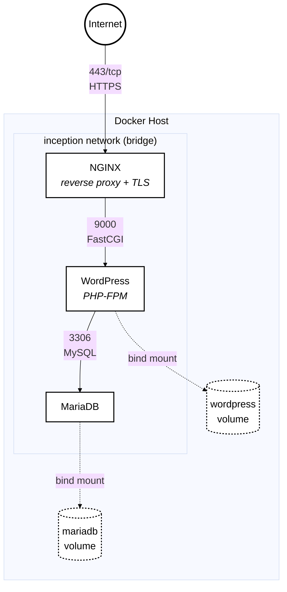

*This project has been created as part of the 42 curriculum by elel-m-b.*

# Inception

## Description

**Inception** is a system administration and Docker project from the 42 curriculum.

The goal of this project is to build a small infrastructure using **Docker Compose**, where each service runs inside its own Docker container. The infrastructure is designed to provide a functional web stack while following security, networking, persistence, and containerization best practices.

The project mainly consists of three services:

* **NGINX** — acts as the web server and reverse proxy.
* **WordPress** — provides the website and communicates with MariaDB through PHP-FPM.
* **MariaDB** — stores the WordPress database.

The services communicate through a dedicated Docker network, while persistent data is stored using Docker volumes.

The general architecture is:



---

# Project Description

## Docker

Docker is used to containerize each component of the infrastructure.

Instead of installing NGINX, WordPress/PHP, and MariaDB directly on the host operating system, every service is isolated inside its own container.

The project uses:

* **Dockerfiles** to define how each image is built.
* **Docker Compose** to define and start the complete infrastructure.
* **Docker networks** to allow containers to communicate with each other.
* **Docker volumes** to persist important data.
* **Environment variables / secrets** to provide configuration without hardcoding sensitive information into the application.

Each service has its own responsibility:

### NGINX

NGINX is the entry point of the application.

Its responsibilities include:

* Accepting HTTPS connections.
* Using TLS/SSL encryption.
* Serving as a reverse proxy.
* Forwarding requests to WordPress/PHP-FPM.
* Handling the website's public traffic.

### WordPress

WordPress is the content management system used for the website.

It runs with **PHP-FPM** and communicates with MariaDB to store and retrieve website data.

WordPress is configured to connect to the MariaDB service through the Docker network rather than using the host machine.

### MariaDB

MariaDB is the database server used by WordPress.

It stores:

* WordPress users.
* Posts and pages.
* Website settings.
* Comments.
* Other WordPress database information.

The database data is stored in a persistent Docker volume so that it is not lost when the container is stopped or recreated.

---

# Main Design Choices

The infrastructure follows a **one-service-per-container** approach.

This provides:

* Isolation between services.
* Easier debugging.
* Independent configuration.
* Clear separation of responsibilities.
* Reproducible environments.
* Easier service management.

The containers communicate through a dedicated Docker bridge network.

Persistent application data is stored in Docker-managed volumes rather than inside the containers themselves.

NGINX is configured to expose HTTPS on port `443`, while internal communication between WordPress and MariaDB happens through the Docker network.

---

# Virtual Machines vs Docker

| Virtual Machines                                 | Docker                                                       |
| ------------------------------------------------ | ------------------------------------------------------------ |
| Virtualizes an entire operating system           | Shares the host kernel                                       |
| Usually requires more resources                  | Lightweight                                                  |
| Each VM has its own OS                           | Containers contain only the required application environment |
| Slower to start                                  | Very fast startup                                            |
| Strong isolation                                 | Process/container-level isolation                            |
| Larger disk usage                                | Usually smaller images                                       |
| Suitable for running different operating systems | Suitable for isolated services and applications              |

A virtual machine normally contains a complete operating system, including its own kernel.

Docker containers are much lighter because they share the host's kernel while isolating processes, filesystems, networks, and other resources.

For the Inception project, Docker is appropriate because the goal is to create an isolated infrastructure composed of multiple services without needing a complete virtual machine for every service.

---

# Secrets vs Environment Variables

Both mechanisms can be used to provide configuration values to containers.

### Environment Variables

Environment variables are useful for non-sensitive configuration such as:

* Database host.
* Database name.
* Database user.
* Ports.
* Application configuration.

However, environment variables are not ideal for highly sensitive information because they can potentially be exposed through container inspection or process environments.

### Secrets

Docker secrets are designed specifically for sensitive information such as:

* Database passwords.
* Administrator passwords.
* Private credentials.

Secrets can be mounted into containers as files rather than being directly exposed as normal environment variables.

| Secrets                              | Environment Variables                 |
| ------------------------------------ | ------------------------------------- |
| Designed for sensitive data          | Good for configuration                |
| Usually mounted as files             | Available directly in the environment |
| Better for passwords and credentials | Convenient for normal settings        |
| Reduces accidental exposure          | Easier to inspect and pass around     |

For this project, sensitive credentials should preferably be handled using secrets or protected configuration files, while normal configuration values can be supplied through environment variables.

---

# Docker Network vs Host Network

### Docker Network

A Docker network provides an isolated communication environment between containers.

For example:

```text
NGINX ───────► WordPress ───────► MariaDB
```

Containers can communicate using service names instead of exposing every service to the host.

For example, WordPress can connect to MariaDB using:

```text
mariadb:3306
```

rather than exposing MariaDB directly to the host.

### Host Network

With host networking, a container uses the host machine's network stack directly.

This means:

* Less network isolation.
* Containers share the host's network namespace.
* Port management can become less isolated.

| Docker Network                              | Host Network                          |
| ------------------------------------------- | ------------------------------------- |
| Provides network isolation                  | Shares host network                   |
| Containers communicate through Docker       | Containers use host networking        |
| Better separation between services          | Less network isolation                |
| Service names can be used for communication | Uses host network interfaces directly |

For Inception, a dedicated Docker network is preferable because the services only need to communicate with each other and the public entry point should be controlled through NGINX.

---

# Docker Volumes vs Bind Mounts

Both volumes and bind mounts can be used to persist or share data.

### Docker Volumes

Docker volumes are managed by Docker.

Example:

```yaml
volumes:
  wordpress_data:
  mariadb_data:
```

Advantages:

* Managed by Docker.
* Easier to move between containers.
* Less dependent on the host filesystem layout.
* Suitable for persistent application data.

### Bind Mounts

Bind mounts directly map a host directory into a container.

Example:

```yaml
volumes:
  - ./data:/var/lib/mysql
```

Advantages:

* Direct access to files from the host.
* Convenient during development.
* Useful when host-side editing is required.

| Docker Volumes                       | Bind Mounts                       |
| ------------------------------------ | --------------------------------- |
| Managed by Docker                    | Managed by the user               |
| Docker controls storage location     | User specifies host path          |
| Good for persistent application data | Good for direct host access       |
| Less coupled to host filesystem      | More dependent on host filesystem |

For this project, Docker volumes are useful for persistent MariaDB and WordPress data because containers can be recreated without losing important application data.

---

# Services

## NGINX

NGINX is the public-facing service.

Responsibilities:

* HTTPS termination.
* TLS configuration.
* Reverse proxying.
* Receiving incoming requests.
* Passing requests to the WordPress/PHP-FPM service.

The NGINX container exposes:

```text
443
```

---

## WordPress

WordPress provides the website.

It runs using PHP-FPM and communicates with MariaDB over the internal Docker network.

WordPress requires:

* PHP.
* PHP-FPM.
* WordPress files.
* A connection to MariaDB.

---

## MariaDB

MariaDB provides the database required by WordPress.

The database is kept on a persistent volume:

```text
mariadb_data
```

This prevents database information from disappearing when the MariaDB container is removed.

---

# Project Structure

A typical project structure is:

```text
.
├── Makefile
├── README.md
├── secrets/
│   ├── db_password
│   └── db_root_password
│
└── srcs/
    ├── .env
    ├── docker-compose.yml
    │
    └── requirements/
        ├── nginx/
        │   ├── Dockerfile
        │   ├── conf/
        │   └── tools/
        │
        ├── wordpress/
        │   ├── Dockerfile
        │   └── tools/
        │
        └── mariadb/
            ├── Dockerfile
            └── tools/
```

The exact structure may vary depending on the implementation.

---

# Instructions

## Requirements

Before running the project, make sure Docker and Docker Compose are installed.

The project is intended to run on a Linux environment, such as the 42 school virtual machine.

You should also make sure that the required domain name is correctly configured in `/etc/hosts`.

For example:

```text
127.0.0.1 elel-m-b.42.fr
```

The exact domain depends on the configuration required by the project.

---

## Configuration

The project uses environment variables for configuration.

Typical variables include:

```text
DOMAIN_NAME
MYSQL_DATABASE
MYSQL_USER
WORDPRESS_DB_HOST
WORDPRESS_DB_NAME
WORDPRESS_DB_USER
```

Sensitive passwords should not be hardcoded directly into Dockerfiles or committed publicly.

Before starting the project, verify that the environment configuration and required secret files exist.

---

## Build and Start

From the root of the repository:

```bash
make
```

The Makefile should build the Docker images and start the containers.

Alternatively, if Docker Compose is configured under `srcs/`:

```bash
cd srcs
docker compose up --build
```

To run the infrastructure in detached mode:

```bash
docker compose up -d --build
```

---

## Stop the Project

To stop the containers:

```bash
make down
```

or:

```bash
docker compose down
```

---

## Check Running Containers

Use:

```bash
docker ps
```

You should see the required containers running.

For example:

```text
nginx
wordpress
mariadb
```

---

## View Logs

To inspect all services:

```bash
docker compose logs
```

To inspect one service:

```bash
docker compose logs nginx
docker compose logs wordpress
docker compose logs mariadb
```

To follow logs in real time:

```bash
docker compose logs -f
```

---

## Rebuild the Project

If a Dockerfile or configuration changes, rebuild the images:

```bash
docker compose up --build
```

To completely stop the containers:

```bash
docker compose down
```

---

# Usage

Once the infrastructure is running, the website can be accessed through the configured domain:

```text
https://elel-m-b.42.fr
```

The browser should connect to NGINX through HTTPS.

NGINX then handles the request and communicates with the WordPress service through the Docker network.

WordPress communicates with MariaDB to access the website database.

---

# Data Persistence

The project uses Docker volumes to preserve important data.

Typical persistent data includes:

```text
WordPress files
MariaDB database
```

The important concept is that the lifecycle of a container should not determine the lifecycle of its data.

For example:

```text
Container removed
       │
       ▼
Volume remains
       │
       ▼
Container recreated
       │
       ▼
Data is still available
```
---

# Technical Choices

## Why NGINX?

NGINX is used as the entry point because it is lightweight, efficient, and well suited for serving HTTPS traffic and forwarding requests to application services.

## Why WordPress?

WordPress is the application required by the Inception subject and provides the website functionality.

## Why MariaDB?

MariaDB is used as the relational database required by WordPress.

## Why Docker Compose?

Docker Compose makes it possible to describe the complete multi-container infrastructure in one configuration file.

It defines:

* Services.
* Networks.
* Volumes.
* Environment variables.
* Build configurations.
* Container dependencies.

This makes the infrastructure reproducible and easier to manage.

---

# Resources

## Docker

* [Docker Documentation](https://docs.docker.com/?utm_source=chatgpt.com) — Official Docker documentation.
* [Docker Compose Documentation](https://docs.docker.com/compose/?utm_source=chatgpt.com) — Documentation for defining and running multi-container applications.
* [Docker Volumes Documentation](https://docs.docker.com/engine/storage/volumes/?utm_source=chatgpt.com) — Information about persistent Docker volumes.
* [Docker Networking Documentation](https://docs.docker.com/engine/network/?utm_source=chatgpt.com) — Documentation about Docker networking.

## NGINX

* [NGINX Documentation](https://nginx.org/en/docs/?utm_source=chatgpt.com) — Official NGINX documentation.
* [NGINX Beginner's Guide](https://nginx.org/en/docs/beginners_guide.html?utm_source=chatgpt.com) — Introduction to NGINX configuration and operation.

## WordPress

* [WordPress Developer Resources](https://developer.wordpress.org/?utm_source=chatgpt.com) — Official WordPress developer documentation.
* [WordPress Documentation](https://wordpress.org/documentation/?utm_source=chatgpt.com) — General WordPress documentation.

## MariaDB

* [MariaDB Documentation](https://mariadb.com/docs/?utm_source=chatgpt.com) — Official MariaDB documentation.
---

# AI Usage

Artificial Intelligence tools (ChatGPT) were used throughout the development of this project as a learning and productivity aid.

The main uses of AI were:

* Understanding Docker and Docker Compose concepts.
* Explaining Docker networking and volumes.
* Explaining Docker commands.
* Helping organize and improve the project documentation.

The final implementation was tested and verified manually.

---

# Useful Commands

### List containers

```bash
docker ps
```

### List all containers

```bash
docker ps -a
```

### List images

```bash
docker images
```

### List volumes

```bash
docker volume ls
```

### List networks

```bash
docker network ls
```

### Inspect a container

```bash
docker inspect <container_name>
```

### Open a shell inside a container

```bash
docker exec -it <container_name> /bin/bash
```

If Bash is not available:

```bash
docker exec -it <container_name> /bin/sh
```

### Remove unused Docker resources

```bash
docker system prune
```

Use cleanup commands carefully because they can remove resources that are no longer in use.

---

# Conclusion

The Inception project demonstrates how to build and manage a small infrastructure using Docker.

The final architecture separates NGINX, WordPress, and MariaDB into independent containers connected through a dedicated Docker network. Persistent information is stored using Docker volumes, while HTTPS provides secure access to the website.

Through this project, the main objectives are to understand:

* Docker images and containers.
* Dockerfiles.
* Docker Compose.
* Container networking.
* Persistent storage.
* NGINX.
* PHP-FPM.
* WordPress.
* MariaDB.
* TLS/HTTPS.
* System administration.
