# 🐳 Inception 

> *"You do not understand a system until you can rebuild it from nothing, explain every line, and defend every decision."*

A complete, from-first-principles guide to the 42 School **Inception** project — covering Linux, virtualization, Docker, Docker Compose, networking, NGINX, TLS, PHP-FPM, WordPress, MariaDB, shell scripting, process management, security, and debugging.


---

## Table of Contents

1. [Introduction](#1-introduction)
2. [Linux Fundamentals](#2-linux-fundamentals)
3. [Virtual Machines vs Containers](#3-virtual-machines-vs-containers)
4. [Docker Fundamentals](#4-docker-fundamentals)
5. [Dockerfile](#5-dockerfile)
6. [Docker Compose](#6-docker-compose)
7. [Docker Networking](#7-docker-networking)
8. [Volumes](#8-volumes)
9. [Environment Variables and Docker Secrets](#9-environment-variables-and-docker-secrets)
10. [NGINX](#10-nginx)
11. [TLS and OpenSSL](#11-tls-and-openssl)
12. [PHP and PHP-FPM](#12-php-and-php-fpm)
13. [WordPress](#13-wordpress)
14. [MariaDB](#14-mariadb)
15. [Shell Scripting](#15-shell-scripting)
16. [Process Management](#16-process-management)
17. [Makefile](#17-makefile)
18. [Project Architecture](#18-project-architecture)
19. [Project Workflow](#19-project-workflow)
20. [Security Best Practices](#20-security-best-practices)
21. [Debugging](#21-debugging)
22. [Common Pitfalls](#22-common-pitfalls)
23. [Evaluation Questions](#23-evaluation-questions)
24. [Practical Exercises](#24-practical-exercises)
25. [Final Checklist](#25-final-checklist)

---

## 1. Introduction

### 1.1 What is Inception?

Inception is a 42 School system administration project. The mission, stripped to its core, is this:

> Build a small hosting infrastructure — a website (WordPress), its database (MariaDB), and a web server that fronts it with TLS (NGINX) — where **every service runs inside its own Docker container**, containers are built **from scratch using your own Dockerfiles** (not pre-built images pulled from Docker Hub, except as a base OS layer), and the whole thing is orchestrated with **Docker Compose**.

On paper that's three services. In practice it forces you to learn an entire professional stack: Linux internals, containerization theory, networking, TLS, process supervision, database initialization, PHP application servers, and infrastructure-as-code. That's why it's such a valuable project — it is a compressed, hands-on crash course in DevOps.

### 1.2 Why does 42 teach Docker?

Two reasons, one technical and one cultural:

**Technical reason.** Modern software is not "a program you compile." It's a *system* of cooperating processes — a web server, an app server, a database, caches, queues — that must be deployed consistently across a developer's laptop, a CI pipeline, and a production server. Containers solved the "it works on my machine" problem by packaging an application with its exact runtime environment. Understanding *why* this problem existed and *how* containers solve it is more valuable than memorizing Docker commands.

**Cultural reason.** 42's pedagogy is "project-based learning without lectures." Inception is the first project where you stop writing an isolated program and start **assembling a system out of other people's software**, configured correctly, wired together securely, and made reproducible. That's the actual day job of most backend/DevOps engineers.

### 1.3 Learning Objectives

By the end of this project (and this README) you should be able to:

- Explain the difference between a virtual machine and a container **at the kernel level**.
- Write a Dockerfile from scratch for any Linux-based service, and explain every instruction.
- Write a multi-service `docker-compose.yml` with networks, volumes, and dependency ordering.
- Configure NGINX as a TLS-terminating reverse proxy in front of a PHP-FPM application.
- Explain the TLS handshake and generate self-signed certificates with OpenSSL.
- Initialize a MariaDB database non-interactively on first container boot, and understand why that boot logic is tricky.
- Deploy WordPress without the browser install wizard, using `wp-cli`.
- Write POSIX-compliant entrypoint scripts that wait for dependencies and correctly hand off to PID 1.
- Debug a broken multi-container stack methodically, from the network layer up to the application layer.
- Defend every configuration decision in front of an evaluator who will ask "why," not "what."

### 1.4 Skills Gained

| Domain | Skills |
|---|---|
| Linux | Filesystem hierarchy, permissions, users/groups, process model, systemd |
| Networking | TCP/IP, DNS, ports, Docker bridge networks, reverse proxying |
| Docker | Image layering, build cache, Dockerfile authoring, Compose orchestration |
| Security | TLS/SSL, least privilege, secrets management, non-root containers |
| Web stack | NGINX, FastCGI, PHP-FPM, WordPress internals |
| Database | MariaDB administration, SQL users/privileges, data persistence |
| Scripting | POSIX shell, entrypoint patterns, idempotent initialization |
| Ops discipline | Makefiles, structured debugging, log reading, systems thinking |

### 1.5 Final Architecture Overview

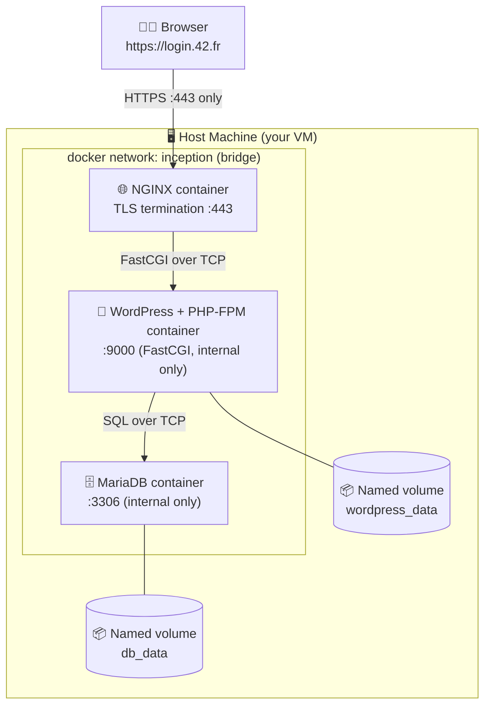

Only port **443** is exposed to the host. Everything else — PHP-FPM's port 9000, MariaDB's port 3306 — is reachable *only* inside the private Docker network. This single diagram encodes about half of the security reasoning behind the whole project; keep it in mind as you read.

> **Note:** In the diagrams throughout this document, arrows show the direction of the *initiating* request, not necessarily the direction of data flow (responses always flow back).

---

## 2. Linux Fundamentals

Docker does not replace your need to know Linux — it *demands* it. A container is, at its core, just a Linux process with restricted visibility into the host. If you don't understand processes, filesystems, permissions, and networking on a bare Linux box, Docker will feel like magic instead of engineering. This chapter removes the magic.

### 2.1 Linux Architecture

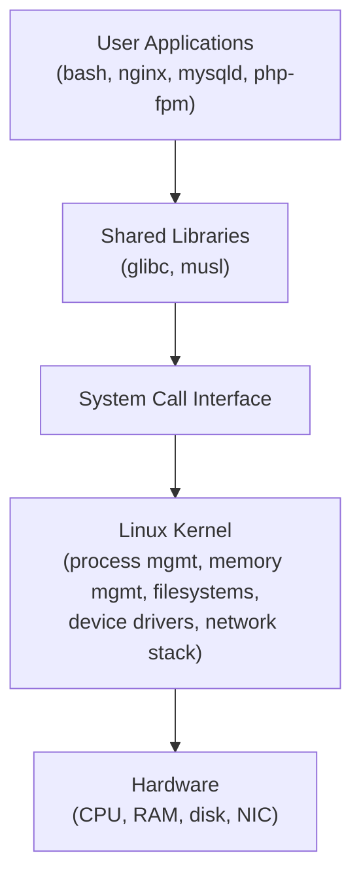

Linux is a **monolithic kernel**: process scheduling, memory management, filesystems, and networking all run in a single privileged address space called **kernel space**. Everything else — your shell, `nginx`, `mysqld` — runs in **user space** and can only touch hardware or kernel resources through **system calls** (`open()`, `read()`, `write()`, `fork()`, `execve()`, `socket()`...).

> **Why this matters for Docker:** containers share the host's kernel. There is no "container kernel." This single fact is the root of almost every VM-vs-container difference discussed in Chapter 3.

### 2.2 The Filesystem Hierarchy Standard (FHS)

Linux organizes everything — including devices and running processes — as files under a single root `/`. Key directories:

| Path | Purpose |
|---|---|
| `/bin`, `/usr/bin` | Essential user command binaries |
| `/sbin`, `/usr/sbin` | System administration binaries (often need root) |
| `/etc` | System-wide configuration files (static, not binaries) |
| `/var` | Variable data: logs (`/var/log`), databases, mail spools |
| `/home` | User home directories |
| `/root` | The root user's home directory |
| `/tmp` | Temporary files, usually cleared on reboot |
| `/proc` | Virtual filesystem exposing kernel/process info (not real files on disk!) |
| `/sys` | Virtual filesystem exposing kernel/device info |
| `/dev` | Device files (`/dev/null`, `/dev/sda`, `/dev/tty`) |
| `/lib`, `/usr/lib` | Shared libraries |
| `/opt` | Optional/third-party software |
| `/mnt`, `/media` | Mount points for external filesystems |

```bash
$ ls -la /
drwxr-xr-x   1 root root  4096 Jan  1 12:00 .
drwxr-xr-x   1 root root  4096 Jan  1 12:00 ..
drwxr-xr-x   2 root root  4096 Jan  1 12:00 bin
drwxr-xr-x   5 root root   360 Jan  1 12:00 dev
drwxr-xr-x   1 root root  4096 Jan  1 12:00 etc
drwxr-xr-x   3 root root  4096 Jan  1 12:00 home
...
```

> **Tip:** `/proc/1/status` shows you information about PID 1 right now. Try `cat /proc/1/status` inside any container — it will show you *the container's own init process*, not the host's. This is your first hands-on proof that containers have an isolated **PID namespace**.

### 2.3 Users, Groups, and Permissions

Every file on Linux has an **owner (user)**, a **group**, and a set of **permission bits** for three classes: owner, group, others.

```bash
$ ls -l /etc/passwd
-rw-r--r-- 1 root root 2847 Jan  1 12:00 /etc/passwd
```

Reading `-rw-r--r--`:

```
-     rw-      r--      r--
type  owner    group    others
      read/write  read-only  read-only
```

| Symbol | Meaning (files) | Meaning (directories) |
|---|---|---|
| `r` | Read file contents | List directory contents |
| `w` | Modify file contents | Create/delete files inside |
| `x` | Execute the file | `cd` into the directory |

Permissions are also representable as octal (base-8) numbers, one digit per class, each digit summing `r=4, w=2, x=1`:

```
rwxr-xr--  →  owner=rwx=7, group=r-x=5, others=r--=4  →  754
```

**`chmod`** — change permission bits:

```bash
chmod 755 script.sh        # owner: rwx, group: r-x, others: r-x
chmod u+x script.sh        # add execute for owner only
chmod -R 644 /var/www      # recursive; careful, this breaks directories! (dirs need +x to be enterable)
```

**`chown`** — change owner and/or group:

```bash
chown www-data:www-data /var/www/html   # user:group
chown -R mysql:mysql /var/lib/mysql     # recursive ownership fix (very common in DB Dockerfiles)
```

**`sudo`** — execute a command as another user (usually root), governed by `/etc/sudoers`. Inside minimal Docker containers, `sudo` is often *not installed* — you either run as root by default, or you switch users with the Dockerfile `USER` instruction, or you use `su`.

> ⚠️ **Common mistake:** running every container process as root "because it's easier." A container process running as root has root privileges *inside the container's namespaces*, and if there's a container-escape vulnerability, that matters a lot. Chapter 20 covers this. Inception explicitly expects non-root, least-privilege processes where feasible (e.g., `nginx` worker processes, `mysqld` running as the `mysql` user, PHP-FPM workers running as `www-data`).

**Evaluation questions — Users & Permissions**

1. What do the three permission classes represent?
2. What does `chmod 700` mean and when would you use it?
3. Why does a directory need the execute bit to be "enterable," not the read bit?
4. What is the difference between `chown` and `chmod`?
5. Why shouldn't your Dockerfile run everything as root?

### 2.4 Processes, PIDs, and Daemons

A **process** is a running instance of a program: its own memory space, file descriptors, and execution state. The kernel identifies every process with a unique **PID** (Process ID).

```bash
$ ps aux
USER   PID  %CPU %MEM    VSZ   RSS TTY  STAT START   TIME COMMAND
root     1   0.0  0.1  16812  9120 ?    Ss   09:00   0:01 /sbin/init
root    412  0.0  0.0   8000  1200 ?    Ss   09:00   0:00 /usr/sbin/nginx
www-d   413  0.0  0.2  30000  8000 ?    S    09:00   0:00 php-fpm: pool www
```

**PID 1** is special. It's the first process the kernel starts at boot (or, in a container, the first process the container runtime starts). PID 1 has two extra responsibilities other processes don't have:

1. It must **reap zombie processes** — when any process's parent dies, its orphaned children get re-parented to PID 1, and PID 1 must `wait()` on them to clear them from the process table.
2. The kernel treats PID 1 specially with respect to **default signal handling** — signals like `SIGTERM` do *not* automatically terminate PID 1 unless the program explicitly handles them.

A **daemon** is a process that runs in the background, detached from any controlling terminal, typically providing a service (a web server, a database engine). Traditionally daemons "double-fork" and detach from the terminal; in Docker, we deliberately do the *opposite* — we run the daemon **in the foreground** so the container runtime can track it as PID 1 (more in Chapter 16).

```bash
ps aux            # snapshot of all processes
ps -ef             # alternate format, shows PPID (parent PID)
top / htop         # live process monitor
kill -TERM <pid>   # send SIGTERM (graceful stop request)
kill -9 <pid>      # send SIGKILL (immediate, un-catchable termination)
kill -l             # list all signal names
```

### 2.5 Signals

Signals are the kernel's way of delivering asynchronous notifications to a process.

| Signal | Number | Default action | Meaning |
|---|---|---|---|
| `SIGHUP` | 1 | Terminate | Terminal closed / "reload config" (convention) |
| `SIGINT` | 2 | Terminate | Interrupt from keyboard (Ctrl+C) |
| `SIGQUIT` | 3 | Core dump | Quit from keyboard (Ctrl+\) |
| `SIGKILL` | 9 | Terminate | Forceful, **cannot be caught, blocked, or ignored** |
| `SIGTERM` | 15 | Terminate | Polite request to terminate; **can be caught** |
| `SIGSTOP` | 19 | Stop | Pause process, cannot be caught |
| `SIGCONT` | 18 | Continue | Resume a stopped process |

`docker stop` sends `SIGTERM`, waits a grace period (default 10s), then sends `SIGKILL` if the process hasn't exited. This is why your entrypoint process needs to correctly handle `SIGTERM` — otherwise `docker stop` on your stack always takes the full timeout and hard-kills your database, risking data corruption.

### 2.6 Shell and Bash

The **shell** is a program that reads commands you type and asks the kernel to execute them. Bash (Bourne Again SHell) is the most common Linux shell; Alpine-based Docker images (very common for Inception, since they're small) typically ship **`ash`** (via BusyBox) or plain **`sh`**, not bash, unless you install it explicitly.

```bash
#!/bin/sh
# shebang line: tells the kernel which interpreter runs this script
echo "Hello from a POSIX shell script"
```

> **Tip:** Alpine's default shell is not bash. If your entrypoint script uses bash-only syntax (`[[ ]]`, arrays, `source`) but starts with `#!/bin/sh`, it will fail or behave unexpectedly on Alpine. Either install bash or write strictly POSIX `sh` syntax. Chapter 15 covers this in depth.

### 2.7 Environment Variables

Environment variables are key-value pairs available to a process and its children, forming part of a process's execution context.

```bash
export MYSQL_DATABASE=wordpress
echo $MYSQL_DATABASE
env                      # list all env vars in current shell
printenv MYSQL_DATABASE  # print one variable
```

In Docker they are how you inject configuration into a container without baking it into the image — critical for Inception, where DB names, users, and passwords must not be hardcoded (Chapter 9).

```dockerfile
ENV PHP_FPM_LISTEN=9000
```

```yaml
# docker-compose.yml
environment:
  - MYSQL_DATABASE=wordpress
env_file:
  - .env
```

### 2.8 Networking Basics

**TCP/IP** is the layered protocol suite underlying almost all internet and container communication.

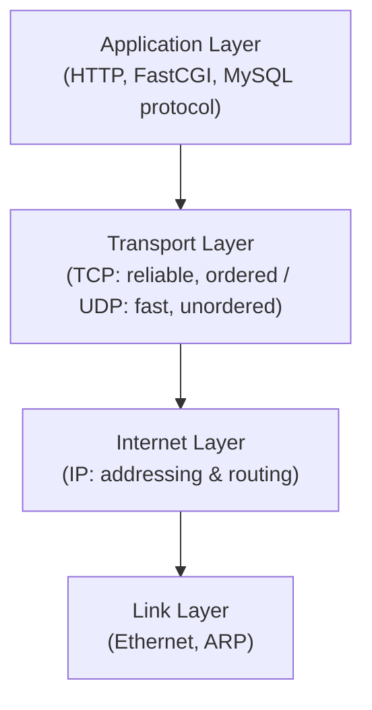

- **IP address**: a numeric address identifying a host on a network (`172.18.0.3`).
- **Port**: a 16-bit number (0–65535) identifying a specific service/process on a host. NGINX conventionally listens on 80/443, MariaDB on 3306, PHP-FPM on 9000.
- **`localhost` / `127.0.0.1`**: the **loopback** interface — a virtual network interface that routes traffic back to the same machine without touching real hardware. Crucially, **inside a container, `localhost` refers to the container itself**, not the host and not other containers. This trips up almost every Inception student at least once: WordPress cannot reach MariaDB via `localhost` — it must use the **service name** (`mariadb`) as a hostname, resolved via Docker's internal DNS (Chapter 7).
- **DNS (Domain Name System)**: translates human-readable names (`login.42.fr`, `mariadb`) into IP addresses.

```bash
dig google.com          # DNS query tool, detailed output
nslookup google.com     # simpler DNS query tool
ping 8.8.8.8             # ICMP echo request — tests basic reachability
curl -v https://example.com   # full HTTP(S) request with verbose protocol trace
ss -tulpn                 # show listening TCP/UDP sockets + owning process
netstat -tulpn             # older equivalent of ss
```

### 2.9 Services, systemd, and Package Managers

**systemd** is the modern Linux **init system** — PID 1 on most distributions — responsible for booting the system, starting/stopping/supervising services ("units"), and managing dependencies between them (`systemctl start nginx`, `systemctl enable mariadb`).

> **Why Inception containers don't use systemd:** systemd assumes it *is* PID 1 of a full OS boot, managing cgroups, mounting filesystems, and supervising dozens of services. A container is not a full OS boot — it's one job. Running systemd inside a container is possible but heavyweight, fights the container model, and is explicitly discouraged by 42's subject. Instead, Inception containers use a **single foreground process** (Chapter 16) or a minimal custom entrypoint script.

**Package managers** install/update/remove software and resolve dependencies:

| Distro family | Package manager | Example |
|---|---|---|
| Debian/Ubuntu | `apt` / `apt-get` | `apt-get install -y nginx` |
| Alpine | `apk` | `apk add --no-cache nginx` |
| RHEL/CentOS/Fedora | `dnf` / `yum` | `dnf install -y nginx` |

> **Tip:** Alpine's `--no-cache` flag skips writing the package index to disk, which keeps the final image smaller — a small but very "Inception-graded" detail.

**Evaluation questions — Linux fundamentals**

6. What is PID 1 and why is it special?
7. What's the difference between `SIGTERM` and `SIGKILL`?
8. Why can't WordPress connect to MariaDB using `localhost`?
9. What does `apk add --no-cache` do and why use it in a Dockerfile?
10. Explain what happens, layer by layer, when you run `curl https://example.com`.
11. Why doesn't Inception recommend running systemd inside containers?
12. What is the difference between a process and a daemon?
13. What does `/proc` contain, and is it "real" data on disk?


---

## 3. Virtual Machines vs Containers

### 3.1 Virtualization and the Hypervisor

A **hypervisor** (VMM — Virtual Machine Monitor) is software that creates and runs virtual machines by emulating hardware (virtual CPU, virtual RAM, virtual disk, virtual NIC). Each VM runs its **own full kernel and OS**, completely unaware it's virtualized (mostly).

- **Type 1 (bare-metal) hypervisor**: runs directly on hardware (VMware ESXi, Xen, KVM). Used in datacenters.
- **Type 2 (hosted) hypervisor**: runs as an application on top of a host OS (VirtualBox, VMware Workstation, Parallels). Used on laptops/dev machines — this is likely what runs your 42 VM.

### 3.2 Containerization

A **container** is not a lightweight VM — it's a **regular Linux process** with a restricted view of the system, achieved through two kernel features:

- **Namespaces** — isolate *what a process can see*: its own PID tree, its own network stack, its own mount points, its own hostname, its own user ID mapping.
- **Control groups (cgroups)** — limit *what a process can use*: CPU shares, memory limits, I/O bandwidth.

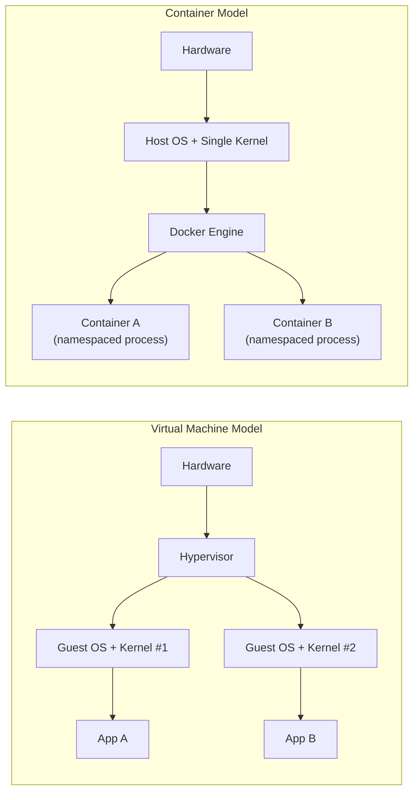

### 3.3 Comparison Table

| Aspect | Virtual Machine | Container |
|---|---|---|
| Kernel | Each VM has its own kernel | All containers share the host kernel |
| Boot time | Seconds to minutes (full OS boot) | Milliseconds (just starting a process) |
| Image size | Gigabytes (full OS) | Megabytes (Alpine ≈ 5–8 MB base) |
| Isolation strength | Strong (hardware-level via hypervisor) | Weaker (kernel-level via namespaces) |
| Resource overhead | High (each VM reserves RAM/CPU) | Low (shares host resources dynamically) |
| Portability | Portable, but heavy to move | Highly portable; images are layered and cacheable |
| Use case | Run different OS kernels, strong multi-tenant isolation | Package & ship one app's runtime, fast scaling, microservices |

> **Why this matters for the Inception defense:** evaluators love asking "why not just install NGINX, WordPress and MariaDB directly on the VM?" The honest answer is: you *could*, but you'd lose reproducibility, isolation between services (a MariaDB crash could take down PHP), easy teardown/rebuild, and you'd violate the pedagogical point of the project — learning to think in isolated, declarative, disposable services.

**Evaluation questions — VMs vs Containers**

14. Why do containers start in milliseconds while VMs take seconds?
15. What two Linux kernel features implement containerization?
16. Why is container isolation considered "weaker" than VM isolation?
17. Could you run a Windows container on a Linux host kernel? Why or why not?
18. What would happen to all containers if the host kernel panicked?

---

## 4. Docker Fundamentals

### 4.1 Docker Architecture

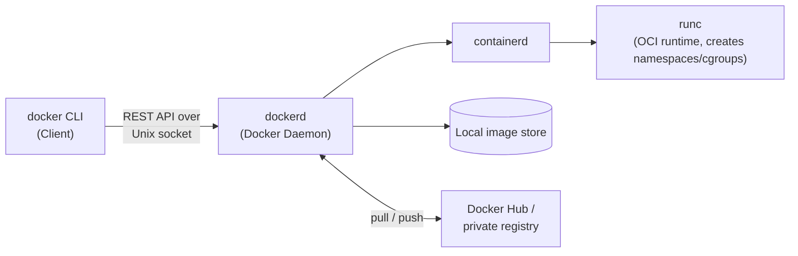

- **Docker Client** — the `docker` command you type. It just sends requests to the daemon.
- **Docker Daemon (`dockerd`)** — the background service that builds images, runs containers, manages networks and volumes.
- **containerd / runc** — lower layers that actually create the namespaces/cgroups and start the container process, following the **OCI (Open Container Initiative)** spec — meaning Docker, Podman, and other runtimes can all run the same image format.

### 4.2 Images vs Containers

> An **image** is a read-only template (your application + its dependencies + filesystem, frozen). A **container** is a running (or stopped) *instance* of that image, with a thin writable layer on top.

Analogy: an image is a **class**; a container is an **object** instantiated from it. You can start many containers from one image, each with independent state, just like many objects from one class.

### 4.3 Layers and the Union Filesystem

Every instruction in a Dockerfile that changes the filesystem creates a new, immutable **layer**. Layers stack using a union filesystem (commonly `overlay2` on Linux), and Docker caches each layer by hash.

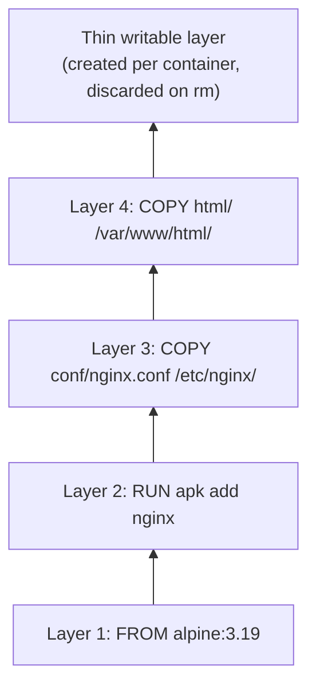

If you change the Dockerfile at layer 3, **layers 1 and 2 are reused from cache**, but layers 3 and 4 must rebuild. This is why **instruction order matters** for build speed (Chapter 5.8).

### 4.4 Registries

A **registry** stores and distributes images. **Docker Hub** is the default public registry. `docker pull nginx:1.25-alpine` fetches the `nginx` repository's `1.25-alpine` tag from Docker Hub. Inception explicitly forbids pulling pre-built service images (like `wordpress:latest` or `mariadb:latest`) — you must build your own from a base OS image like `debian:bookworm-slim` or `alpine:3.19`, which *is* allowed since it's just a base filesystem, not a pre-baked service.

```bash
docker pull alpine:3.19        # download an image
docker build -t myimage:1.0 .   # build an image from a Dockerfile in the current dir
docker push myrepo/myimage:1.0  # upload to a registry (needs docker login)
docker images                    # list local images
docker rmi <image>                # remove an image
```

### 4.5 Container Lifecycle

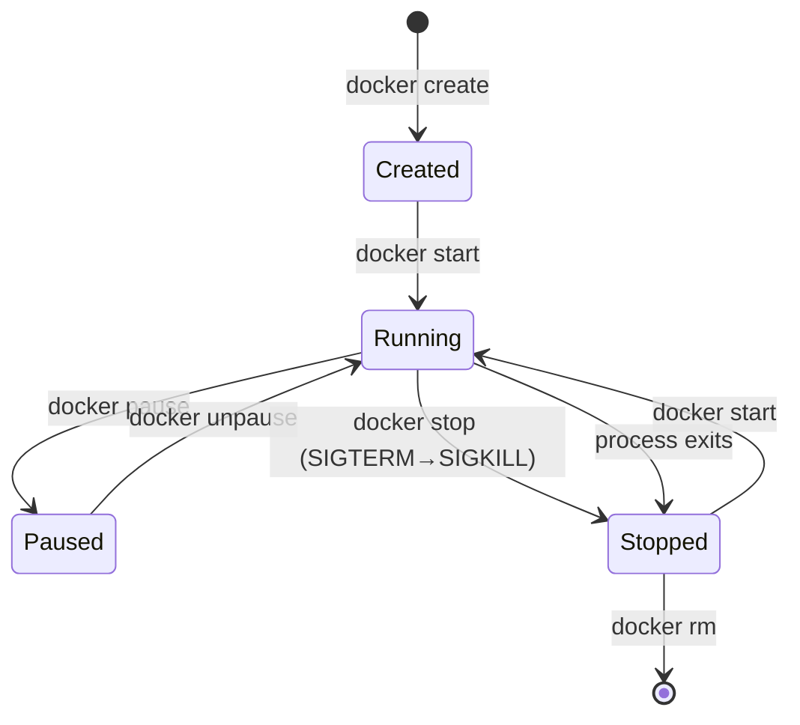

```bash
docker run -d --name web nginx        # create + start, detached
docker ps                              # list running containers
docker ps -a                           # list all containers, incl. stopped
docker stop web                        # SIGTERM, then SIGKILL after grace period
docker start web                       # restart a stopped container
docker restart web                     # stop + start
docker rm web                          # remove a stopped container
docker rm -f web                       # force remove (kills first)
```

### 4.6 Restart Policies

| Policy | Behavior |
|---|---|
| `no` (default) | Never restart automatically |
| `always` | Always restart, even after `docker stop` and daemon restart |
| `unless-stopped` | Restart unless the user explicitly stopped it |
| `on-failure[:max-retries]` | Restart only if the container exits with a non-zero code |

Inception typically expects `restart: always` (or `unless-stopped`) on all three services in `docker-compose.yml`, so that if the 42 VM reboots, your infrastructure comes back up unattended — a very common evaluation check.

**Evaluation questions — Docker fundamentals**

19. What is the difference between an image and a container, in one sentence?
20. Why does Docker use a layered filesystem instead of a flat one?
21. What does `docker rmi` do vs `docker rm`?
22. What is `containerd` and how does it relate to `dockerd`?
23. Why is `restart: always` important for the Inception evaluation?
24. Why does Inception forbid pulling `wordpress:latest` or `mariadb:latest` directly?

---

## 5. Dockerfile

A **Dockerfile** is a declarative recipe: a sequence of instructions that Docker executes, in order, to produce an image, one layer per instruction (roughly).

### 5.1 Every Instruction, Explained

| Instruction | Purpose | Example |
|---|---|---|
| `FROM` | Sets the base image; must be the first instruction (except `ARG` before it) | `FROM debian:bookworm-slim` |
| `RUN` | Executes a command **at build time**, result committed as a new layer | `RUN apt-get update && apt-get install -y nginx` |
| `COPY` | Copies files from build context into the image | `COPY conf/nginx.conf /etc/nginx/nginx.conf` |
| `ADD` | Like `COPY`, but also auto-extracts local tar archives and can fetch URLs | `ADD app.tar.gz /app/` |
| `CMD` | Default command run **at container start**, overridable via `docker run  <cmd>` | `CMD ["nginx", "-g", "daemon off;"]` |
| `ENTRYPOINT` | The fixed executable for the container; `CMD` becomes its default arguments | `ENTRYPOINT ["/usr/local/bin/entrypoint.sh"]` |
| `WORKDIR` | Sets the working directory for subsequent instructions | `WORKDIR /var/www/html` |
| `USER` | Sets the user (and optionally group) for subsequent instructions and at runtime | `USER www-data` |
| `ENV` | Sets a persistent environment variable, available at build and run time | `ENV PHP_FPM_PORT=9000` |
| `ARG` | Defines a build-time-only variable, not available at runtime unless passed to `ENV` | `ARG PHP_VERSION=8.2` |
| `EXPOSE` | Documents which port(s) the container listens on (does **not** publish them) | `EXPOSE 443` |
| `VOLUME` | Marks a path as a mount point for persistent/external storage | `VOLUME /var/lib/mysql` |
| `HEALTHCHECK` | Defines a command Docker runs periodically to determine container health | `HEALTHCHECK CMD curl -f http://localhost/ \|\| exit 1` |
| `LABEL` | Attaches arbitrary metadata (key-value) to the image | `LABEL maintainer="you@student.42.fr"` |

### 5.2 `CMD` vs `ENTRYPOINT` — the instruction everyone confuses

```dockerfile
ENTRYPOINT ["/usr/local/bin/entrypoint.sh"]
CMD ["nginx", "-g", "daemon off;"]
```

At runtime this becomes: `/usr/local/bin/entrypoint.sh nginx -g "daemon off;"` — `CMD`'s contents are passed as **arguments** to `ENTRYPOINT`. This is the standard Inception pattern: `ENTRYPOINT` is a small setup script (fix permissions, wait for the DB, generate configs from env vars), and it finishes by `exec`-ing into `CMD`, which becomes the real PID 1 (Chapter 16).

| | Overridable via `docker run img <args>`? | Typical use |
|---|---|---|
| `CMD` alone | Yes, entirely replaced | Simple default command |
| `ENTRYPOINT` alone | No (args appended, not replaced) | Force a fixed executable |
| `ENTRYPOINT` + `CMD` | `CMD` part is overridable, `ENTRYPOINT` isn't | Setup script + default main process |

> ⚠️ **Common mistake:** using shell form (`CMD nginx -g "daemon off;"`) instead of exec form (`CMD ["nginx", "-g", "daemon off;"]`). Shell form runs your command as a child of `/bin/sh -c`, so **`sh`, not `nginx`, becomes PID 1** — breaking signal handling (Chapter 16). Always prefer exec (JSON array) form for `CMD`/`ENTRYPOINT`.

### 5.3 `COPY` vs `ADD`

Use `COPY` unless you specifically need `ADD`'s auto-extraction of local archives. `ADD`'s URL-fetching feature is considered a legacy footgun (no cache invalidation, no cleanup, security risk) — evaluators may dock points if you use `ADD` for a plain file copy, since it signals you don't know the distinction.

### 5.4 Build Context and `.dockerignore`

```bash
docker build -t inception/nginx -f srcs/requirements/nginx/Dockerfile srcs/requirements/nginx
```

Everything in the build context directory is sent to the daemon before the build starts — including files you never `COPY`. A `.dockerignore` (same syntax as `.gitignore`) excludes junk (`.git`, `node_modules`, secrets) from that context, keeping builds fast and safe.

### 5.5 Build Cache and Layer Ordering

Docker caches each layer keyed by (instruction + its inputs). Put **rarely-changing instructions first**, **frequently-changing ones last**:

```dockerfile
FROM debian:bookworm-slim
RUN apt-get update && apt-get install -y php8.2-fpm    # changes rarely → early
COPY conf/php-fpm.conf /etc/php/8.2/fpm/php-fpm.conf     # changes sometimes → middle
COPY src/ /var/www/html/                                   # changes often → late
```

If you reverse this — `COPY` your whole source tree before `RUN apt-get install` — *every* code change invalidates the cache for the (expensive) package install step too, making builds needlessly slow.

### 5.6 A Real Example — NGINX Dockerfile for Inception

```dockerfile
FROM debian:bookworm-slim

RUN apt-get update && \
    apt-get install -y --no-install-recommends nginx openssl && \
    rm -rf /var/lib/apt/lists/*

# Generate a self-signed TLS certificate at build time (Chapter 11)
RUN mkdir -p /etc/nginx/ssl && \
    openssl req -x509 -nodes -days 365 \
      -newkey rsa:2048 \
      -keyout /etc/nginx/ssl/inception.key \
      -out /etc/nginx/ssl/inception.crt \
      -subj "/C=MA/ST=Casablanca/L=Casablanca/O=42/CN=login.42.fr"

COPY conf/nginx.conf /etc/nginx/nginx.conf

EXPOSE 443

# exec form → nginx becomes PID 1, receives signals correctly
CMD ["nginx", "-g", "daemon off;"]
```

> **Note:** baking the TLS cert at *build* time is common and accepted for Inception, since it's self-signed and only used internally. In real production you'd never bake secrets/certs into an image layer — you'd mount them at runtime (Chapter 9).

### 5.7 Multi-stage builds (bonus knowledge)

Not required by the base Inception subject, but worth understanding: a Dockerfile can have multiple `FROM` stages, where a later stage copies only the *build artifacts* from an earlier one, discarding build tools from the final image (smaller, more secure). Example: compiling `wp-cli` from source in a `builder` stage, then `COPY --from=builder` into the final slim image.

### 5.8 Security in Dockerfiles

- Prefer minimal base images (`alpine`, `debian-slim`) — smaller attack surface.
- `rm -rf /var/lib/apt/lists/*` after `apt-get install` to shrink layers and avoid stale package indices.
- Never `ENV MYSQL_ROOT_PASSWORD=hunter2` — secrets don't belong in image layers, ever (Chapter 9).
- Pin versions (`FROM debian:bookworm-slim`, not `FROM debian:latest`) for reproducibility.
- Drop to a non-root `USER` once setup requiring root is done.

**Evaluation questions — Dockerfile**

25. What's the difference between `CMD` and `ENTRYPOINT`?
26. Why does shell-form `CMD` break signal handling?
27. Why should `COPY` be preferred over `ADD` in most cases?
28. Explain build cache invalidation with a concrete example.
29. Why is `FROM debian:latest` discouraged in a reproducible build?
30. What does `EXPOSE` actually do — does it publish a port to the host?
31. Why generate the self-signed cert in the Dockerfile instead of hardcoding a pre-made one in the repo?
32. What's wrong with `ENV MYSQL_PASSWORD=root123` in a Dockerfile?

---

## 6. Docker Compose

### 6.1 Why Compose Exists

Running three interdependent containers by hand with `docker run` — remembering every flag, every network, every volume, every time — doesn't scale. **Docker Compose** lets you declare your entire multi-container application in one YAML file and bring it up/down with a single command.

### 6.2 Anatomy of `docker-compose.yml`

```yaml
version: "3.8"

services:
  mariadb:
    build: ./requirements/mariadb
    container_name: mariadb
    image: mariadb-inception
    restart: always
    networks:
      - inception
    volumes:
      - db_data:/var/lib/mysql
    env_file:
      - .env
    expose:
      - "3306"

  wordpress:
    build: ./requirements/wordpress
    container_name: wordpress
    image: wordpress-inception
    restart: always
    depends_on:
      - mariadb
    networks:
      - inception
    volumes:
      - wp_data:/var/www/html
    env_file:
      - .env
    expose:
      - "9000"

  nginx:
    build: ./requirements/nginx
    container_name: nginx
    image: nginx-inception
    restart: always
    depends_on:
      - wordpress
    networks:
      - inception
    volumes:
      - wp_data:/var/www/html
    ports:
      - "443:443"
    env_file:
      - .env

networks:
  inception:
    driver: bridge

volumes:
  db_data:
    driver: local
    driver_opts:
      type: none
      o: bind
      device: /home/${LOGIN}/data/db
  wp_data:
    driver: local
    driver_opts:
      type: none
      o: bind
      device: /home/${LOGIN}/data/wordpress
```

### 6.3 Every Option, Explained

| Key | Meaning |
|---|---|
| `build` | Path to the directory containing the `Dockerfile` to build this service's image |
| `image` | Name/tag to assign the built (or pulled) image |
| `container_name` | Fixed container name (otherwise Compose auto-generates one) |
| `restart` | Restart policy (Chapter 4.6) |
| `ports` | **Publishes** a port to the host: `"HOST:CONTAINER"`. Only NGINX should use this (443:443) |
| `expose` | Documents a port as reachable **within the Docker network only** — no host publishing |
| `volumes` | Mounts persistent storage. `named_volume:/container/path` or `./host/path:/container/path` |
| `networks` | Attaches the service to one or more custom networks |
| `depends_on` | Controls **startup order** only — it does *not* wait for the dependency to be "ready" (see note below) |
| `environment` | Inline environment variables (`KEY=value` list or map) |
| `env_file` | Loads environment variables from a file (typically `.env`, kept out of git) |
| `secrets` | Mounts Docker Secrets as files inside the container (Chapter 9) |
| `healthcheck` | Overrides/defines the container's health check |

> ⚠️ **Critical misconception:** `depends_on` only waits for the dependency **container to start** (or, with `condition: service_healthy`, for its healthcheck to pass) — it does *not* guarantee the service *inside* is ready to accept connections. MariaDB's container can be "started" while `mysqld` is still initializing. This is exactly why Inception entrypoint scripts need explicit "wait for the port to be open" logic (Chapter 15), or why `depends_on` should be combined with a proper `healthcheck` + `condition: service_healthy`.

```yaml
depends_on:
  mariadb:
    condition: service_healthy
```

### 6.4 Bind Mounts vs Named Volumes vs tmpfs

| Type | Syntax | Managed by | Use case |
|---|---|---|---|
| Named volume | `db_data:/var/lib/mysql` | Docker | Persistent app data, portable across hosts |
| Bind mount | `./conf:/etc/nginx/conf.d` | You (host path) | Config files, source code during dev |
| Anonymous volume | `/var/lib/mysql` (no name) | Docker (auto-named) | Rarely intentional; usually a mistake |
| tmpfs | `tmpfs: /run` | Docker (RAM-backed, non-persistent) | Fast, sensitive, ephemeral data |

Inception specifically requires **named volumes bind-mounted to a fixed host path** (`/home/<login>/data/...`) — a hybrid using `driver_opts` as shown above — so evaluators can verify persistence by inspecting `/home/<login>/data` directly on the host, not just via `docker volume inspect`.

### 6.5 Compose Command Reference

```bash
docker compose up -d              # build (if needed) + start all services, detached
docker compose up --build -d       # force rebuild images, then start
docker compose down                 # stop and remove containers + default network
docker compose down -v              # also remove named volumes (⚠️ deletes DB data!)
docker compose ps                    # list this project's containers
docker compose logs -f nginx          # follow logs for one service
docker compose exec wordpress sh       # shell into a running container
docker compose build --no-cache        # rebuild ignoring cache entirely
docker compose config                    # validate & print the fully resolved config
```

**Evaluation questions — Docker Compose**

33. What's the real difference between `ports` and `expose`?
34. Why doesn't `depends_on` alone guarantee a dependency is ready?
35. What's the danger of `docker compose down -v`?
36. Why does Inception require bind-mounted named volumes to `/home/<login>/data`?
37. What's an anonymous volume and why is it usually accidental?
38. How would you make WordPress wait until MariaDB is truly ready, not just started?

---

## 7. Docker Networking

### 7.1 Network Drivers

| Driver | Behavior |
|---|---|
| `bridge` | Default for user-defined networks; private internal network with NAT to the outside; containers can reach each other by name |
| `host` | Container shares the host's network namespace directly — no isolation, no port mapping needed (and none possible) |
| `none` | No networking at all — fully isolated |
| `overlay` | Multi-host networking for Docker Swarm clusters (not needed for Inception) |

Inception uses a single **user-defined bridge network** (`docker network create` or the `networks:` block in Compose). This is deliberately *not* the default bridge network (`docker0`), because user-defined bridges get **automatic DNS-based service discovery** — the default bridge does not.

### 7.2 Service Discovery via Docker DNS

When containers share a user-defined bridge network, Docker runs an internal DNS server (`127.0.0.11` inside each container) that resolves **service/container names to their internal IPs automatically**.

```bash
# from inside the wordpress container:
$ getent hosts mariadb
172.18.0.2      mariadb
$ ping -c 1 mariadb
PING mariadb (172.18.0.2): 56 data bytes
```

This is *why* your `wp-config.php` sets `DB_HOST` to `mariadb` (the Compose service name) and not an IP address — IPs are assigned dynamically and can change between restarts; names are stable.

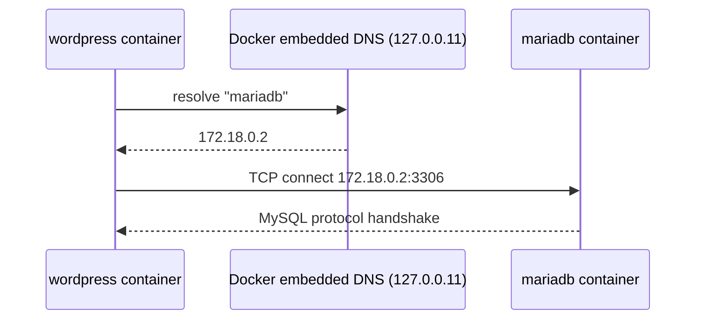

### 7.3 Communication Between Containers — Reverse Proxy Pattern

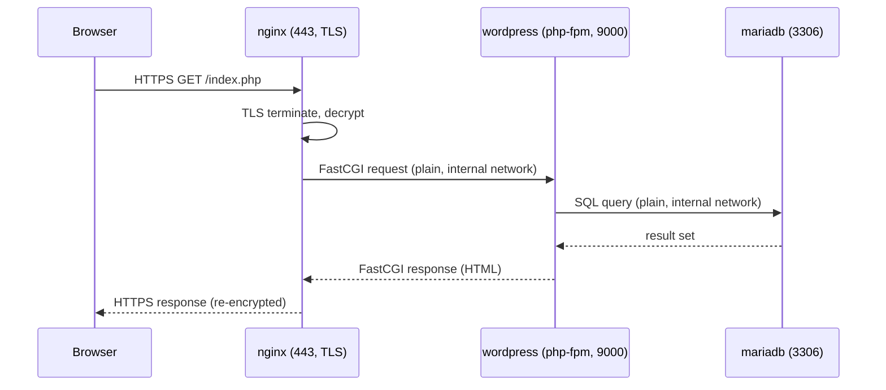

NGINX is the only container that has a port published to the host (`443:443`). WordPress's `9000` and MariaDB's `3306` are only `expose`d — reachable from other containers on the same Docker network, invisible from outside the Docker host entirely. This is a textbook **reverse proxy** + **defense-in-depth** pattern: even if a firewall rule slipped, PHP-FPM and MariaDB are still not bound to any host-facing interface.

**Evaluation questions — Docker Networking**

39. Why does the default `bridge` network *not* get automatic DNS resolution but a user-defined one does?
40. Why use the service name `mariadb` instead of a hard-coded IP in `wp-config.php`?
41. What's the difference between `host` and `bridge` network drivers?
42. Why is only NGINX's port published to the host?
43. What tool would you use inside a container to verify DNS resolution of another service?

---

## 8. Volumes

### 8.1 Why Persistence Matters

A container's writable layer is **ephemeral** — `docker rm` destroys it permanently. WordPress's uploaded media, installed plugins, and `wp-config.php`; MariaDB's actual table data on disk — none of that can live only in the container's writable layer, or a single `docker compose down` / rebuild would wipe your entire site and database.

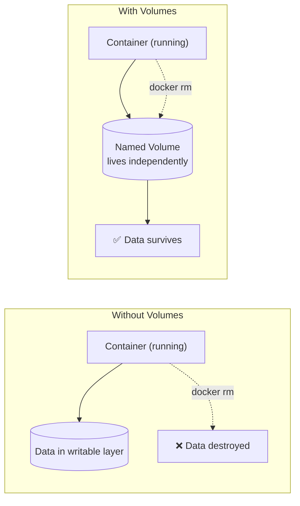

### 8.2 Bind Mounts vs Named Volumes vs Anonymous Volumes (recap with detail)

- **Bind mount**: maps an exact host path into the container. Full control over location; you manage permissions/backups yourself. Fragile if the host path structure changes.
- **Named volume**: Docker manages the storage location (`/var/lib/docker/volumes/<name>/_data` by default), referenced by a stable name. Portable between hosts, easy to back up with `docker run --volumes-from`.
- **Anonymous volume**: created implicitly (e.g. by a Dockerfile `VOLUME` instruction with no explicit name given at `run`/`compose` time) — gets a random hash as its name, easy to lose track of, easy to accumulate as orphaned garbage (`docker volume prune`).

Inception's twist: it wants **named volumes whose data physically lives at a specific host path** (`/home/<login>/data/...`) so the grader can `ls` it directly — achieved via the `driver_opts` `bind` trick shown in Chapter 6.2. This is neither a pure bind mount nor a pure named volume; it's a named volume backed by a bind mount, giving you both Docker-native management (`docker volume ls`) and a guaranteed, inspectable host path.

```bash
docker volume ls                     # list volumes
docker volume inspect db_data         # show mountpoint, driver, options
docker volume rm db_data               # delete a volume (data loss!)
docker volume prune                     # delete all unused volumes
```

### 8.3 Why WordPress and MariaDB specifically need persistence

- **MariaDB**: `/var/lib/mysql` contains the actual InnoDB/MyISAM table files. Lose this directory and you lose every post, user, and comment in the WordPress database — not recoverable without a backup.
- **WordPress**: `/var/www/html` contains `wp-config.php`, the `wp-content/uploads` media library, and any installed themes/plugins. Without persisting this, every container rebuild would force you to reinstall WordPress and re-upload every image from scratch.

> **Tip:** Both NGINX and WordPress mount the *same* `wp_data` volume at `/var/www/html`, because NGINX needs read access to static assets (images, CSS, JS) directly, while only `.php` requests get proxied to PHP-FPM (Chapter 10.5). This shared-volume pattern is standard for the NGINX+PHP-FPM split.

**Evaluation questions — Volumes**

44. What happens to a container's writable layer on `docker rm`?
45. Why does Inception require volumes backed by a specific host path rather than plain named volumes?
46. Why do both NGINX and WordPress mount the same volume?
47. What's the risk of an anonymous volume accumulating over time?
48. If you ran `docker compose down -v` by accident, what exactly would you lose?

---

## 9. Environment Variables and Docker Secrets

### 9.1 The Core Principle

> **Never hardcode credentials into an image, a Dockerfile, or a repository.** Anyone who obtains the image (or the git history) obtains the secret — permanently, since old layers/commits don't disappear just because you "fixed" it later.

### 9.2 `.env` Files

```bash
# .env (must be .gitignore'd!)
MYSQL_DATABASE=wordpress
MYSQL_USER=wp_user
MYSQL_PASSWORD=change_me_in_real_life
MYSQL_ROOT_PASSWORD=another_strong_password
WP_ADMIN_USER=admin_not_admin
WP_ADMIN_PASSWORD=change_me_too
DOMAIN_NAME=login.42.fr
```

Compose automatically loads `.env` from the project root for variable substitution in `docker-compose.yml` (`${DOMAIN_NAME}`), and `env_file:` explicitly injects it into a container's environment at runtime. Both are **plaintext at rest** and **plaintext inside `docker inspect`** — meaning `.env` is *convenient*, not *secure*. That's the whole reason Docker Secrets exist.

### 9.3 Docker Secrets

Docker Secrets mount sensitive values as **files** inside `/run/secrets/<name>` in the container, rather than as environment variables — meaning they never appear in `docker inspect`, shell history, or `/proc/<pid>/environ`.

```yaml
# docker-compose.yml
services:
  mariadb:
    secrets:
      - db_password
      - db_root_password

secrets:
  db_password:
    file: ./secrets/db_password.txt
  db_root_password:
    file: ./secrets/db_root_password.txt
```

Inside the container:

```bash
$ cat /run/secrets/db_password
change_me_in_real_life
```

Your entrypoint script then reads the file content into the actual variable the underlying software expects:

```sh
export MYSQL_PASSWORD="$(cat /run/secrets/db_password)"
```

> **Note:** Native Docker Secrets (the `secrets:` top-level key) technically require **Swarm mode** for full secret-management semantics (encryption at rest in the Swarm raft log). In plain `docker compose` (non-Swarm), the `secrets:` key still works and still mounts files at `/run/secrets/`, which is what 42's Inception subject explicitly asks for — the file-based *pattern*, even without full Swarm-grade encryption. Know this distinction; evaluators sometimes probe it.

### 9.4 Why This Matters — Concretely

| Approach | Visible in `docker inspect`? | Visible in image layers? | Visible in `docker history`? |
|---|---|---|---|
| `ENV PASSWORD=x` in Dockerfile | ✅ Yes | ✅ Yes, forever | ✅ Yes |
| `environment:` in Compose | ✅ Yes | ❌ No | ❌ No |
| `env_file: .env` | ✅ Yes (resolved values) | ❌ No | ❌ No |
| Docker secret (`/run/secrets/`) | ❌ No | ❌ No | ❌ No |

**Evaluation questions — Env vars & Secrets**

49. Why is `ENV MYSQL_PASSWORD=x` in a Dockerfile worse than putting it in `.env`?
50. What's the practical difference between an environment variable secret and a Docker Secret?
51. Where do Docker Secrets get mounted inside a container?
52. Why must `.env` be excluded from git?
53. Does plain (non-Swarm) `docker compose` encrypt secrets at rest?

---

## 10. NGINX

### 10.1 What is NGINX?

NGINX is a high-performance **web server**, **reverse proxy**, and **load balancer**, built around an event-driven, asynchronous architecture (as opposed to Apache's traditional one-thread/process-per-connection model), which lets it handle tens of thousands of concurrent connections with low memory overhead.

In Inception, NGINX plays exactly one role: it is the **single TLS-terminating entrypoint** to the whole stack. Nothing else is reachable from outside the Docker network.

### 10.2 Web Server vs Reverse Proxy

- **Web server**: serves files directly from disk in response to HTTP requests (e.g., NGINX serving `style.css`).
- **Reverse proxy**: receives a request on behalf of a backend, forwards it to that backend, and returns the backend's response to the client — the client never talks to the backend directly.

NGINX does *both* in Inception: it serves static WordPress assets directly (fast, no PHP involved) and reverse-proxies `.php` requests to PHP-FPM via FastCGI.

### 10.3 HTTPS, TLS, SSL — vocabulary

- **SSL (Secure Sockets Layer)**: the historical predecessor protocol, now considered insecure and deprecated.
- **TLS (Transport Layer Security)**: the modern replacement (people still colloquially say "SSL" to mean TLS). Inception requires **TLSv1.2 and/or TLSv1.3 only** — older versions (SSLv3, TLSv1.0/1.1) must be disabled.
- **HTTPS**: HTTP running over a TLS-encrypted connection.
- **Certificate**: a signed document binding a public key to an identity (a domain name), used during the TLS handshake (Chapter 11).

### 10.4 A Full Annotated `nginx.conf` for Inception

```nginx
events {
    worker_connections 1024;   # max simultaneous connections per worker process
}

http {
    include       mime.types;   # maps file extensions to Content-Type headers
    default_type  application/octet-stream;

    server {
        listen 443 ssl;                  # listen on 443, TLS required
        server_name login.42.fr;         # matched against the Host header / SNI

        ssl_certificate     /etc/nginx/ssl/inception.crt;
        ssl_certificate_key /etc/nginx/ssl/inception.key;
        ssl_protocols       TLSv1.2 TLSv1.3;   # explicitly forbid old/insecure TLS

        root /var/www/html;      # document root — must match the WordPress volume mount
        index index.php index.html;

        location / {
            try_files $uri $uri/ /index.php?$args;   # WordPress "pretty permalinks" support
        }

        location ~ \.php$ {
            fastcgi_pass wordpress:9000;              # forward to PHP-FPM by service name
            fastcgi_index index.php;
            fastcgi_param SCRIPT_FILENAME $document_root$fastcgi_script_name;
            include fastcgi_params;
        }
    }
}
```

### 10.5 Directive-by-Directive

| Directive | Meaning |
|---|---|
| `listen 443 ssl` | Bind to port 443, require TLS negotiation on this socket |
| `server_name` | Virtual host matching — which `Host:` header this block answers |
| `ssl_certificate` / `ssl_certificate_key` | Paths to the public cert and private key used for the TLS handshake |
| `ssl_protocols` | Whitelist of allowed TLS versions — **security-critical**, must exclude SSLv3/TLSv1.0/1.1 |
| `root` | Filesystem base path NGINX serves files from |
| `try_files` | Attempts each path in order; falls back to the last (here, routes unknown paths into `index.php` for WordPress's router) |
| `location ~ \.php$` | A regex location block matching any URI ending in `.php` |
| `fastcgi_pass` | Forwards the request to a FastCGI backend (here, PHP-FPM's TCP socket) — this is `proxy_pass`'s cousin, specific to the FastCGI protocol rather than plain HTTP |
| `fastcgi_param SCRIPT_FILENAME` | Tells PHP-FPM exactly which `.php` file to execute (PHP-FPM cannot infer this on its own) |
| `include fastcgi_params` | Pulls in NGINX's standard set of FastCGI parameter mappings |

> ⚠️ **Common mistake:** forgetting `ssl_protocols TLSv1.2 TLSv1.3;` — NGINX's compiled-in defaults may include older, insecure protocol versions depending on the build. Inception's evaluation sheet explicitly checks this with `nmap --script ssl-enum-ciphers` or similar. Always set it explicitly.

**Evaluation questions — NGINX**

54. What is the difference between a web server and a reverse proxy?
55. Why must NGINX be the *only* container with a published host port?
56. What does `fastcgi_pass wordpress:9000` actually do?
57. Why must `SCRIPT_FILENAME` be passed explicitly to PHP-FPM?
58. Why does Inception forbid TLSv1.0/1.1?
59. What's the difference between `proxy_pass` and `fastcgi_pass`?

---

## 11. TLS and OpenSSL

### 11.1 The Problem TLS Solves

Plain HTTP sends everything — including passwords, cookies, page content — as cleartext over the network. Anyone on the path (a shared Wi-Fi network, a compromised router, an ISP) can read or modify it. TLS provides three guarantees:

1. **Confidentiality** — traffic is encrypted, unreadable to eavesdroppers.
2. **Integrity** — traffic cannot be tampered with undetected.
3. **Authentication** — the client can verify it's really talking to the server it intended to (via the certificate).

### 11.2 Public-Key (Asymmetric) Cryptography, briefly

Each party has a **key pair**: a **public key** (shareable) and a **private key** (secret, never transmitted). Data encrypted with the public key can only be decrypted with the matching private key, and vice versa for signatures. TLS uses this to safely negotiate a temporary **symmetric session key** (fast) without ever transmitting it in the clear — asymmetric crypto is computationally expensive, so it's only used briefly during the handshake, not for the whole session.

### 11.3 Certificates and Self-Signing

A **certificate** binds a public key to an identity, normally **signed by a trusted Certificate Authority (CA)** so browsers trust it automatically (Let's Encrypt, DigiCert...). A **self-signed certificate** is signed by its own private key instead of a CA — meaning browsers will show a trust warning, because there's no chain of trust back to a known authority. That's expected and accepted for Inception: you're not deploying to the real internet, and 42 subjects explicitly permit/require self-signed certs for `login.42.fr`.

```bash
openssl req -x509 -nodes -days 365 \
  -newkey rsa:2048 \
  -keyout inception.key \
  -out inception.crt \
  -subj "/C=MA/ST=Casablanca/L=Casablanca/O=42/CN=login.42.fr"
```

| Flag | Meaning |
|---|---|
| `req -x509` | Generate a self-signed X.509 certificate directly (instead of a CSR for a CA to sign) |
| `-nodes` | "No DES" — don't encrypt the private key with a passphrase (needed for unattended container startup) |
| `-days 365` | Validity period |
| `-newkey rsa:2048` | Generate a new 2048-bit RSA key pair alongside the cert |
| `-keyout` / `-out` | Output paths for the private key and the certificate |
| `-subj` | Certificate subject fields (Country, State, Locality, Organization, Common Name) — `CN` **must match** the domain NGINX serves |

### 11.4 The TLS Handshake (simplified, TLS 1.2-style for teaching clarity)

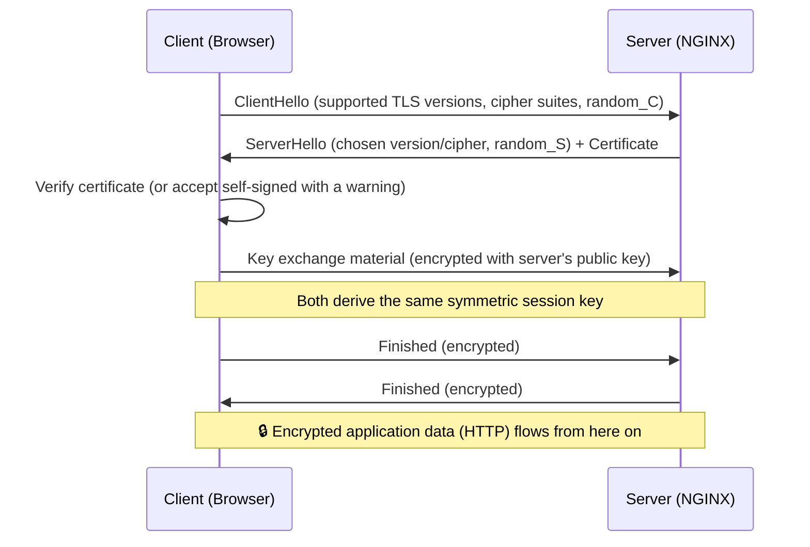

> **Tip:** TLS 1.3 streamlines this to a single round trip in most cases (1-RTT handshake) — faster than TLS 1.2's two round trips — one more reason to prefer allowing TLS 1.3.

**Evaluation questions — TLS/OpenSSL**

60. What three guarantees does TLS provide?
61. Why is a self-signed certificate acceptable for Inception but not for a real production public site?
62. What does the `-nodes` flag do and why is it necessary here?
63. Why must the certificate's `CN` match the domain name NGINX serves?
64. Why does TLS use asymmetric crypto only briefly, then switch to symmetric encryption?

---

## 12. PHP and PHP-FPM

### 12.1 PHP

PHP is a server-side scripting language designed for web development: a script runs on the server, generates HTML (or JSON, etc.), and the result is sent to the browser. WordPress is written entirely in PHP.

### 12.2 CGI → FastCGI → PHP-FPM

- **CGI (Common Gateway Interface)**: the original standard for a web server to run an external program per request. Extremely wasteful — a *new process* was spawned for *every single request*, then destroyed.
- **FastCGI**: an evolution of CGI that keeps worker processes alive between requests, communicating with the web server over a persistent socket (TCP or Unix socket) instead of spawning fresh processes each time — dramatically faster.
- **PHP-FPM (FastCGI Process Manager)**: PHP's official FastCGI implementation. It manages a **pool of PHP worker processes**, handling process spawning, recycling, and request routing, so NGINX never has to execute PHP itself (NGINX has no PHP interpreter built in, by design — this separation of concerns is intentional and is the whole reason the two are separate containers in Inception).

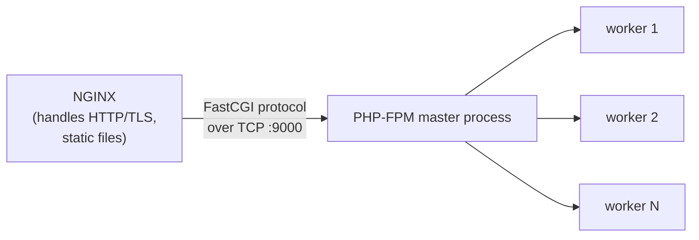

### 12.3 PHP-FPM Pool Configuration

```ini
; www.conf
[www]
listen = 9000                    ; TCP port PHP-FPM listens on (0.0.0.0:9000 inside the container)
user = www-data                  ; run workers as an unprivileged user, not root
group = www-data
pm = dynamic                     ; process manager mode: dynamic|static|ondemand
pm.max_children = 5              ; hard cap on simultaneous worker processes
pm.start_servers = 2             ; workers spawned at startup
pm.min_spare_servers = 1
pm.max_spare_servers = 3
```

| Directive | Meaning |
|---|---|
| `listen` | Where PHP-FPM accepts FastCGI connections — a TCP port (needed since NGINX is in a *different container*, so a Unix socket file wouldn't be shareable without extra volume tricks) |
| `pm = dynamic` | Worker count scales between `min_spare_servers` and `max_spare_servers` based on load |
| `pm.max_children` | Absolute ceiling — prevents unbounded memory usage under load |
| `user` / `group` | **Never run PHP-FPM workers as root** — least privilege (Chapter 20) |

> ⚠️ **Common mistake:** using `listen = /run/php/php-fpm.sock` (a Unix socket) — this works fine when NGINX and PHP-FPM are on the *same* filesystem, but **fails silently or with "502 Bad Gateway"** across separate containers unless that socket path is on a shared volume. In Inception's split-container setup, always use a **TCP socket** (`listen = 9000`) instead.

**Evaluation questions — PHP-FPM**

65. Why doesn't NGINX just execute PHP scripts directly?
66. What problem did FastCGI solve compared to plain CGI?
67. Why must PHP-FPM listen on a TCP port rather than a Unix socket in Inception's architecture?
68. What does `pm.max_children` protect against?
69. Why should PHP-FPM workers run as `www-data`, not `root`?

---

## 13. WordPress

### 13.1 Architecture

WordPress is a PHP + MySQL/MariaDB content management system (CMS). At a high level:

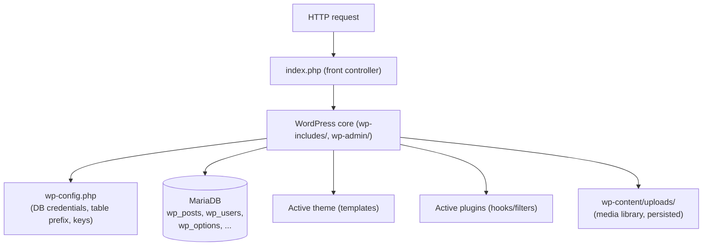

### 13.2 `wp-config.php`, Line by Line (the parts that matter for Inception)

```php
<?php
define( 'DB_NAME', getenv('MYSQL_DATABASE') );
define( 'DB_USER', getenv('MYSQL_USER') );
define( 'DB_PASSWORD', getenv('MYSQL_PASSWORD') );
define( 'DB_HOST', 'mariadb' );          // Docker Compose service name, NOT localhost!
define( 'DB_CHARSET', 'utf8' );
define( 'DB_COLLATE', '' );

$table_prefix = 'wp_';

require_once ABSPATH . 'wp-settings.php';
```

- `DB_HOST` **must** be the Compose service name (`mariadb`), resolved via Docker's internal DNS (Chapter 7.2) — not `localhost`, not `127.0.0.1`.
- Credentials pulled from environment variables (`getenv()`), never hardcoded — same principle as Chapter 9.
- `$table_prefix` lets multiple WordPress installs share one database safely (not usually relevant for Inception's single-site setup, but evaluators may ask about it).

### 13.3 Installing WordPress Without the Browser Wizard — `wp-cli`

42's subject requires a **fully automated, non-interactive** setup — no clicking through the famous 5-minute browser install. The standard tool for this is **`wp-cli`**, the official WordPress command-line interface.

```sh
# inside the wordpress container's entrypoint script:
wp core download --allow-root

wp config create \
  --dbname="$MYSQL_DATABASE" \
  --dbuser="$MYSQL_USER" \
  --dbpass="$MYSQL_PASSWORD" \
  --dbhost="mariadb" \
  --allow-root

wp core install \
  --url="$DOMAIN_NAME" \
  --title="Inception" \
  --admin_user="$WP_ADMIN_USER" \
  --admin_password="$WP_ADMIN_PASSWORD" \
  --admin_email="$WP_ADMIN_EMAIL" \
  --skip-email \
  --allow-root

# Inception commonly also requires a second, non-administrator user:
wp user create "$WP_USER" "$WP_USER_EMAIL" \
  --role=author \
  --user_pass="$WP_USER_PASSWORD" \
  --allow-root
```

> **Note:** `--allow-root` is required because the entrypoint script typically runs as root during setup (to fix permissions, etc.) before optionally dropping privileges for the long-running PHP-FPM process itself.

> ⚠️ **Common mistake:** the 42 subject usually forbids the WordPress admin username from containing "admin", "administrator", etc. (case-insensitive) as a security-awareness exercise — evaluators check this manually. Pick something like `boss_wp` for the admin account.

### 13.4 Persistence Recap

`/var/www/html` (WordPress core files, `wp-config.php`, `wp-content/uploads`) must live on the `wp_data` named volume (Chapter 8) — otherwise every rebuild forces a full reinstall and loses all uploaded media.

**Evaluation questions — WordPress**

70. Why must `DB_HOST` in `wp-config.php` be `mariadb`, not `localhost`?
71. What is `wp-cli` and why does Inception require it instead of the browser install wizard?
72. Why must the WordPress admin account not have "admin" in its username?
73. What's the role of `wp-content/uploads` and why must it be persisted?
74. What does `wp core install --skip-email` avoid, and why is that necessary in this environment?
