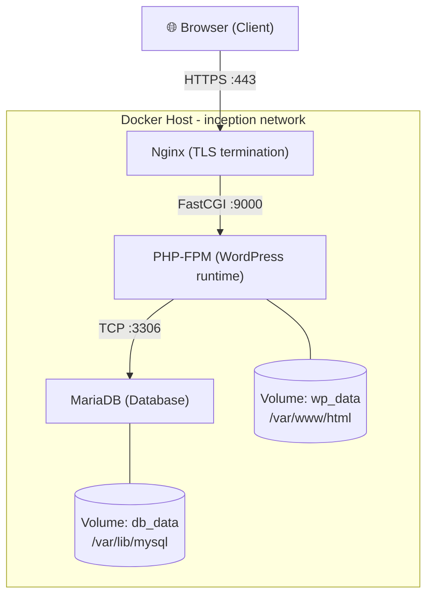
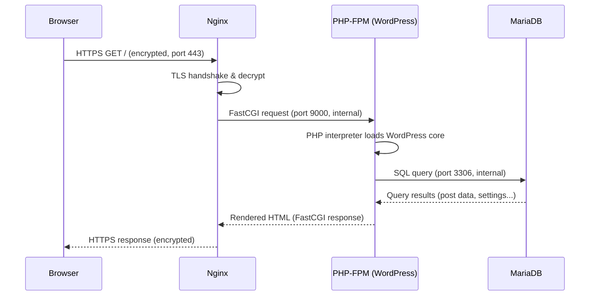
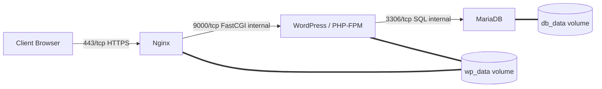

# 🐳 Docker & 42 Inception — The Complete Course

> A from-zero-to-hero guide to Docker and the 42 School **Inception** project, written for someone who already knows Linux and Bash but has never touched Docker.

---

## 📚 Table of Contents

- [Part 1 — Docker Fundamentals](#part-1--docker-fundamentals)
- [Part 2 — Docker Commands](#part-2--docker-commands)
- [Part 3 — Dockerfile](#part-3--dockerfile)
- [Part 4 — Storage](#part-4--storage)
- [Part 5 — Docker Networking](#part-5--docker-networking)
- [Part 6 — Docker Compose](#part-6--docker-compose)
- [Part 7 — 42 Inception: Concepts & Architecture](#part-7--42-inception-concepts--architecture)
- [Part 8 — Building the Project](#part-8--building-the-project)
- [Part 9 — Debugging](#part-9--debugging)
- [Part 10 — Final Project](#part-10--final-project)

---

# Part 1 — Docker Fundamentals

## 1.1 The Problem Before Docker

Before Docker existed, deploying software had one recurring nightmare: **"it works on my machine."**

Imagine you build an app on your laptop with Python 3.11, a specific version of a library, and a certain OS config. You hand it to a teammate or push it to a production server, and it breaks — because their Python is 3.9, a library version differs, or a system package is missing.

> **Note**
> The core problem Docker solves is **environment inconsistency**: the gap between "developed here" and "runs there."

### Traditional Deployment

In the traditional model, you install your application directly onto a server's operating system, alongside every other application on that machine.

```
┌─────────────────────────────┐
│         Physical Server      │
│  ┌───────────┐ ┌───────────┐ │
│  │  App A    │ │  App B    │ │
│  │ (Python2) │ │ (Python3) │ │
│  └─────┬─────┘ └─────┬─────┘ │
│        └──────┬──────┘       │
│         Shared OS Libraries  │
└─────────────────────────────┘
```

**Problems with this approach:**

| Problem | Explanation |
|---|---|
| Dependency conflicts | App A needs Python 2, App B needs Python 3 — both fight over the same system |
| No isolation | A crash or resource hog in App A can affect App B |
| Hard to reproduce | Setting up a new server means manually reinstalling everything, hoping you remember every step |
| Scaling is slow | Provisioning a whole new server takes minutes to hours |

### Virtual Machines (The First Fix)

Virtual Machines (VMs) solve isolation by virtualizing an entire computer — including its own kernel — on top of your physical hardware, using a **hypervisor** (e.g., VirtualBox, VMware, KVM).

```
┌───────────────────────────────────────────┐
│               Physical Server               │
│  ┌───────────────────────────────────────┐ │
│  │              Hypervisor                │ │
│  │  ┌───────────────┐ ┌───────────────┐   │ │
│  │  │     VM 1      │ │     VM 2      │   │ │
│  │  │  Guest OS Full│ │  Guest OS Full│   │ │
│  │  │  App A        │ │  App B        │   │ │
│  │  └───────────────┘ └───────────────┘   │ │
│  └───────────────────────────────────────┘ │
└───────────────────────────────────────────┘
```

Each VM ships with a **full guest operating system** — its own kernel, its own drivers, its own everything.

**Why VMs are heavy:**
- Each VM can be gigabytes in size (a full OS image).
- Booting a VM means booting an entire OS — often 30+ seconds.
- Running 10 VMs means running 10 full kernels — huge RAM/CPU overhead.

This is real isolation, but it's expensive. You're not just isolating an *application*, you're duplicating an *entire computer*.

### Containers (The Docker Fix)

Containers take a different approach: instead of virtualizing hardware, they virtualize **at the operating system level**. All containers on a host share the **same host kernel**, but each one has its own isolated filesystem, process tree, and network stack.

```
┌───────────────────────────────────────────┐
│               Physical Server               │
│  ┌───────────────────────────────────────┐ │
│  │            Host Operating System        │ │
│  │                (One Kernel)              │ │
│  │  ┌───────────────────────────────────┐ │ │
│  │  │           Docker Engine            │ │ │
│  │  │  ┌───────────┐   ┌───────────┐    │ │ │
│  │  │  │Container 1│   │Container 2│    │ │ │
│  │  │  │  App A    │   │  App B    │    │ │ │
│  │  │  │  libs     │   │  libs     │    │ │ │
│  │  │  └───────────┘   └───────────┘    │ │ │
│  │  └───────────────────────────────────┘ │ │
│  └───────────────────────────────────────┘ │
└───────────────────────────────────────────┘
```

**Containers vs Virtual Machines**

| Aspect | Virtual Machine | Container |
|---|---|---|
| What's virtualized | Hardware | Operating System (process-level) |
| Kernel | Each VM has its own | Shared with host |
| Boot time | Seconds to minutes | Milliseconds to seconds |
| Size | Gigabytes | Megabytes (often) |
| Isolation strength | Very strong (separate kernel) | Strong, but shares host kernel |
| Density (per host) | Tens of VMs | Hundreds of containers |

> **Tip**
> Think of a VM as building a **whole new house** for every tenant. A container is more like an **apartment building**: one foundation (the kernel), but every apartment (container) has its own locked door, its own furniture, and can't see into the neighbor's apartment.

### What Actually Makes a Container "Isolated"?

Docker containers achieve isolation using two Linux kernel features (this is the "what happens internally" layer):

1. **Namespaces** — give a process its own isolated *view* of the system:
   - `PID` namespace → its own process ID tree (a container's "PID 1" is not the host's PID 1)
   - `NET` namespace → its own network interfaces, IP address, routing table
   - `MNT` namespace → its own filesystem mount points
   - `UTS` namespace → its own hostname
   - `IPC` namespace → its own inter-process communication resources
   - `USER` namespace → its own user/group ID mapping

2. **Control Groups (cgroups)** — limit and account for *how much* of a resource (CPU, RAM, disk I/O) a process can use, preventing one container from starving the others.

So a container isn't magic — it's just a **regular Linux process** that the kernel has convinced, via namespaces, that it's alone on the machine, and whose resource consumption cgroups keep in check.

## 1.2 Images vs Containers

This is one of the most important distinctions in Docker, and it trips up almost every beginner.

> **An image is a blueprint. A container is a running instance of that blueprint.**

| Image | Container |
|---|---|
| Read-only template | Running (or stopped) instance |
| Stored on disk as layers | Image + a thin writable layer |
| Doesn't "run" | Actually executes processes |
| One image | Many containers can be spawned from it |

**Real-world analogy:** an image is like a *class* in object-oriented programming; a container is an *instance* (object) of that class. You can create many objects from one class definition, each with its own state, but they all share the same blueprint.

```
        docker run
Image  ───────────►  Container
(class)               (object/instance)
```

## 1.3 Layers

A Docker image isn't one giant file — it's built from **layers**, stacked on top of each other, where each layer represents a filesystem diff (a set of changes) from the layer below it.

```
┌─────────────────────────────┐
│  Layer 4: COPY app.py        │  ← your app
├─────────────────────────────┤
│  Layer 3: RUN pip install    │  ← dependencies
├─────────────────────────────┤
│  Layer 2: RUN apt update     │  ← system packages
├─────────────────────────────┤
│  Layer 1: FROM ubuntu:22.04  │  ← base OS layer
└─────────────────────────────┘
```

**Why layers matter:**

1. **Caching** — if Layer 1–3 haven't changed, Docker reuses them from cache and only rebuilds Layer 4. This makes rebuilds fast.
2. **Sharing** — if 10 images are all built `FROM ubuntu:22.04`, that base layer is stored **once** on disk and shared by all 10 images.
3. **Efficiency** — only the diffs are stored, not full copies of the filesystem at every step.

Layers are read-only. When you run a container, Docker adds one more layer on top — a **writable layer** — where all runtime changes (new files, edits, deletes) happen. We'll cover this in depth in Part 4 (Storage).

## 1.4 Docker Engine, CLI, and Docker Hub

- **Docker Engine** — the background service (daemon, called `dockerd`) that does the actual work: building images, running containers, managing networks and volumes. It exposes an API.
- **Docker CLI** (`docker`) — the command-line tool you type commands into. It doesn't do the work itself — it sends API requests to the Docker Engine (daemon), which does.
- **Docker Hub** — a public registry (like GitHub, but for images) where prebuilt images (e.g., `nginx`, `mysql`, `python`) are stored and can be pulled down.

## 1.5 Docker Architecture

```
┌──────────────┐        REST API        ┌──────────────────────┐
│  Docker CLI   │ ─────────────────────► │   Docker Daemon        │
│ (docker run…) │                        │   (dockerd)             │
└──────────────┘                        │  ┌──────────────────┐  │
                                          │  │  containerd       │  │
                                          │  │  (runtime mgmt)   │  │
                                          │  └────────┬─────────┘  │
                                          │           │ runc        │
                                          │  ┌────────▼─────────┐  │
                                          │  │   Containers       │  │
                                          │  └──────────────────┘  │
                                          └──────────────────────┘
                                                     │
                                                     ▼
                                          ┌──────────────────────┐
                                          │      Docker Hub        │
                                          │   (image registry)     │
                                          └──────────────────────┘
```

- You type a command in the CLI.
- The CLI sends it to the daemon via a REST API (usually over a Unix socket `/var/run/docker.sock`).
- The daemon delegates actual container execution to `containerd`, which uses `runc` (a low-level tool implementing the OCI runtime spec) to actually create the namespaces/cgroups and start the process.
- If an image isn't present locally, the daemon pulls it from a registry like Docker Hub.

## Chapter Summary

- Docker solves the "works on my machine" problem by packaging an app with everything it needs.
- VMs virtualize hardware (heavy); containers virtualize the OS process space (lightweight), sharing the host kernel via namespaces and cgroups.
- An **image** is a read-only blueprint; a **container** is a running instance of it.
- Images are built from stacked, cacheable, shareable **layers**.
- The **Docker CLI** talks to the **Docker daemon**, which uses `containerd`/`runc` to actually run containers, and can pull images from **Docker Hub**.

## Quiz — Part 1

1. What is the main problem Docker was created to solve?
2. Name the two Linux kernel features that make container isolation possible.
3. What's the difference between an image and a container?
4. Why are Docker images built in layers instead of as one single file?
5. What is the role of `containerd` and `runc`?

## Practice Exercise — Part 1

Without running any commands yet, sketch (on paper or in a text file) a diagram of what happens, step by step, from the moment you type `docker run nginx` to the moment the Nginx container is running. Try to include: CLI, daemon, image cache/registry, containerd, runc.

---

# Part 2 — Docker Commands

> Every command below: **why it exists → syntax → key options → what happens internally → examples → common mistakes.**

## 2.1 `docker pull`

**Why it exists:** to download an image from a registry (Docker Hub by default) to your local machine, without running it.

```bash
docker pull <image>[:tag]
```

**Internally:** the daemon contacts the registry, resolves the tag to a manifest (a list of layer digests), and downloads any layers not already cached locally, verifying checksums.

```bash
docker pull nginx:1.25
docker pull ubuntu:22.04
```

> **Warning**
> If you omit the tag (`docker pull nginx`), Docker assumes `:latest`. `latest` is just a tag name, not necessarily "the newest version" — it's whatever the maintainer tagged as latest. Never rely on `latest` in production.

## 2.2 `docker run`

**Why it exists:** the core command — creates **and starts** a container from an image (pulling the image first if not present locally).

```bash
docker run [OPTIONS] IMAGE [COMMAND] [ARG...]
```

**Key options:**

| Option | Meaning |
|---|---|
| `-d` | detached mode — run in background |
| `-it` | interactive + allocate a TTY (for shells) |
| `--name` | give the container a custom name |
| `-p host:container` | publish/map a port |
| `-v` | mount a volume or bind mount |
| `-e KEY=VALUE` | set an environment variable |
| `--rm` | auto-remove the container when it stops |
| `--network` | attach to a specific network |

**Internally:** `docker run` = `docker create` + `docker start`. It pulls the image if missing, creates a new writable layer, sets up namespaces/cgroups, and executes the container's entrypoint process.

```bash
docker run -d --name my_nginx -p 8080:80 nginx
docker run -it ubuntu bash
docker run --rm -e APP_ENV=dev myapp
```

**Common mistakes:**
- Forgetting `-d`, then wondering why the terminal is "frozen" (it's attached to the container's output).
- Forgetting `-p`, then wondering why `localhost:8080` doesn't work — nothing was mapped.
- Running `docker run` repeatedly for the "same" container — each call creates a brand-new container, not restarts an existing one.

## 2.3 `docker build`

**Why it exists:** to create an image from a `Dockerfile` (a recipe).

```bash
docker build -t <name>:<tag> <context_path>
```

```bash
docker build -t myapp:1.0 .
```

**Internally:** the daemon reads the Dockerfile instruction by instruction, executing each in a temporary container, committing the result as a new layer, and caching each layer's digest. The `.` at the end is the **build context** — the set of files sent to the daemon that `COPY`/`ADD` can reference.

> **Warning**
> A huge, common beginner mistake: running `docker build .` inside a directory containing `node_modules` or huge unrelated files — the entire context gets sent to the daemon, making builds painfully slow. Use a `.dockerignore` file.

## 2.4 `docker ps`

**Why it exists:** to list containers.

```bash
docker ps          # running containers only
docker ps -a       # all containers, including stopped
```

## 2.5 `docker stop` / `docker start` / `docker restart`

- `docker stop <container>` — sends `SIGTERM`, waits (default 10s), then `SIGKILL` if still running. Graceful shutdown.
- `docker start <container>` — starts an existing, stopped container (keeps its config/writable layer).
- `docker restart <container>` — stop + start in one command.

> **Note**
> `docker stop` ≠ `docker rm`. A stopped container still exists on disk (with its writable layer) until removed.

## 2.6 `docker rm`

**Why it exists:** permanently deletes a stopped container (and its writable layer's data).

```bash
docker rm <container>
docker rm -f <container>   # force: stop then remove
```

## 2.7 `docker images`

Lists locally stored images.

```bash
docker images
docker rmi <image>   # remove an image
```

## 2.8 `docker logs`

**Why it exists:** shows the stdout/stderr of a container's main process — essential for debugging.

```bash
docker logs <container>
docker logs -f <container>     # follow (like tail -f)
docker logs --tail 100 <container>
```

## 2.9 `docker exec`

**Why it exists:** run an additional command *inside an already-running* container — great for debugging without stopping the app.

```bash
docker exec -it <container> bash
docker exec <container> ls /app
```

> **Note**
> `docker exec` starts a *new* process inside the existing container's namespaces — it does not restart the container's main process.

## 2.10 `docker inspect`

**Why it exists:** returns detailed low-level JSON metadata about a container/image/network/volume — IP address, mounts, env vars, config, everything.

```bash
docker inspect <container>
docker inspect -f '{{.NetworkSettings.IPAddress}}' <container>
```

## Chapter Summary

- `pull`/`build` get images; `run` creates+starts a container from one.
- `ps`/`logs`/`inspect`/`exec` are your primary tools for observing and debugging running containers.
- `stop`/`start`/`restart`/`rm` manage a container's lifecycle — stopping ≠ deleting.

## Quiz — Part 2

1. What's the difference between `docker stop` and `docker rm`?
2. Why might `docker run` unexpectedly create a *new* container instead of reusing one?
3. What does `-p 8080:80` actually do?
4. Why should you use `.dockerignore` before running `docker build`?
5. What's the difference between `docker exec` and the process started by `docker run`?

## Practice Exercise — Part 2

Pull the `nginx` image, run it detached on port 8080, check it's running with `ps`, view its logs, `exec` into it to inspect `/etc/nginx`, then stop and remove it — all via CLI.

---

# Part 3 — Dockerfile

A `Dockerfile` is a **text recipe**: a sequence of instructions Docker executes, in order, to produce an image, one layer per instruction (roughly).

## 3.1 `FROM`

Sets the **base image** everything else builds on. Must (almost always) be the first instruction.

```dockerfile
FROM debian:bookworm-slim
```

> **Tip**
> Prefer `-slim` or `alpine` variants for smaller images, unless you specifically need the full OS toolset.

## 3.2 `RUN`

Executes a command **at build time**, and commits the resulting filesystem changes as a new layer.

```dockerfile
RUN apt-get update && apt-get install -y nginx
```

> **Warning**
> A very common mistake: splitting `apt-get update` and `apt-get install` into two separate `RUN` lines. Docker caches each layer independently — if a later rebuild reuses the cached "update" layer without re-running it, you can get stale package lists. Always chain them in one `RUN`.

## 3.3 `COPY` vs `ADD`

Both copy files from the build context into the image.

| | `COPY` | `ADD` |
|---|---|---|
| Copies local files | ✅ | ✅ |
| Auto-extracts tar archives | ❌ | ✅ |
| Can fetch remote URLs | ❌ | ✅ |
| Recommended default | ✅ | Only for special cases |

```dockerfile
COPY ./src /app/src
```

> **Tip**
> Prefer `COPY` unless you specifically need `ADD`'s auto-extraction — `ADD`'s "magic" behavior has surprised many developers.

## 3.4 `CMD` vs `ENTRYPOINT`

This is one of the most confused pairs in Docker.

- **`ENTRYPOINT`** — defines the **fixed, main executable** of the container. Hard to override.
- **`CMD`** — defines **default arguments** (or a default command if no `ENTRYPOINT` is set). Easily overridden by whatever you pass after `docker run <image> <here>`.

```dockerfile
ENTRYPOINT ["nginx"]
CMD ["-g", "daemon off;"]
```

Running `docker run myimage -v` effectively becomes `nginx -v` (CMD gets replaced, ENTRYPOINT stays).

| Scenario | Use |
|---|---|
| Container should always run one program, optionally with different args | `ENTRYPOINT` + `CMD` (default args) |
| Container should run different arbitrary commands each time | `CMD` alone |

## 3.5 `WORKDIR`

Sets the working directory for subsequent instructions (like `cd`, but persistent and creates the dir if missing).

```dockerfile
WORKDIR /app
```

## 3.6 `ENV` and `ARG`

- **`ENV`** — sets an environment variable available at **build time AND runtime**, visible inside the running container.
- **`ARG`** — sets a variable available **only during build**, not present in the final running container.

```dockerfile
ARG VERSION=1.0
ENV APP_ENV=production
```

> **Warning**
> Never put secrets in `ENV` — they end up baked into the image and visible via `docker inspect`. Use build secrets or runtime env vars injected at `docker run`/Compose time instead.

## 3.7 `USER`

Switches the user that subsequent instructions (and the final container process) run as.

```dockerfile
USER appuser
```

> **Note**
> By default, containers run as `root`. This is a common security beginner mistake — always drop to a non-root user when possible.

## 3.8 `EXPOSE`

**Documents** which port the container listens on. It does **not** actually publish the port — that's what `-p` at `docker run` does. Purely informational/metadata (though tools like Compose can use it).

```dockerfile
EXPOSE 80
```

## 3.9 `VOLUME`

Declares a mount point that should be treated as persistent storage, telling Docker "don't store this in the writable layer." Covered fully in Part 4.

```dockerfile
VOLUME /var/lib/mysql
```

## 3.10 Build Cache and Layers, Revisited

Docker caches each instruction's result. On rebuild, it walks the Dockerfile top to bottom; the **first instruction whose input changed** invalidates the cache for it *and every instruction after it*.

```dockerfile
FROM node:20            # cached
COPY package.json .     # cached (if package.json unchanged)
RUN npm install          # cached (fast rebuild!)
COPY . .                 # changes almost every time
```

> **Tip**
> Order your Dockerfile from **least frequently changing** to **most frequently changing**. Copying `package.json` and installing dependencies *before* copying the rest of your source code means code changes don't force a full reinstall.

## Chapter Summary

- A Dockerfile is a build recipe; each instruction typically creates a new layer.
- `FROM` sets the base; `RUN` executes build-time commands; `COPY` brings in files.
- `CMD` = overridable default args; `ENTRYPOINT` = fixed main process.
- `ENV` persists into the container; `ARG` is build-time only.
- `USER` improves security; `EXPOSE` is documentation, not publishing.
- Instruction order affects cache efficiency — put stable steps first.

## Quiz — Part 3

1. Why is chaining `apt-get update && apt-get install` in one `RUN` important?
2. What's the practical difference between `CMD` and `ENTRYPOINT`?
3. Does `EXPOSE 80` in a Dockerfile actually open port 80 to your host machine?
4. Why shouldn't you store a secret password using `ENV`?
5. Why does instruction order in a Dockerfile matter for build speed?

## Practice Exercise — Part 3

Write a Dockerfile for a simple Python Flask app: base image `python:3.12-slim`, `WORKDIR /app`, copy `requirements.txt` first and `pip install`, then copy the rest of the source, `EXPOSE 5000`, run as non-root user, `ENTRYPOINT ["python"]` + `CMD ["app.py"]`.

---

# Part 4 — Storage

## 4.1 The Writable Layer

When a container runs, Docker adds one thin **writable layer** on top of the image's read-only layers. Any file the running process creates, edits, or deletes happens here.

```
┌─────────────────────────────┐
│   Writable Layer (container)  │  ← ephemeral! deleted with `docker rm`
├─────────────────────────────┤
│   Image Layer 3 (read-only)   │
├─────────────────────────────┤
│   Image Layer 2 (read-only)   │
├─────────────────────────────┤
│   Image Layer 1 (read-only)   │
└─────────────────────────────┘
```

> **Warning**
> The writable layer is **destroyed** when you `docker rm` the container. This is the #1 cause of the classic beginner panic: "I ran my database in a container, restarted it, and all my data disappeared!" The fix: **volumes**.

## 4.2 Volumes

**Named volumes** are storage areas managed entirely by Docker, living outside any container's writable layer, in a location Docker controls on the host (on Linux, typically `/var/lib/docker/volumes/<name>/_data`).

```bash
docker volume create mydata
docker run -v mydata:/var/lib/mysql mysql
```

Because the volume exists independently of any single container, you can delete and recreate the container while the data in the volume survives.

## 4.3 Bind Mounts

A **bind mount** maps a specific path on your **host machine** directly into the container.

```bash
docker run -v /home/user/project:/app myimage
```

| | Named Volume | Bind Mount |
|---|---|---|
| Managed by | Docker | You (arbitrary host path) |
| Location | Docker's storage area | Anywhere on host you choose |
| Portability | High (works the same across hosts) | Low (depends on host path existing) |
| Common use | Databases, persistent app data | Local development (live code editing) |

## 4.4 Anonymous Volumes

A volume with no explicit name, created implicitly (e.g., via `VOLUME` in a Dockerfile with no source specified, or `-v /data` without a `host:` part). Docker assigns it a random hash as a name.

```bash
docker run -v /data myimage
```

> **Warning**
> Anonymous volumes are easy to lose track of — since they have random names, they pile up as "dangling" volumes over time if not cleaned with `docker volume prune`.

## 4.5 Data Persistence — Where Files Actually Live

```
Host Machine
└── /var/lib/docker/
    ├── overlay2/           ← image + container writable layers
    │   └── <layer-id>/
    └── volumes/
        └── mydata/
            └── _data/      ← actual volume file contents
```

```
┌─────────────┐   -v mydata:/data   ┌───────────────────────────┐
│  Container   │ ◄─────────────────► │ /var/lib/docker/volumes/…  │
│   /data       │                     │ mydata/_data/               │
└─────────────┘                     └───────────────────────────┘
```

## Chapter Summary

- Every container has an ephemeral **writable layer**, destroyed with the container.
- **Named volumes** are Docker-managed, persistent, and portable — best for databases/app state.
- **Bind mounts** link a host path directly in — best for local dev with live-reloading code.
- **Anonymous volumes** are unnamed and easy to lose track of.
- Volume data lives on the host at `/var/lib/docker/volumes/...` (Linux), independent of any single container's lifecycle.

## Quiz — Part 4

1. Why does data disappear when you `docker rm` a container without a volume?
2. What's the key difference between a named volume and a bind mount?
3. Where does Docker physically store named volume data on a Linux host?
4. Why are anonymous volumes risky to rely on?
5. Which storage type would you use for local development where you want to edit code on your host and see changes instantly in the container?

## Practice Exercise — Part 4

Create a named volume, run a container that writes a file to it, remove the container, then run a *new* container mounting the same volume and confirm the file still exists.

---

# Part 5 — Docker Networking

## 5.1 The Network Drivers

| Driver | Behavior |
|---|---|
| `bridge` (default) | Private internal network; containers get their own IP, can reach each other and the internet via NAT |
| `host` | Container shares the host's network namespace directly — no isolation, no port mapping needed |
| `none` | No networking at all — fully isolated |
| custom `bridge` | A user-defined bridge network — like default bridge, but with **automatic DNS resolution by container name** |

```
Default bridge:                    Custom bridge network "app_net":
┌──────────┐  ┌──────────┐        ┌──────────┐  ┌──────────┐
│Container1 │  │Container2 │        │  web      │  │   db      │
│172.17.0.2│  │172.17.0.3│        │ (DNS: web)│  │ (DNS: db) │
└─────┬────┘  └────┬─────┘        └─────┬────┘  └────┬─────┘
      └──────┬──────┘                    └──────┬──────┘
        must use IPs                    can use container NAME
      to talk to each other            e.g. "ping db" just works
```

> **Tip**
> Always create a **custom bridge network** for multi-container apps instead of relying on the default bridge. The default bridge doesn't provide automatic DNS between containers — you'd have to hardcode IPs, which change every restart.

## 5.2 `localhost` Inside vs Outside a Container

A container has its **own network namespace** — `localhost` *inside* a container refers to the container itself, not your host machine, and not other containers. This trips up nearly everyone at first.

```
Host:      localhost = your laptop
Container: localhost = only that container's own processes
```

If Container A wants to reach Container B, it must use B's **container name** (on a custom network, thanks to Docker's built-in DNS) or its container IP — never `localhost`.

## 5.3 Port Mapping: `EXPOSE` vs `-p`

- `EXPOSE` (Dockerfile) — **documentation only**. Declares intent; doesn't open anything to the outside world.
- `-p host_port:container_port` (`docker run`) — **actually publishes** the port, creating a NAT/proxy rule so traffic hitting the host's port gets forwarded into the container's network namespace.

```bash
docker run -p 8080:80 nginx
```

```
Your Browser → localhost:8080 (HOST) ──NAT──► container:80 (nginx listening)
```

> **Warning**
> `EXPOSE 80` in a Dockerfile with **no** `-p` at runtime means the container's port 80 is reachable from *other containers on the same network*, but **not** from your host browser at all.

## 5.4 Container-to-Container Communication

On a custom bridge network, Docker runs an internal DNS server. Any container can resolve another container's **name** (or Compose service name) to its current internal IP automatically — even after restarts change the IP.

```bash
docker network create app_net
docker run -d --name db --network app_net mariadb
docker run -d --name web --network app_net myapp
# inside "web", connecting to "db:3306" just works
```

## Chapter Summary

- `bridge` is Docker's default isolated virtual network; `host` removes isolation; `none` disables networking.
- Custom bridge networks add automatic **DNS by container name** — essential for multi-container apps.
- `localhost` inside a container is *not* your host, and *not* other containers.
- `EXPOSE` documents a port; `-p` actually publishes it to the host.
- Containers on the same custom network reach each other by **name**, not IP.

## Quiz — Part 5

1. Why does relying on `localhost` to reach another container fail?
2. What's the practical benefit of a custom bridge network over the default one?
3. Does `EXPOSE 3306` alone let you connect from your host machine's browser?
4. If container `web` wants to reach container `db` on network `app_net`, what hostname should it use?
5. When would you use the `host` network driver, and what's the tradeoff?

## Practice Exercise — Part 5

Create a custom bridge network, run two containers on it (e.g., an `alpine` container and an `nginx` container), and from inside the alpine container, `ping` the nginx container **by name** to prove Docker's internal DNS works.

---

# Part 6 — Docker Compose

## 6.1 Why Compose Exists

Once you have more than one container that needs to work together (web server + database + cache…), manually running multiple `docker run` commands with matching networks, volumes, and env vars becomes unmanageable and unrepeatable.

**Docker Compose** lets you describe your **entire multi-container application** — services, networks, volumes, configuration — in a single declarative YAML file, and bring it all up (or down) with one command.

```bash
docker compose up -d
docker compose down
```

## 6.2 Anatomy of `docker-compose.yml`

```yaml
services:
  web:
    build: ./web
    ports:
      - "8080:80"
    environment:
      - APP_ENV=production
    depends_on:
      - db
    networks:
      - app_net

  db:
    image: mariadb:11
    volumes:
      - db_data:/var/lib/mysql
    environment:
      - MYSQL_ROOT_PASSWORD=changeme
    networks:
      - app_net

networks:
  app_net:

volumes:
  db_data:
```

### `build` vs `image`

| | `build:` | `image:` |
|---|---|---|
| Source | Builds from a local Dockerfile | Pulls a prebuilt image from a registry |
| Use case | Your own custom app code | Off-the-shelf software (databases, proxies) |

### `depends_on`

Controls **start order** — `db` starts before `web`. Important nuance: by default, `depends_on` only waits for the container to *start*, not for the application inside it to be *ready* (e.g., MariaDB accepting connections). That's what `healthcheck` is for.

### `restart`

Defines what happens if a container crashes or the host reboots.

```yaml
restart: always        # always restart
restart: on-failure    # only restart on non-zero exit
restart: unless-stopped
```

### `healthcheck`

Lets Docker actually verify a service is *functionally* ready, not just "started."

```yaml
healthcheck:
  test: ["CMD", "mysqladmin", "ping", "-h", "localhost"]
  interval: 5s
  timeout: 3s
  retries: 5
```

Combined with `depends_on`:

```yaml
depends_on:
  db:
    condition: service_healthy
```

Now `web` truly waits until `db` is not just started, but **healthy**.

## 6.3 Progressive Examples

**Example 1 — single service:**

```yaml
services:
  web:
    image: nginx
    ports:
      - "8080:80"
```

**Example 2 — two services with a shared network and env vars:**

```yaml
services:
  app:
    build: .
    environment:
      - DB_HOST=db
    depends_on:
      - db
  db:
    image: postgres:16
    environment:
      - POSTGRES_PASSWORD=secret
```

**Example 3 — full stack with named volumes, healthcheck, and restart policy:**

```yaml
services:
  nginx:
    build: ./nginx
    ports:
      - "443:443"
    depends_on:
      wordpress:
        condition: service_started
    restart: unless-stopped
    networks:
      - inception

  wordpress:
    build: ./wordpress
    depends_on:
      mariadb:
        condition: service_healthy
    restart: unless-stopped
    volumes:
      - wp_data:/var/www/html
    networks:
      - inception

  mariadb:
    build: ./mariadb
    healthcheck:
      test: ["CMD", "mysqladmin", "ping", "-h", "localhost"]
      interval: 5s
      retries: 5
    restart: unless-stopped
    volumes:
      - db_data:/var/lib/mysql
    networks:
      - inception

networks:
  inception:

volumes:
  wp_data:
  db_data:
```

## Chapter Summary

- Compose describes a multi-container app declaratively in `docker-compose.yml` and manages it as one unit.
- `build` creates images from your own Dockerfiles; `image` pulls prebuilt ones.
- `depends_on` controls start *order*; `healthcheck` + `condition: service_healthy` ensures true *readiness*.
- `restart` policies define crash/reboot recovery behavior.
- Named `networks:` and `volumes:` at the top level are declared once and referenced by services.

## Quiz — Part 6

1. What problem does Compose solve that plain `docker run` doesn't?
2. Why isn't `depends_on` alone enough to guarantee a database is ready for connections?
3. What's the difference between `build:` and `image:` in a Compose service?
4. What does `restart: unless-stopped` mean in practice?
5. In the Compose file, where are volumes and networks *declared*, and where are they *used*?

## Practice Exercise — Part 6

Write a `docker-compose.yml` with two services: a custom-built Python API (`build: ./api`) and a Redis cache (`image: redis:7-alpine`), on a shared custom network, with the API waiting for Redis via a `healthcheck`.

---

# Part 7 — 42 Inception: Concepts & Architecture

## 7.1 Why This Project Exists

**Inception** is a 42 School project whose real goal isn't "make a WordPress site" — it's to force you to deeply understand **system administration through containerization**: building every image yourself from a minimal base (no pulling prebuilt `wordpress` or `nginx` images), configuring services to talk to each other securely, and managing persistent data — all orchestrated with Docker Compose.

**What it teaches:**
- Writing Dockerfiles from scratch (not relying on official images)
- Multi-service orchestration with Compose
- Reverse proxying and TLS termination
- Process management inside containers (PHP-FPM)
- Database administration in a containerized context
- The principle of **least exposure**: only the service that *needs* to be public, is public

## 7.2 Overall Architecture



Only **Nginx** exposes a port to the outside world (`443`). Everything else is reachable only from *inside* the Docker network.

## 7.3 Service-by-Service Breakdown

### Nginx

| | |
|---|---|
| **What** | A reverse proxy / web server, terminating TLS |
| **Why it exists** | Single, secure, public entry point for all HTTP(S) traffic |
| **Problem it solves** | Without it, you'd need PHP-FPM (not designed for direct internet exposure) to handle raw HTTPS traffic itself |
| **Port** | `443` (HTTPS) exposed to host; `80` typically disabled/redirected |
| **Files it needs** | `nginx.conf`, TLS certificate + private key |
| **Talks to** | Forwards PHP requests to `wordpress:9000` via the FastCGI protocol |

### WordPress + PHP-FPM

| | |
|---|---|
| **What** | WordPress is the CMS application (PHP code); PHP-FPM ("FastCGI Process Manager") is the process manager that actually *executes* that PHP code |
| **Why it exists** | Nginx doesn't execute PHP itself — it needs a PHP interpreter process to hand `.php` requests to |
| **Problem it solves** | Efficient, pooled handling of PHP execution requests, separate from the web server |
| **Port** | `9000` (FastCGI) — **not published to the host**, only reachable from Nginx over the internal network |
| **Files it needs** | WordPress source files, `wp-config.php`, `www.conf` (PHP-FPM pool config) |
| **Talks to** | MariaDB, over TCP `3306`, using credentials from environment variables |

### MariaDB

| | |
|---|---|
| **What** | A relational database (MySQL-compatible) storing all WordPress content: posts, users, settings |
| **Why it exists** | WordPress needs persistent structured storage |
| **Port** | `3306` — **never published to the host or the internet** |
| **Files it needs** | Init SQL/setup script, data directory (volume-backed) |
| **Talks to** | Only PHP-FPM connects to it — nothing else needs to |

## 7.4 Why Each Design Decision Matters

**Why is MariaDB private?**
It holds all your sensitive data (user credentials, content). If it were exposed to the internet, anyone could attempt to brute-force or directly query your database. It should only ever be reachable by the one service that legitimately needs it: PHP-FPM/WordPress.

**Why doesn't PHP-FPM expose a port to the host?**
PHP-FPM speaks the FastCGI protocol, not raw HTTP — it isn't designed to safely parse untrusted internet traffic. It should only ever receive requests forwarded by Nginx, which has already handled TLS and basic HTTP hygiene.

**Why is Nginx public?**
It's specifically designed and hardened to handle raw internet traffic, TLS termination, and act as the single controlled gateway. Concentrating your "attack surface" into one well-understood component is a core security principle.

**Why are volumes required?**
Without them, all WordPress files and all database data live only in each container's ephemeral writable layer — destroyed the moment the container is removed (see Part 4). Volumes make your website's content and database **survive container recreation, rebuilds, and restarts**.

**Why is a custom network required?**
So that Nginx, WordPress, and MariaDB can find each other by **service name** (Docker's internal DNS) rather than hardcoded, restart-fragile IP addresses — and so they're isolated from other unrelated Docker networks on the same host.

## 7.5 HTTPS Inside Inception

Nginx terminates TLS: it holds the certificate and private key, decrypts incoming HTTPS traffic, and forwards the *decrypted* request internally (over FastCGI to PHP-FPM) within the trusted Docker network. This is called **TLS termination at the edge** — a very common real-world pattern, because managing certificates in one place is far simpler than in every internal service.

```
Browser  ══HTTPS (encrypted)══►  Nginx  ──FastCGI (plain, internal)──►  PHP-FPM
```

42's subject typically requires TLS 1.2 or 1.3 only (older protocols disabled) using a self-signed certificate for the `login.42.fr`-style domain.

## 7.6 The Complete Request Flow



**Step by step:**
1. The browser initiates an HTTPS request to your domain, hitting the host's port `443`, which Docker forwards to the Nginx container.
2. Nginx performs the TLS handshake, decrypting the request.
3. Nginx recognizes it's a request for a `.php` resource and forwards it over the FastCGI protocol to PHP-FPM on the internal network (`wordpress:9000`).
4. PHP-FPM spins up (or reuses a pooled) PHP process to execute WordPress's PHP code.
5. WordPress's code determines it needs data (post content, options, etc.) and queries MariaDB over TCP `3306`.
6. MariaDB returns the query results.
7. WordPress finishes rendering the page as HTML and hands it back to PHP-FPM, which returns it to Nginx via FastCGI.
8. Nginx encrypts the response and sends it back to the browser over HTTPS.

## Chapter Summary

- Inception forces you to build every image from scratch and orchestrate them securely with Compose.
- Only Nginx is public; PHP-FPM and MariaDB are internal-only — a **least exposure** design.
- Volumes persist WordPress files and database data beyond any single container's life.
- Nginx handles TLS termination, then forwards plaintext internally within the trusted Docker network.
- Request flow: Browser → Nginx (TLS) → PHP-FPM (FastCGI) → MariaDB (SQL) → back up the chain.

## Quiz — Part 7

1. Why shouldn't MariaDB's port ever be published to the host?
2. What protocol does Nginx use to talk to PHP-FPM, and why isn't it plain HTTP?
3. Why is TLS terminated at Nginx instead of at PHP-FPM or MariaDB?
4. What would happen to your WordPress site's data if you removed the `wordpress` and `mariadb` containers without volumes?
5. Walk through, in your own words, the full request path from browser to database and back.

## Practice Exercise — Part 7

Draw (on paper or in a diagram tool) the full Inception architecture from memory, labeling every port, every volume, and every network connection, without looking back at this document. Then compare against the diagrams above.

---

# Part 8 — Building the Project

## 8.1 Folder Structure

```
inception/
├── Makefile
├── .env
└── srcs/
    ├── docker-compose.yml
    └── requirements/
        ├── nginx/
        │   ├── Dockerfile
        │   ├── conf/
        │   │   └── nginx.conf
        │   └── tools/
        │       └── setup.sh
        ├── wordpress/
        │   ├── Dockerfile
        │   ├── conf/
        │   │   └── www.conf
        │   └── tools/
        │       └── setup.sh
        └── mariadb/
            ├── Dockerfile
            ├── conf/
            │   └── my.cnf
            └── tools/
                └── setup.sh
```

**Why this structure:** 42's subject mandates it — `srcs/` isolates all source material from the top-level `Makefile`/`.env`, and each service gets its own `requirements/<service>/` folder containing its Dockerfile and any config/scripts it needs, mirroring how you'd organize a real multi-service infrastructure repo.

## 8.2 `.env`

```bash
DOMAIN_NAME=yourlogin.42.fr

MYSQL_DATABASE=wordpress
MYSQL_USER=wp_user
MYSQL_PASSWORD=changeme
MYSQL_ROOT_PASSWORD=changeme_root

WP_ADMIN_USER=admin
WP_ADMIN_PASSWORD=changeme_admin
WP_ADMIN_EMAIL=admin@example.com
```

**Why it exists:** centralizes all configurable/sensitive values in one place, referenced by Compose via `${VARIABLE}` syntax, keeping secrets and environment-specific config out of your Dockerfiles and version-controlled code paths.

> **Warning**
> `.env` should be in `.gitignore` in any real project — never commit real credentials. (42's evaluation context has its own rules about this; follow your campus's specific requirement.)

## 8.3 `docker-compose.yml`

```yaml
services:
  nginx:
    build: ./requirements/nginx
    container_name: nginx
    ports:
      - "443:443"
    volumes:
      - wp_data:/var/www/html
    env_file: ../.env
    networks:
      - inception
    depends_on:
      - wordpress
    restart: unless-stopped

  wordpress:
    build: ./requirements/wordpress
    container_name: wordpress
    volumes:
      - wp_data:/var/www/html
    env_file: ../.env
    networks:
      - inception
    depends_on:
      mariadb:
        condition: service_healthy
    restart: unless-stopped

  mariadb:
    build: ./requirements/mariadb
    container_name: mariadb
    volumes:
      - db_data:/var/lib/mysql
    env_file: ../.env
    networks:
      - inception
    healthcheck:
      test: ["CMD", "mysqladmin", "ping", "-h", "localhost"]
      interval: 5s
      timeout: 3s
      retries: 5
    restart: unless-stopped

networks:
  inception:
    driver: bridge

volumes:
  wp_data:
    driver: local
    driver_opts:
      type: none
      device: /home/${USER}/data/wordpress
      o: bind
  db_data:
    driver: local
    driver_opts:
      type: none
      device: /home/${USER}/data/mariadb
      o: bind
```

**Explaining every line:**
- Each service uses `build:` (never a prebuilt `image:`) — this is Inception's core requirement: *you* write every Dockerfile.
- `wordpress` shares the `wp_data` volume with `nginx` so Nginx can serve WordPress's static assets directly while PHP requests go to PHP-FPM.
- `depends_on: mariadb: condition: service_healthy` ensures WordPress's setup script doesn't try to connect to a database that isn't accepting connections yet.
- The `driver_opts` bind the named volumes to specific host paths (a common 42-specific requirement, so data is inspectable directly on the host's filesystem, e.g., under your home directory).
- `restart: unless-stopped` ensures services come back up automatically after a host reboot or crash, without restarting containers you deliberately stopped.

## 8.4 Nginx: `Dockerfile`

```dockerfile
FROM debian:bookworm-slim

RUN apt-get update && apt-get install -y --no-install-recommends \
    nginx \
    openssl \
    && rm -rf /var/lib/apt/lists/*

COPY conf/nginx.conf /etc/nginx/nginx.conf
COPY tools/setup.sh /setup.sh
RUN chmod +x /setup.sh

EXPOSE 443

ENTRYPOINT ["/setup.sh"]
```

**Line by line:**
- `FROM debian:bookworm-slim` — minimal base, per Inception's requirement to avoid heavy/pre-packaged images.
- `RUN apt-get update && ... && rm -rf /var/lib/apt/lists/*` — installs Nginx and OpenSSL (for cert generation) in one layer, then cleans the apt cache to reduce image size.
- `COPY conf/nginx.conf` — your custom server block (listen 443, ssl_certificate, proxy to PHP-FPM/fastcgi_pass).
- `setup.sh` — an entrypoint script that generates a self-signed TLS certificate at container start (if not present) and then execs `nginx -g "daemon off;"` so Nginx runs as PID 1 in the foreground (required — containers exit when PID 1 exits).

**Common mistakes:**
- Forgetting `daemon off;` — Nginx forks to background by default, PID 1 exits immediately, and the container stops right after starting.
- Hardcoding the domain/cert paths instead of reading from `.env`.

## 8.5 `nginx.conf` (excerpt)

```nginx
server {
    listen 443 ssl;
    server_name yourlogin.42.fr;

    ssl_certificate     /etc/nginx/ssl/inception.crt;
    ssl_certificate_key /etc/nginx/ssl/inception.key;
    ssl_protocols       TLSv1.2 TLSv1.3;

    root /var/www/html;
    index index.php;

    location ~ \.php$ {
        fastcgi_pass wordpress:9000;
        fastcgi_index index.php;
        include fastcgi_params;
        fastcgi_param SCRIPT_FILENAME $document_root$fastcgi_script_name;
    }
}
```

`fastcgi_pass wordpress:9000` is the critical line: `wordpress` resolves via Docker's internal DNS to the PHP-FPM container, on the internal-only port `9000`.

## 8.6 WordPress/PHP-FPM: `Dockerfile`

```dockerfile
FROM debian:bookworm-slim

RUN apt-get update && apt-get install -y --no-install-recommends \
    php-fpm php-mysqli php-curl php-gd \
    mariadb-client curl \
    && rm -rf /var/lib/apt/lists/*

COPY conf/www.conf /etc/php/8.2/fpm/pool.d/www.conf
COPY tools/setup.sh /setup.sh
RUN chmod +x /setup.sh

WORKDIR /var/www/html
EXPOSE 9000

ENTRYPOINT ["/setup.sh"]
```

`setup.sh` (conceptually) downloads WordPress via `wp-cli`, waits for MariaDB, generates `wp-config.php` from the `.env` variables, creates the admin user non-interactively, and finally execs `php-fpm8.2 -F` (foreground mode — same "don't background PID 1" principle as Nginx).

## 8.7 MariaDB: `Dockerfile`

```dockerfile
FROM debian:bookworm-slim

RUN apt-get update && apt-get install -y --no-install-recommends \
    mariadb-server \
    && rm -rf /var/lib/apt/lists/*

COPY conf/my.cnf /etc/mysql/mariadb.conf.d/50-server.cnf
COPY tools/setup.sh /setup.sh
RUN chmod +x /setup.sh

EXPOSE 3306

ENTRYPOINT ["/setup.sh"]
```

`setup.sh` initializes the MariaDB data directory (only if empty — so a restart with an existing volume doesn't wipe it), starts `mysqld` temporarily to run setup SQL (create database, create user, set root password from `.env`), stops it, then execs `mysqld_safe` (or `mariadbd`) in the foreground as the final process.

> **Warning**
> A classic mistake: re-running the full `CREATE DATABASE`/`CREATE USER` init script on every container start, even when the volume already has data — causing errors or, worse, silently resetting things. Always guard init logic with a check like `if [ ! -d "/var/lib/mysql/mysql" ]; then ... fi`.

## 8.8 `Makefile`

```makefile
all: up

up:
	docker compose -f srcs/docker-compose.yml up -d --build

down:
	docker compose -f srcs/docker-compose.yml down

clean: down
	docker system prune -af

fclean: clean
	docker volume prune -f
	sudo rm -rf /home/$(USER)/data

re: fclean all

.PHONY: all up down clean fclean re
```

**Why it exists:** provides a single, memorable interface (`make`, `make down`, `make re`) instead of remembering long `docker compose` invocations — standard practice in 42 projects, and in real infra repos too.

## Chapter Summary

- Inception's structure isolates config (`.env`), orchestration (`docker-compose.yml`), and each service's build context (`requirements/<service>/`).
- Every Dockerfile builds from a minimal base and installs only what's needed, cleaning package caches.
- Every service's entrypoint script must keep its main process in the **foreground** — the container dies the moment PID 1 exits.
- Init scripts must be **idempotent** — safe to re-run against an already-initialized volume.
- The `Makefile` wraps Compose commands for a clean, repeatable developer workflow.

## Quiz — Part 8

1. Why must `nginx`, `php-fpm`, and `mysqld` all run in the **foreground** inside their containers?
2. Why is the MariaDB init script guarded with a check like `if [ ! -d ... ]`?
3. Why does `wordpress` share the `wp_data` volume with `nginx`?
4. What does `depends_on: condition: service_healthy` prevent in the WordPress service?
5. What's the purpose of the `Makefile`'s `fclean` vs `clean` targets?

## Practice Exercise — Part 8

Starting from an empty `inception/` directory, recreate the full folder structure by hand (just `mkdir`/`touch`, no content yet), matching the tree shown in 8.1, to build muscle memory for the required layout.

---

# Part 9 — Debugging

## 9.1 General Workflow

```
1. docker compose ps         → is it even running?
2. docker compose logs <svc> → what does it say?
3. docker exec -it <svc> sh  → go inspect from inside
4. docker inspect <svc>      → check config/network/mounts
5. docker network inspect    → verify connectivity setup
```

## 9.2 Debugging Containers

```bash
docker compose ps -a
docker logs --tail 50 -f wordpress
docker exec -it wordpress bash
docker inspect wordpress | less
```

**Common findings:**
- **`Exited (0)`** — the main process finished normally, but shouldn't have (likely missing `daemon off;`/foreground flag).
- **`Exited (1)` or other non-zero** — check `docker logs` immediately; it's almost always a config or startup script error printed there.
- **Restarting loop** — combined with `restart: unless-stopped`, Compose will keep retrying a crashing container; `docker logs` shows the crash reason each cycle.

## 9.3 Debugging Networks

```bash
docker network ls
docker network inspect inception
docker exec -it nginx ping wordpress
docker exec -it nginx getent hosts wordpress
```

If `ping wordpress` fails from `nginx`, either they're not on the same network, or the `wordpress` container isn't running/hasn't registered its name yet.

## 9.4 Debugging Volumes

```bash
docker volume ls
docker volume inspect wp_data
docker exec -it wordpress ls -la /var/www/html
```

If data seems to have "disappeared," check whether the container is actually mounting the volume you think it is (`docker inspect <container>` → `Mounts` section) rather than writing to its own writable layer by mistake (e.g., a typo in the volume path).

## 9.5 Debugging MariaDB

```bash
docker exec -it mariadb mysql -u root -p
docker exec -it mariadb mysqladmin ping -h localhost
docker logs mariadb
```

Common issue: WordPress can't connect → check that `MYSQL_USER`/`MYSQL_PASSWORD` in `.env` match exactly what the init script actually created, and that MariaDB is bound to `0.0.0.0` (not just `127.0.0.1`) inside its `my.cnf` so other containers can reach it.

## 9.6 Debugging Nginx

```bash
docker exec -it nginx nginx -t          # test config syntax
docker logs nginx
```

A `nginx -t` syntax error is the #1 cause of Nginx refusing to start. Also check the certificate paths actually exist inside the container (`docker exec -it nginx ls /etc/nginx/ssl`).

## 9.7 Debugging PHP-FPM

```bash
docker logs wordpress
docker exec -it wordpress php-fpm8.2 -t     # test FPM config
```

If Nginx returns a `502 Bad Gateway`, it almost always means Nginx **can't reach PHP-FPM at all** — check the network, the `fastcgi_pass` hostname/port, and that PHP-FPM is actually listening on `9000` (not `127.0.0.1:9000`, which would block external-to-container connections — it needs to listen on `0.0.0.0:9000` or a Unix socket shared via volume).

## 9.8 Debugging Compose Itself

```bash
docker compose config          # validates and prints the resolved YAML
docker compose up --build      # foreground, see all logs interleaved live
```

`docker compose config` is invaluable for catching `.env` variable substitution mistakes — it shows you the *final*, resolved YAML Compose will actually use.

## Chapter Summary

- Always start with `docker compose ps` and `logs` — most problems reveal themselves immediately there.
- `502 Bad Gateway` = Nginx can't reach PHP-FPM (network/port/config issue).
- Containers that immediately exit almost always lack a foreground-running main process.
- `docker compose config` is the fastest way to catch `.env`/variable substitution bugs.
- Volume/network issues are best diagnosed with `docker inspect` and `docker network inspect`.

## Quiz — Part 9

1. What does a `502 Bad Gateway` from Nginx almost always mean in this stack?
2. Why would a container show status `Exited (0)` right after starting, and how do you fix it?
3. Which command shows you the fully-resolved Compose configuration, with all `.env` variables substituted?
4. How do you check whether two containers can actually reach each other on the network?
5. If WordPress can't connect to MariaDB, what two `.env`-related things would you check first?

## Practice Exercise — Part 9

Deliberately break your `nginx.conf` (introduce a syntax typo), rebuild, observe the failure via `docker logs`, then use `docker exec -it nginx nginx -t` to pinpoint and fix it — practicing the full debug loop.

---

# Part 10 — Final Project

## 10.1 Final Architecture



## 10.2 Deployment Checklist

- [ ] Every service builds from a minimal base image (no prebuilt `nginx`/`wordpress`/`mysql` images)
- [ ] Only Nginx publishes a port to the host (`443`)
- [ ] TLS 1.2/1.3 only, valid self-signed cert for your domain
- [ ] `wp_data` and `db_data` volumes bound to host paths and surviving `docker compose down`
- [ ] All secrets/config sourced from `.env`, never hardcoded in Dockerfiles
- [ ] All main container processes run in the **foreground**
- [ ] `healthcheck` on MariaDB; WordPress waits on `service_healthy`
- [ ] Init scripts are idempotent (safe on volume re-use)
- [ ] `Makefile` targets (`up`, `down`, `clean`, `fclean`, `re`) all work correctly
- [ ] `docker compose config` resolves cleanly with no missing variables

## 10.3 Common Errors

| Symptom | Likely Cause |
|---|---|
| Container exits immediately | Main process not running in foreground |
| `502 Bad Gateway` | Nginx can't reach PHP-FPM (network/port) |
| WordPress install loop / DB errors | Wrong DB creds in `.env`, or MariaDB not actually ready |
| Data lost after `docker compose down` | Volumes not correctly declared/mounted |
| `Connection refused` on 443 from browser | Nginx not listening, or wrong port mapping |
| Cert warnings in browser | Expected — self-signed cert; verify it's the correct domain, not an actual misconfiguration |

## 10.4 Best Practices

- Minimize image size: `-slim`/`alpine` bases, clean apt caches, multi-stage builds where relevant.
- One primary process per container.
- Keep secrets out of Dockerfiles and image layers entirely.
- Prefer named, host-bound volumes for anything you must not lose.
- Use `healthcheck` for any service another service depends on functionally, not just for "is it started."

## 10.5 Security Tips

- Never run application processes as `root` inside the container when avoidable (`USER` instruction).
- Never expose MariaDB's or PHP-FPM's ports to the host — internal network only.
- Restrict TLS to modern protocol versions (`TLSv1.2`/`TLSv1.3`).
- Keep `.env` out of version control; never bake credentials into image layers via `ENV`.
- Regularly rebuild base images to pick up upstream security patches.

## 10.6 Performance Tips

- Order Dockerfile instructions to maximize cache hits (stable steps first, volatile ones — like `COPY . .` — last).
- Use a `.dockerignore` to keep build contexts small and fast.
- Tune PHP-FPM's pool size (`pm.max_children`, etc.) to your expected load rather than defaults.
- Use named volumes (faster on Linux) over bind mounts for database storage in production.

## Final Quiz

1. Explain, end to end, why Inception's architecture only exposes one port to the outside world.
2. What is the difference between "the container started" and "the service is healthy," and which Compose feature bridges that gap?
3. Name three things that would make your Nginx container exit immediately after `docker compose up`.
4. Why must init scripts for MariaDB be idempotent, and what happens if they aren't?
5. Trace a single HTTPS request from a user's browser all the way to a database row and back, naming every port and protocol involved at each hop.

## Final Practical Exercises

1. Build the entire Inception stack from the Dockerfiles and Compose file sketched in Part 8, filling in the real init scripts and configs.
2. Intentionally remove the `wp_data` volume declaration, rebuild, add a blog post, `docker compose down && up`, and confirm the post is gone — then fix it by re-adding the volume and repeat, confirming persistence.
3. Simulate a MariaDB crash (`docker kill mariadb`) while the stack is running, and observe how `restart: unless-stopped` and the WordPress `depends_on: condition: service_healthy` behave on recovery.

## Additional Challenges

- Add a `redis` caching layer as a 4th service, with WordPress configured to use it as an object cache, on the same internal network.
- Add a `bonus` static site service, following Inception's optional bonus part, exposed through the same Nginx reverse proxy on a different path.
- Convert one Dockerfile to a multi-stage build to reduce final image size, and measure the size difference with `docker images`.
- Write a small shell script that runs `docker compose config`, `nginx -t` inside the Nginx container, and `mysqladmin ping` inside MariaDB, as an automated pre-deployment sanity check.

---

> **This README is designed to be revisited.** Work through each Part in order, don't skip the quizzes, and don't move to Part *n+1* until you can explain Part *n* to someone else from memory — including drawing its diagrams without looking.
