# 🐳 Docker & 42 Inception — The Complete Course

> A from-zero-to-hero guide to Docker and the 42 School **Inception** project, written for someone who already knows Linux and Bash but has never touched Docker.

---

## 📚 Table of Contents

- [Part 1 — Docker Fundamentals](#part-1--docker-fundamentals)
- [Part 2 — Docker Commands](#part-2--docker-commands)
- [Part 3 — Dockerfile](#part-3--dockerfile)
- [Part 4 — Storage](#part-4--storage)
- [Part 5 — Docker Networking](#part-5--docker-networking)
- [Part 6 — Docker Compose](#part-6--docker-compose)
- [Part 7 — 42 Inception: Concepts & Architecture](#part-7--42-inception-concepts--architecture)
- [Part 8 — Building the Project](#part-8--building-the-project)
- [Part 9 — Debugging](#part-9--debugging)
- [Part 10 — Final Project](#part-10--final-project)

---

# Part 1 — Docker Fundamentals

## 1.1 The Problem Before Docker

Before Docker existed, deploying software had one recurring nightmare: **"it works on my machine."**

Imagine you build an app on your laptop with Python 3.11, a specific version of a library, and a certain OS config. You hand it to a teammate or push it to a production server, and it breaks — because their Python is 3.9, a library version differs, or a system package is missing.

> **Note**
> The core problem Docker solves is **environment inconsistency**: the gap between "developed here" and "runs there."

## Traditional Deployment

Before containers existed, applications were installed **directly on the server's operating system**.

Every application shares the same OS, system libraries, CPU, memory, and disk.

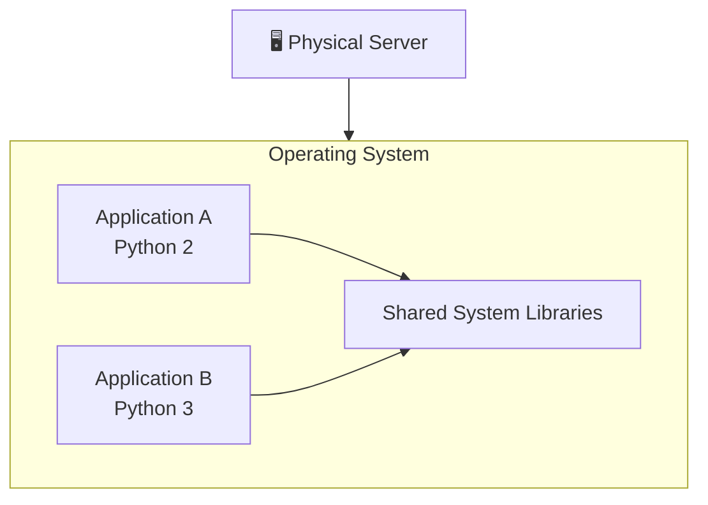

### Why is this a problem?

| Problem | Explanation |
|----------|-------------|
| ❌ Dependency conflicts | One application may require Python 2 while another requires Python 3. Since both use the same operating system, their dependencies can conflict. |
| ❌ No isolation | If one application crashes or consumes all CPU or memory, other applications on the same server are affected. |
| ❌ Difficult deployments | Recreating another server requires manually installing every package, dependency, and configuration again. |
| ❌ Slow scaling | Adding another server means provisioning an entire operating system before deploying the application. |

---

## Virtual Machines (The First Solution)

To solve these issues, virtualization introduced **Virtual Machines (VMs).**

A **hypervisor** creates multiple virtual computers on one physical server.

Each VM contains:

- Its own **Guest Operating System**
- Its own kernel
- Its own libraries
- Its own application

This provides strong isolation because each application runs inside its own operating system.

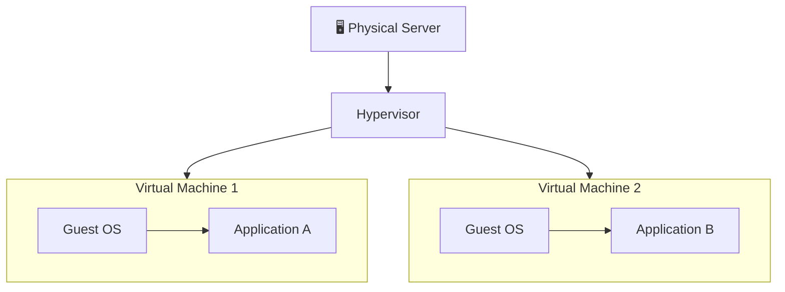

### Advantages of Virtual Machines

| Advantage | Explanation |
|-----------|-------------|
| ✅ Isolation | Each VM has its own operating system, so applications cannot interfere with each other. |
| ✅ Different operating systems | One VM can run Ubuntu while another runs Windows or Fedora on the same physical server. |
| ✅ Better security | Problems inside one VM usually do not affect other VMs. |
| ✅ Easy snapshots | Entire virtual machines can be backed up, restored, or cloned. |

### Limitations of Virtual Machines

| Limitation | Explanation |
|------------|-------------|
| ❌ Heavy | Every VM includes a complete operating system, consuming significant disk space and RAM. |
| ❌ Slow startup | Booting a VM is similar to starting a physical computer and can take several minutes. |
| ❌ Resource overhead | Running multiple kernels wastes CPU and memory resources. |
| ❌ Lower density | A server can host fewer VMs compared to containers because each VM carries an entire OS. |

Each VM ships with a **full guest operating system** — its own kernel, its own drivers, its own everything.

**Why VMs are heavy:**
- Each VM can be gigabytes in size (a full OS image).
- Booting a VM means booting an entire OS — often 30+ seconds.
- Running 10 VMs means running 10 full kernels — huge RAM/CPU overhead.

This is real isolation, but it's expensive. You're not just isolating an *application*, you're duplicating an *entire computer*.
---

## Containers (The Docker Solution)

Virtual Machines solved isolation, but they introduced another problem: **every VM contains a complete operating system**, making them heavy and slow to start.

Docker takes a different approach.

Instead of virtualizing the hardware, Docker **virtualizes the operating system**.

All containers share the **Host Operating System's kernel**, while each container keeps its own isolated:

- Filesystem
- Processes
- Network
- Environment variables
- Installed libraries

This makes containers lightweight, fast, and portable.

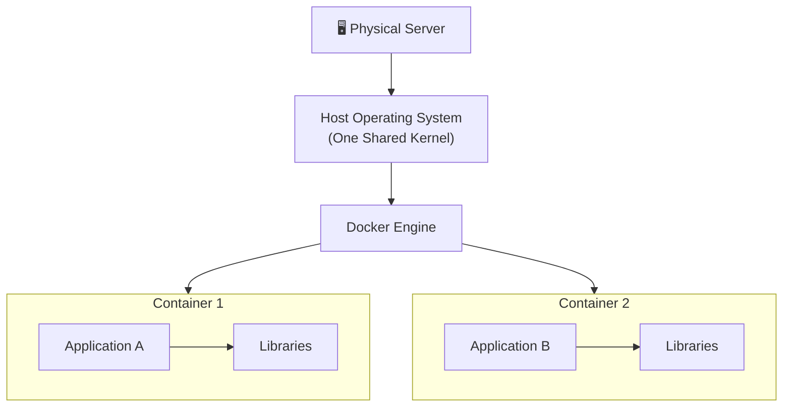

### Why Are Containers So Fast?

Unlike Virtual Machines, containers **do not boot a separate operating system**.

Instead, they **share the host operating system's kernel** while keeping their own isolated user space (application, libraries, binaries, and configuration).

This eliminates the overhead of running a complete Guest OS for every application.

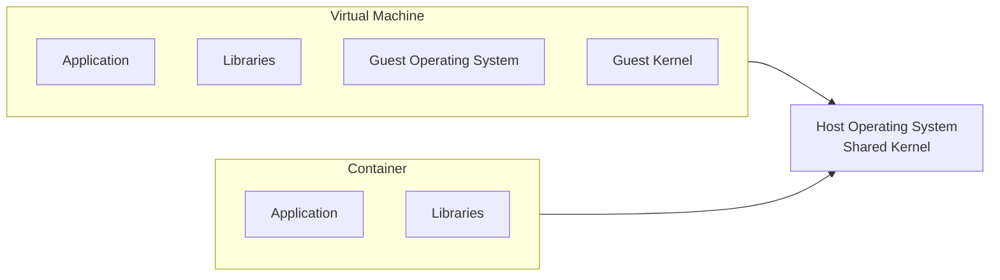

### Why Does This Make Containers Faster?

Since containers reuse the host's kernel:

- 🚀 They start in **seconds (often milliseconds)** because there is no operating system to boot.
- 💾 They consume much less RAM since multiple containers share the same kernel.
- 📦 Hundreds of containers can run on a single machine, whereas far fewer Virtual Machines fit on the same hardware.
- ⚡ Images are smaller, making them faster to build, download, and deploy.
- 🔄 Scaling applications is much quicker because creating a new container is simply starting another isolated process.

> 💡 **Key idea:** A container is essentially an **isolated process** running on the host's operating system, while a Virtual Machine is an **entire computer** with its own operating system and kernel.

## Advantages of Containers

| Advantage | Explanation |
|-----------|-------------|
| ✅ Lightweight | Containers package only the application and its dependencies, not an entire operating system. |
| ✅ Fast startup | Most containers start in a few seconds or less because there is no OS boot process. |
| ✅ Portable | A container behaves the same on any machine running Docker. |
| ✅ Efficient | Sharing the host kernel allows many more containers than virtual machines on the same hardware. |
| ✅ Isolated | Each container has its own filesystem, processes, networking, and environment. |
| ✅ Easy deployment | Applications can be packaged once and run consistently across development, testing, and production environments. |

---

## Containers vs Virtual Machines

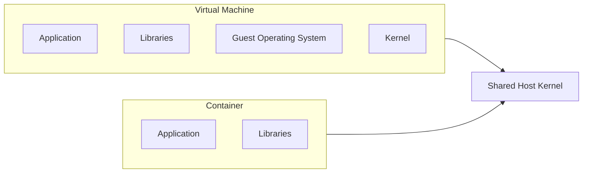

| Virtual Machine | Container |
|-----------------|-----------|
| Includes a full Guest OS | Shares the Host OS kernel |
| Large (GBs) | Small (MBs) |
| Boots in minutes | Starts in seconds or milliseconds |
| High memory usage | Low memory usage |
| Strong isolation | Lightweight isolation |
| Lower density | High container density |

> **Key idea:** A container is **not a tiny virtual machine**. It is an isolated process running on the **same operating system kernel** as the host.

> **Tip**
> Think of a VM as building a **whole new house** for every tenant. A container is more like an **apartment building**: one foundation (the kernel), but every apartment (container) has its own locked door, its own furniture, and can't see into the neighbor's apartment.

### What Actually Makes a Container "Isolated"?

Docker containers achieve isolation using two Linux kernel features (this is the "what happens internally" layer):

1. **Namespaces** — give a process its own isolated *view* of the system:
   - `PID` namespace → its own process ID tree (a container's "PID 1" is not the host's PID 1)
   - `NET` namespace → its own network interfaces, IP address, routing table
   - `MNT` namespace → its own filesystem mount points
   - `UTS` namespace → its own hostname
   - `IPC` namespace → its own inter-process communication resources
   - `USER` namespace → its own user/group ID mapping

2. **Control Groups (cgroups)** — limit and account for *how much* of a resource (CPU, RAM, disk I/O) a process can use, preventing one container from starving the others.

So a container isn't magic — it's just a **regular Linux process** that the kernel has convinced, via namespaces, that it's alone on the machine, and whose resource consumption cgroups keep in check.

# 1.2 Images vs Containers

One of the biggest beginner mistakes is confusing **Images** and **Containers**.

Think of it this way:

> **An Image is a blueprint. A Container is a running application created from that blueprint.**

A Docker **Image** is a read-only package containing everything an application needs to run:

- Application code
- Runtime (Python, Node.js, Java, etc.)
- Libraries
- Dependencies
- Configuration
- Startup command

An Image **cannot run by itself**.

When Docker starts an Image, it creates a **Container**.

A **Container** is simply a running (or stopped) instance of an Image.

---

## How Docker Creates a Container

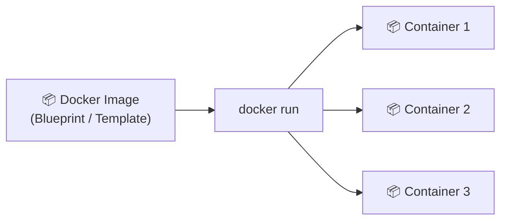

A single Image can create **many Containers**.

Each container has its own:

- Processes
- Files
- Network
- Writable storage

Even though they all share the same Image.

---

## Object-Oriented Programming Analogy

If you know C++, Java, or Python, Docker Images are very similar to **classes**, while Containers are like **objects**.

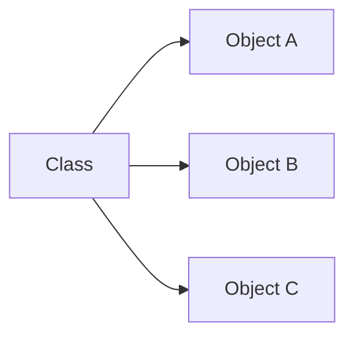

Docker works exactly the same way.

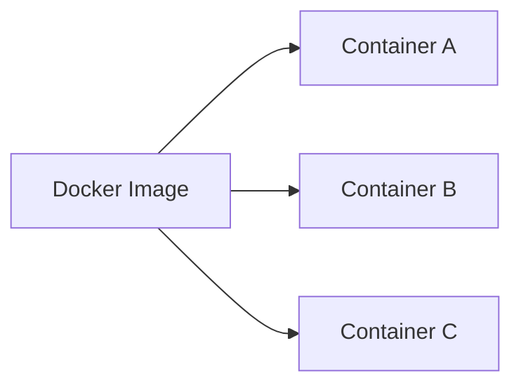

---

## Image vs Container

| Docker Image | Docker Container |
|---------------|------------------|
| 📦 Blueprint | 🚀 Running instance |
| Read-only | Writable |
| Cannot execute processes | Executes processes |
| Stored on disk | Exists in memory while running |
| Can create many containers | Created from one image |
| Built using a Dockerfile | Started using `docker run` |

---

# 1.3 Docker Image Layers

A Docker Image is **not one huge file**.

Instead, it is built from multiple **read-only layers** stacked on top of each other.

Each Dockerfile instruction usually creates a new layer.

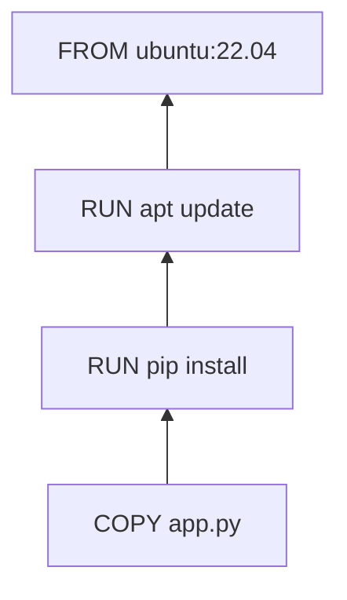

You can imagine the image like a stack of transparent sheets.

Each layer only stores **what changed** compared to the layer below it.

---

## Example

Consider this Dockerfile:

```dockerfile
FROM ubuntu:22.04
RUN apt update
RUN pip install flask
COPY app.py /app/
```

Docker builds it layer by layer:

| Layer | Dockerfile Instruction | Purpose |
|--------|------------------------|----------|
| Layer 4 | `COPY app.py` | Copies your application |
| Layer 3 | `RUN pip install flask` | Installs Python packages |
| Layer 2 | `RUN apt update` | Updates Ubuntu packages |
| Layer 1 | `FROM ubuntu:22.04` | Base operating system |

---

## Why Layers Matter

### 🚀 Faster Builds (Cache)

Suppose you only modify `app.py`.

Docker notices that the first three layers haven't changed.

Instead of rebuilding everything, it only rebuilds the last layer.

```text
Layer 1 ✅ Reused
Layer 2 ✅ Reused
Layer 3 ✅ Reused
Layer 4 🔄 Rebuilt
```

This is called **Docker Build Cache**.

---

### 💾 Disk Space Saving

Imagine you have ten Python projects.

Every project starts with:

```dockerfile
FROM ubuntu:22.04
```

Docker stores the Ubuntu layer **only once**.

```
Ubuntu Layer
      │
 ┌────┼────┐
 │    │    │
Img1 Img2 Img3
```

Every image shares the same base layer.

---

### ⚡ Faster Downloads

When pulling an updated image:

```bash
docker pull myapp:latest
```

Docker downloads **only the layers you don't already have**.

Existing layers are reused.

This makes image downloads much faster.

---

# Running a Container

When Docker starts a container, it **does not modify the Image**.

Instead, Docker adds one extra **writable layer** on top of the read-only image.

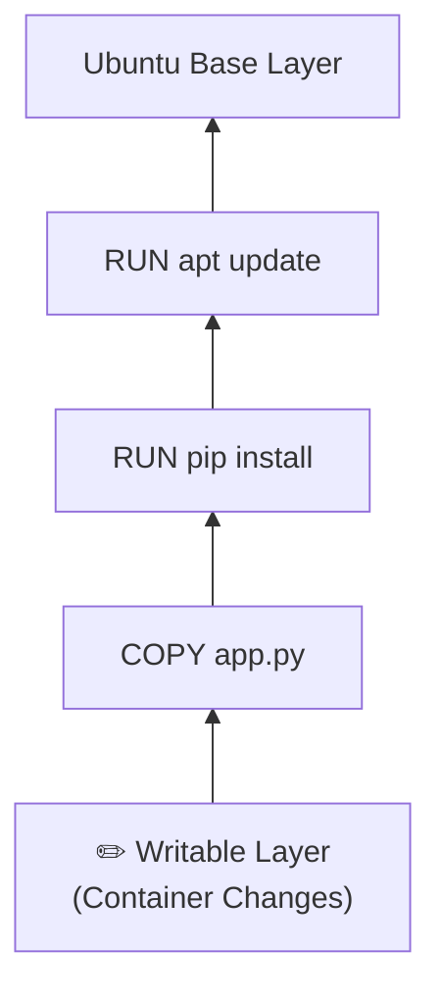

Any runtime changes happen only inside this writable layer.

For example:

- Creating files
- Editing configuration
- Installing packages inside the running container
- Deleting files

The original Image **never changes**.

If the container is removed, its writable layer is also removed (unless data is stored in a Docker Volume, which we'll explore later).

> **Key idea:** A Docker Image is a stack of **read-only layers**. A running Container is **that same Image plus one writable layer** where all runtime changes occur.

## 1.4 Docker Engine, CLI, and Docker Hub

- **Docker Engine** — the background service (daemon, called `dockerd`) that does the actual work: building images, running containers, managing networks and volumes. It exposes an API.
- **Docker CLI** (`docker`) — the command-line tool you type commands into. It doesn't do the work itself — it sends API requests to the Docker Engine (daemon), which does.
- **Docker Hub** — a public registry (like GitHub, but for images) where prebuilt images (e.g., `nginx`, `mysql`, `python`) are stored and can be pulled down.

# 1.5 Docker Architecture

Docker follows a **client-server architecture**.

When you type a Docker command, it does **not** create containers directly.

Instead, the command travels through several components, each responsible for a specific task.

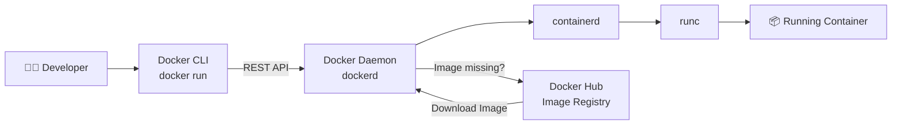

---

# Main Components

## 👨‍💻 Docker CLI

The **Docker CLI (Command Line Interface)** is the program you interact with every day.

Examples:

```bash
docker run nginx
docker ps
docker images
docker build .
docker stop my_container
```

The CLI **does not create containers**.

Its only job is to send your request to the Docker Daemon.

---

## ⚙️ Docker Daemon (`dockerd`)

The **Docker Daemon** is the brain of Docker.

It runs continuously in the background as a system service.

Responsibilities include:

- Building images
- Pulling images
- Creating containers
- Starting containers
- Stopping containers
- Managing networks
- Managing volumes
- Managing images

The CLI communicates with the daemon using the **Docker REST API**.

On Linux, this communication usually happens through the Unix socket:

```text
/var/run/docker.sock
```

---

## 📦 containerd

The Docker Daemon does not create containers by itself.

Instead, it delegates container management to **containerd**.

`containerd` is responsible for:

- Managing container lifecycle
- Managing images
- Managing snapshots
- Managing storage
- Managing container execution

Think of it as Docker's container manager.

---

## 🚀 runc

`runc` is the low-level runtime that actually starts the container.

Its responsibilities include:

- Creating Linux namespaces
- Configuring cgroups
- Mounting filesystems
- Starting the application process

This is where the container truly comes to life.

---

## ☁️ Docker Hub

Docker Hub is the default **image registry**.

If the requested image doesn't exist locally, Docker automatically downloads it.

Example:

```bash
docker run nginx
```

Docker first checks:

```
Is nginx already on this machine?
```

If not:

```
Download nginx from Docker Hub
```

After the image is downloaded, Docker creates the container.

---

# What Happens When You Run `docker run nginx`?

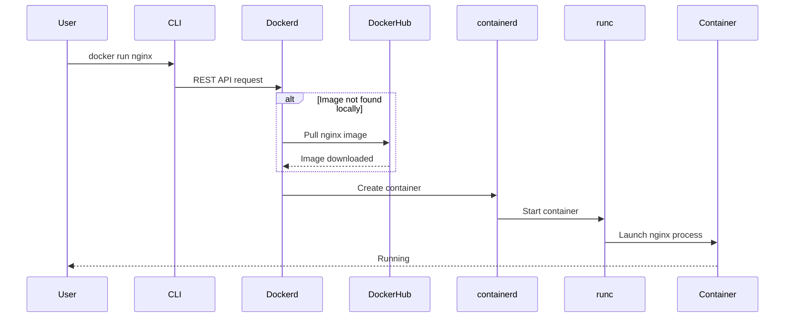

---

# Request Flow

```text
You
 │
 ▼
docker run nginx
 │
 ▼
Docker CLI
 │
 ▼
Docker Daemon (dockerd)
 │
 ├── Pull image if needed
 │
 ▼
containerd
 │
 ▼
runc
 │
 ▼
Running Container
```

---

# Summary

| Component | Responsibility |
|-----------|----------------|
| 👨‍💻 Docker CLI | Accepts Docker commands from the user |
| ⚙️ Docker Daemon (`dockerd`) | The central engine that manages Docker resources |
| 📦 containerd | Manages the container lifecycle and execution |
| 🚀 runc | Creates Linux namespaces, cgroups, and starts the container process |
| ☁️ Docker Hub | Stores and distributes Docker images |

> **Key idea:** When you type `docker run`, the Docker CLI doesn't create the container. It sends a request to the **Docker Daemon**, which coordinates everything—pulling the image if necessary, asking **containerd** to manage the container, and finally using **runc** to create the isolated Linux process that becomes your running container.

## Chapter Summary

- Docker solves the "works on my machine" problem by packaging an app with everything it needs.
- VMs virtualize hardware (heavy); containers virtualize the OS process space (lightweight), sharing the host kernel via namespaces and cgroups.
- An **image** is a read-only blueprint; a **container** is a running instance of it.
- Images are built from stacked, cacheable, shareable **layers**.
- The **Docker CLI** talks to the **Docker daemon**, which uses `containerd`/`runc` to actually run containers, and can pull images from **Docker Hub**.

## Quiz — Part 1

1. What is the main problem Docker was created to solve?
2. Name the two Linux kernel features that make container isolation possible.
3. What's the difference between an image and a container?
4. Why are Docker images built in layers instead of as one single file?
5. What is the role of `containerd` and `runc`?

## Practice Exercise — Part 1

Without running any commands yet, sketch (on paper or in a text file) a diagram of what happens, step by step, from the moment you type `docker run nginx` to the moment the Nginx container is running. Try to include: CLI, daemon, image cache/registry, containerd, runc.

---

# Part 2 — Docker Commands

> Every command below: **why it exists → syntax → key options → what happens internally → examples → common mistakes.**

## 2.1 `docker pull`

**Why it exists:** to download an image from a registry (Docker Hub by default) to your local machine, without running it.

```bash
docker pull <image>[:tag]
```

**Internally:** the daemon contacts the registry, resolves the tag to a manifest (a list of layer digests), and downloads any layers not already cached locally, verifying checksums.

```bash
docker pull nginx:1.25
docker pull ubuntu:22.04
```

> **Warning**
> If you omit the tag (`docker pull nginx`), Docker assumes `:latest`. `latest` is just a tag name, not necessarily "the newest version" — it's whatever the maintainer tagged as latest. Never rely on `latest` in production.

## 2.2 `docker run`

**Why it exists:** the core command — creates **and starts** a container from an image (pulling the image first if not present locally).

```bash
docker run [OPTIONS] IMAGE [COMMAND] [ARG...]
```

**Key options:**

| Option | Meaning |
|---|---|
| `-d` | detached mode — run in background |
| `-it` | interactive + allocate a TTY (for shells) |
| `--name` | give the container a custom name |
| `-p host:container` | publish/map a port |
| `-v` | mount a volume or bind mount |
| `-e KEY=VALUE` | set an environment variable |
| `--rm` | auto-remove the container when it stops |
| `--network` | attach to a specific network |

**Internally:** `docker run` = `docker create` + `docker start`. It pulls the image if missing, creates a new writable layer, sets up namespaces/cgroups, and executes the container's entrypoint process.

```bash
docker run -d --name my_nginx -p 8080:80 nginx
docker run -it ubuntu bash
docker run --rm -e APP_ENV=dev myapp
```

**Common mistakes:**
- Forgetting `-d`, then wondering why the terminal is "frozen" (it's attached to the container's output).
- Forgetting `-p`, then wondering why `localhost:8080` doesn't work — nothing was mapped.
- Running `docker run` repeatedly for the "same" container — each call creates a brand-new container, not restarts an existing one.

## 2.3 `docker build`

**Why it exists:** to create an image from a `Dockerfile` (a recipe).

```bash
docker build -t <name>:<tag> <context_path>
```

```bash
docker build -t myapp:1.0 .
```

**Internally:** the daemon reads the Dockerfile instruction by instruction, executing each in a temporary container, committing the result as a new layer, and caching each layer's digest. The `.` at the end is the **build context** — the set of files sent to the daemon that `COPY`/`ADD` can reference.

> **Warning**
> A huge, common beginner mistake: running `docker build .` inside a directory containing `node_modules` or huge unrelated files — the entire context gets sent to the daemon, making builds painfully slow. Use a `.dockerignore` file.

## 2.4 `docker ps`

**Why it exists:** to list containers.

```bash
docker ps          # running containers only
docker ps -a       # all containers, including stopped
```

## 2.5 `docker stop` / `docker start` / `docker restart`

- `docker stop <container>` — sends `SIGTERM`, waits (default 10s), then `SIGKILL` if still running. Graceful shutdown.
- `docker start <container>` — starts an existing, stopped container (keeps its config/writable layer).
- `docker restart <container>` — stop + start in one command.

> **Note**
> `docker stop` ≠ `docker rm`. A stopped container still exists on disk (with its writable layer) until removed.

## 2.6 `docker rm`

**Why it exists:** permanently deletes a stopped container (and its writable layer's data).

```bash
docker rm <container>
docker rm -f <container>   # force: stop then remove
```

## 2.7 `docker images`

Lists locally stored images.

```bash
docker images
docker rmi <image>   # remove an image
```

## 2.8 `docker logs`

**Why it exists:** shows the stdout/stderr of a container's main process — essential for debugging.

```bash
docker logs <container>
docker logs -f <container>     # follow (like tail -f)
docker logs --tail 100 <container>
```

## 2.9 `docker exec`

**Why it exists:** run an additional command *inside an already-running* container — great for debugging without stopping the app.

```bash
docker exec -it <container> bash
docker exec <container> ls /app
```

> **Note**
> `docker exec` starts a *new* process inside the existing container's namespaces — it does not restart the container's main process.

## 2.10 `docker inspect`

**Why it exists:** returns detailed low-level JSON metadata about a container/image/network/volume — IP address, mounts, env vars, config, everything.

```bash
docker inspect <container>
docker inspect -f '{{.NetworkSettings.IPAddress}}' <container>
```

## Chapter Summary

- `pull`/`build` get images; `run` creates+starts a container from one.
- `ps`/`logs`/`inspect`/`exec` are your primary tools for observing and debugging running containers.
- `stop`/`start`/`restart`/`rm` manage a container's lifecycle — stopping ≠ deleting.

## Quiz — Part 2

1. What's the difference between `docker stop` and `docker rm`?
2. Why might `docker run` unexpectedly create a *new* container instead of reusing one?
3. What does `-p 8080:80` actually do?
4. Why should you use `.dockerignore` before running `docker build`?
5. What's the difference between `docker exec` and the process started by `docker run`?

## Practice Exercise — Part 2

Pull the `nginx` image, run it detached on port 8080, check it's running with `ps`, view its logs, `exec` into it to inspect `/etc/nginx`, then stop and remove it — all via CLI.

---

# Part 3 — Dockerfile

A `Dockerfile` is a **text recipe**: a sequence of instructions Docker executes, in order, to produce an image, one layer per instruction (roughly).

## 3.1 `FROM`

Sets the **base image** everything else builds on. Must (almost always) be the first instruction.

```dockerfile
FROM debian:bookworm-slim
```

> **Tip**
> Prefer `-slim` or `alpine` variants for smaller images, unless you specifically need the full OS toolset.

## 3.2 `RUN`

Executes a command **at build time**, and commits the resulting filesystem changes as a new layer.

```dockerfile
RUN apt-get update && apt-get install -y nginx
```

> **Warning**
> A very common mistake: splitting `apt-get update` and `apt-get install` into two separate `RUN` lines. Docker caches each layer independently — if a later rebuild reuses the cached "update" layer without re-running it, you can get stale package lists. Always chain them in one `RUN`.

## 3.3 `COPY` vs `ADD`

Both copy files from the build context into the image.

| | `COPY` | `ADD` |
|---|---|---|
| Copies local files | ✅ | ✅ |
| Auto-extracts tar archives | ❌ | ✅ |
| Can fetch remote URLs | ❌ | ✅ |
| Recommended default | ✅ | Only for special cases |

```dockerfile
COPY ./src /app/src
```

> **Tip**
> Prefer `COPY` unless you specifically need `ADD`'s auto-extraction — `ADD`'s "magic" behavior has surprised many developers.

## 3.4 `CMD` vs `ENTRYPOINT`

This is one of the most confused pairs in Docker.

- **`ENTRYPOINT`** — defines the **fixed, main executable** of the container. Hard to override.
- **`CMD`** — defines **default arguments** (or a default command if no `ENTRYPOINT` is set). Easily overridden by whatever you pass after `docker run <image> <here>`.

```dockerfile
ENTRYPOINT ["nginx"]
CMD ["-g", "daemon off;"]
```

Running `docker run myimage -v` effectively becomes `nginx -v` (CMD gets replaced, ENTRYPOINT stays).

| Scenario | Use |
|---|---|
| Container should always run one program, optionally with different args | `ENTRYPOINT` + `CMD` (default args) |
| Container should run different arbitrary commands each time | `CMD` alone |

## 3.5 `WORKDIR`

Sets the working directory for subsequent instructions (like `cd`, but persistent and creates the dir if missing).

```dockerfile
WORKDIR /app
```

## 3.6 `ENV` and `ARG`

- **`ENV`** — sets an environment variable available at **build time AND runtime**, visible inside the running container.
- **`ARG`** — sets a variable available **only during build**, not present in the final running container.

```dockerfile
ARG VERSION=1.0
ENV APP_ENV=production
```

> **Warning**
> Never put secrets in `ENV` — they end up baked into the image and visible via `docker inspect`. Use build secrets or runtime env vars injected at `docker run`/Compose time instead.

## 3.7 `USER`

Switches the user that subsequent instructions (and the final container process) run as.

```dockerfile
USER appuser
```

> **Note**
> By default, containers run as `root`. This is a common security beginner mistake — always drop to a non-root user when possible.

## 3.8 `EXPOSE`

**Documents** which port the container listens on. It does **not** actually publish the port — that's what `-p` at `docker run` does. Purely informational/metadata (though tools like Compose can use it).

```dockerfile
EXPOSE 80
```

## 3.9 `VOLUME`

Declares a mount point that should be treated as persistent storage, telling Docker "don't store this in the writable layer." Covered fully in Part 4.

```dockerfile
VOLUME /var/lib/mysql
```

## 3.10 Build Cache and Layers, Revisited

Docker caches each instruction's result. On rebuild, it walks the Dockerfile top to bottom; the **first instruction whose input changed** invalidates the cache for it *and every instruction after it*.

```dockerfile
FROM node:20            # cached
COPY package.json .     # cached (if package.json unchanged)
RUN npm install          # cached (fast rebuild!)
COPY . .                 # changes almost every time
```

> **Tip**
> Order your Dockerfile from **least frequently changing** to **most frequently changing**. Copying `package.json` and installing dependencies *before* copying the rest of your source code means code changes don't force a full reinstall.

## Chapter Summary

- A Dockerfile is a build recipe; each instruction typically creates a new layer.
- `FROM` sets the base; `RUN` executes build-time commands; `COPY` brings in files.
- `CMD` = overridable default args; `ENTRYPOINT` = fixed main process.
- `ENV` persists into the container; `ARG` is build-time only.
- `USER` improves security; `EXPOSE` is documentation, not publishing.
- Instruction order affects cache efficiency — put stable steps first.

## Quiz — Part 3

1. Why is chaining `apt-get update && apt-get install` in one `RUN` important?
2. What's the practical difference between `CMD` and `ENTRYPOINT`?
3. Does `EXPOSE 80` in a Dockerfile actually open port 80 to your host machine?
4. Why shouldn't you store a secret password using `ENV`?
5. Why does instruction order in a Dockerfile matter for build speed?

## Practice Exercise — Part 3

Write a Dockerfile for a simple Python Flask app: base image `python:3.12-slim`, `WORKDIR /app`, copy `requirements.txt` first and `pip install`, then copy the rest of the source, `EXPOSE 5000`, run as non-root user, `ENTRYPOINT ["python"]` + `CMD ["app.py"]`.

---

# Part 4 — Storage

# 4.1 The Writable Layer

Docker Images are **read-only**.

When you start a container, Docker **does not modify the Image**.

Instead, Docker creates a new **writable layer** on top of the Image where all runtime changes are stored.

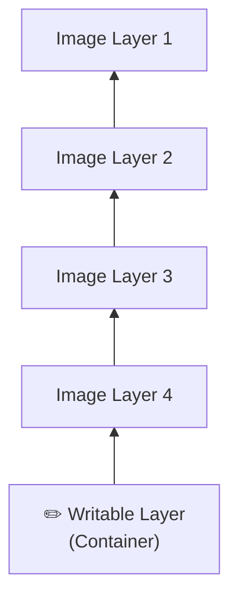

Everything that happens while the container is running is stored in this writable layer.

For example:

- Creating new files
- Editing configuration files
- Installing packages
- Writing logs
- Saving uploaded files
- Database writes

The original Image **never changes**.

---

# How It Works

Imagine you start an Ubuntu container.

```bash
docker run -it ubuntu bash
```

Inside the container, you create a file:

```bash
echo "Hello Docker" > hello.txt
```

Where is `hello.txt` stored?

```text
Image Layers ❌
Writable Layer ✅
```

The Image remains unchanged.

Only this specific container can see the file.

---

# What Happens When the Container Is Removed?

Suppose you stop and remove the container:

```bash
docker stop my_container
docker rm my_container
```

The writable layer is deleted.

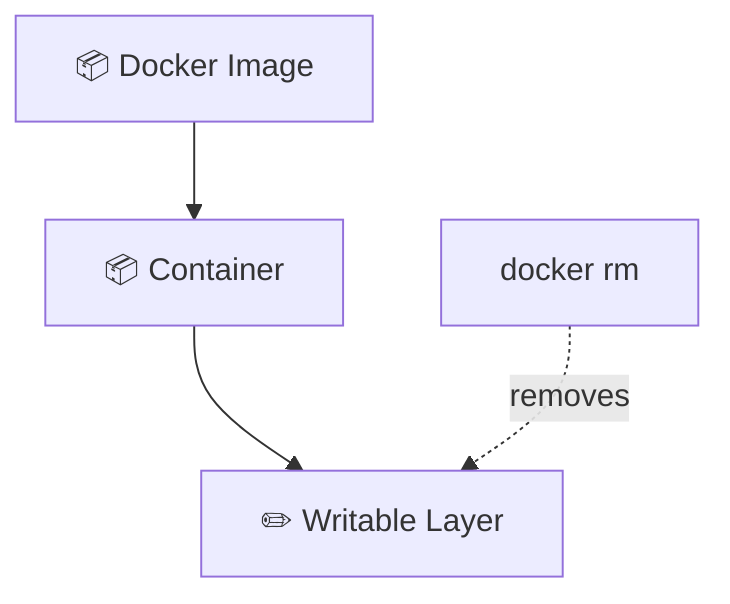

Everything stored there disappears:

- ❌ Created files
- ❌ Installed software
- ❌ Logs
- ❌ Database data
- ❌ Uploaded files

The Image is still available because it was never modified.

---

# Why Is It Called "Ephemeral"?

The writable layer is **ephemeral**, meaning it is **temporary**.

It exists **only for the lifetime of the container**.

```
Create Container
        │
        ▼
Writable Layer Created
        │
        ▼
Application Runs
        │
        ▼
Container Removed
        │
        ▼
Writable Layer Deleted
```

---

# A Common Beginner Mistake

Imagine running a MySQL container:

```bash
docker run mysql
```

The database starts normally.

You create:

- Customers
- Orders
- Products

Everything works perfectly.

Then later you remove the container:

```bash
docker rm mysql
```

You start a new one:

```bash
docker run mysql
```

The database is empty.

Why?

Because all of the database files were stored inside the **container's writable layer**, and removing the container also removed that layer.

---

# The Solution: Docker Volumes

Docker Volumes store data **outside the container's writable layer**.

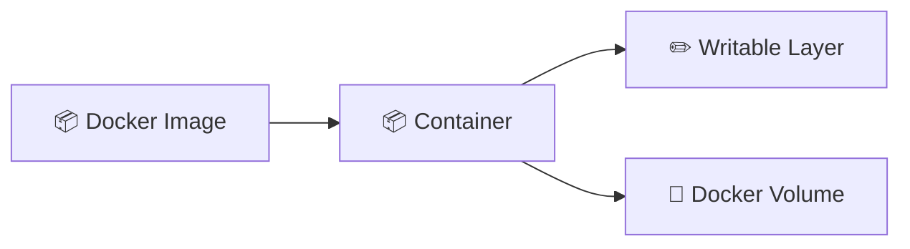

Now:

- Remove the container ✅
- Create another container from the same Image ✅
- Attach the same Volume ✅
- Your data is still there ✅

This is why databases such as:

- MySQL
- PostgreSQL
- MariaDB
- MongoDB
- Redis

almost always use **Docker Volumes**.

---

> 💡 **Key idea:** A Docker Image is **read-only**. Every running Container gets its own **writable layer**, which is temporary and deleted when the container is removed. To keep important data after a container is deleted, store it in a **Docker Volume**, not in the writable layer.

## 4.2 Volumes

**Named volumes** are storage areas managed entirely by Docker, living outside any container's writable layer, in a location Docker controls on the host (on Linux, typically `/var/lib/docker/volumes/<name>/_data`).

```bash
docker volume create mydata
docker run -v mydata:/var/lib/mysql mysql
```

Because the volume exists independently of any single container, you can delete and recreate the container while the data in the volume survives.

## 4.3 Bind Mounts

A **bind mount** maps a specific path on your **host machine** directly into the container.

```bash
docker run -v /home/user/project:/app myimage
```

| | Named Volume | Bind Mount |
|---|---|---|
| Managed by | Docker | You (arbitrary host path) |
| Location | Docker's storage area | Anywhere on host you choose |
| Portability | High (works the same across hosts) | Low (depends on host path existing) |
| Common use | Databases, persistent app data | Local development (live code editing) |

# 4.4 Anonymous Volumes

An **Anonymous Volume** is a Docker Volume that **does not have a human-readable name**.

Instead, Docker automatically generates a random name for it.

For example:

```bash
docker run -v /data myimage
```

Notice that only the **container path** is specified:

```text
/data
```

Since no volume name is provided, Docker creates one automatically.


Internally, Docker creates something similar to:

```text
8d5c2f9b7e5d5a...
```

instead of a friendly name like:

```text
mysql_data
```

---

## What Happens Behind the Scenes?

When you run:

```bash
docker run -v /data myimage
```

Docker actually does something similar to:

```text
Create Volume
      │
      ▼
8d5c2f9b7e5d...
      │
      ▼
Mount it inside:
/data
```

The application doesn't know or care what the volume is called.

It simply reads and writes files inside `/data`.

---

## Why Does Docker Create Anonymous Volumes?

Some Docker Images include a `VOLUME` instruction in their Dockerfile.

Example:

```dockerfile
VOLUME /var/lib/mysql
```

When you start a container **without providing your own volume**, Docker automatically creates an anonymous volume for that directory.

This protects important data from being stored in the container's writable layer.

---

## The Problem with Anonymous Volumes

Because Docker generates random names, they are difficult to recognize later.

Imagine running the same container several times:

```bash
docker run myimage
docker run myimage
docker run myimage
```

Docker may create several anonymous volumes:

```
8d5c2f9b...
c17a91f3...
91ab82d4...
```

After deleting the containers, these volumes may remain on your system.

Over time they consume disk space.

---

## Cleaning Up

List all volumes:

```bash
docker volume ls
```

Remove unused anonymous volumes:

```bash
docker volume prune
```

⚠️ This removes **all unused volumes**, so be careful if they contain important data.

---

## Named vs Anonymous Volumes

| Named Volume | Anonymous Volume |
|--------------|------------------|
| Has a readable name | Docker generates a random name |
| Easy to reuse | Difficult to identify later |
| Easy to share between containers | Usually tied to one container |
| Best for databases and persistent data | Mostly created automatically by Docker Images |

> 💡 **Recommendation:** In your own projects, prefer **Named Volumes**. They are easier to manage, easier to reuse, and much more readable than anonymous volumes.

---

# 4.5 Data Persistence — Where Files Actually Live

Many beginners think Docker Volumes are stored **inside the container**.

They are not.

A Docker Volume lives **on the host machine**.

The container simply mounts it into its filesystem.

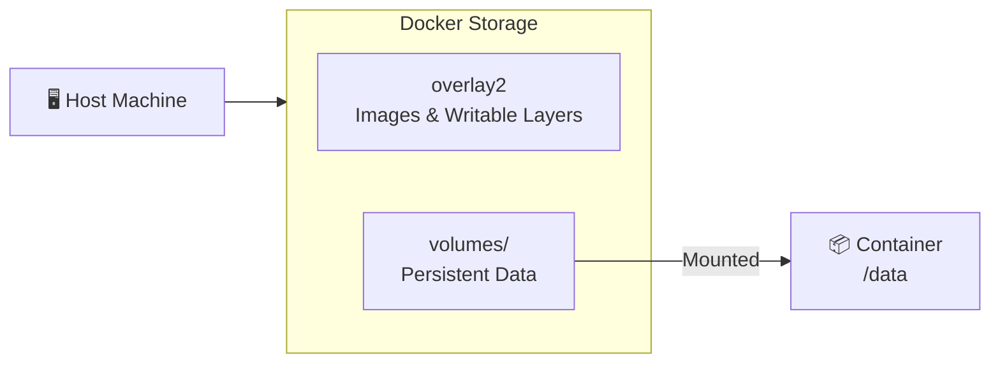

---

## Docker Storage Layout (Linux)

By default, Docker stores its data under:

```text
/var/lib/docker/
```

A simplified structure looks like this:

```text
/var/lib/docker/
├── overlay2/
│   ├── Image Layers
│   └── Container Writable Layers
│
└── volumes/
    ├── mysql_data/
    │   └── _data/
    │
    └── postgres_data/
        └── _data/
```

### What Does Each Folder Contain?

| Directory | Purpose |
|-----------|----------|
| `overlay2/` | Stores Docker Images and container writable layers. |
| `volumes/` | Stores Docker Volumes that persist even after containers are removed. |

---

## How a Volume Is Mounted

Suppose you run:

```bash
docker run -v mysql_data:/var/lib/mysql mysql
```

Docker performs the following mapping:

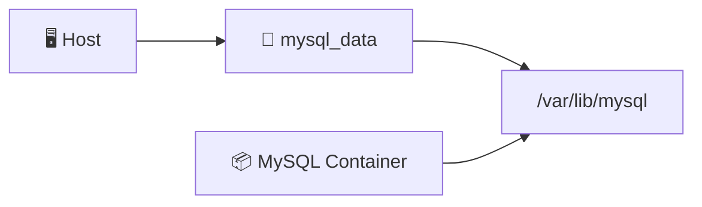

Internally, Docker mounts something similar to:

```text
/var/lib/docker/volumes/mysql_data/_data
```

into

```text
/var/lib/mysql
```

inside the container.

The MySQL process simply writes to `/var/lib/mysql`.

It doesn't know those files are actually stored on the host machine.

---

## Why This Matters

When you remove the container:

```bash
docker rm mysql
```

the container disappears.

The volume remains.

```
Container ❌ Deleted

Volume ✅ Still Exists
```

Create a new MySQL container using the same volume:

```bash
docker run -v mysql_data:/var/lib/mysql mysql
```

Your database is still there because the files were stored in the Docker Volume, **not in the container's writable layer**.

> 💡 **Key idea:** A Docker Volume is **host storage managed by Docker**. Containers only mount the volume into their filesystem. This separation allows data to survive even when containers are deleted.

## Chapter Summary

- Every container has an ephemeral **writable layer**, destroyed with the container.
- **Named volumes** are Docker-managed, persistent, and portable — best for databases/app state.
- **Bind mounts** link a host path directly in — best for local dev with live-reloading code.
- **Anonymous volumes** are unnamed and easy to lose track of.
- Volume data lives on the host at `/var/lib/docker/volumes/...` (Linux), independent of any single container's lifecycle.

## Quiz — Part 4

1. Why does data disappear when you `docker rm` a container without a volume?
2. What's the key difference between a named volume and a bind mount?
3. Where does Docker physically store named volume data on a Linux host?
4. Why are anonymous volumes risky to rely on?
5. Which storage type would you use for local development where you want to edit code on your host and see changes instantly in the container?

## Practice Exercise — Part 4

Create a named volume, run a container that writes a file to it, remove the container, then run a *new* container mounting the same volume and confirm the file still exists.

---

# Part 5 — Docker Networking

# 5.1 Docker Network Drivers

By default, every Docker container runs in its own isolated network environment.

Docker uses **network drivers** to determine **how containers communicate** with:

- Other containers
- The host machine
- The Internet

Different applications require different networking behavior, which is why Docker provides multiple network drivers.

---

## Docker Network Drivers

| Driver | Description | Typical Use |
|---------|-------------|-------------|
| `bridge` | Default private network for containers on a single host | General applications |
| `host` | Container shares the host's network stack | High-performance networking |
| `none` | Completely disables networking | Security, testing, isolated workloads |
| Custom `bridge` | User-created bridge network with automatic DNS | Multi-container applications (recommended) |

---

# 1. Bridge Network (Default)

When Docker is installed, it automatically creates a **bridge** network.

Every container connected to this network receives:

- Its own private IP address
- Internet access through NAT
- Network isolation from the host

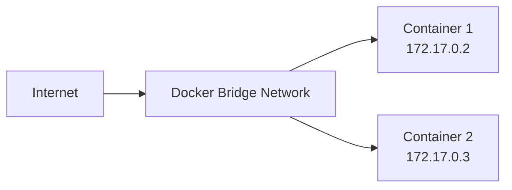

Example:

```bash
docker run nginx
```

The container is automatically attached to the default bridge network.

---

## Limitation of the Default Bridge

Containers can communicate using **IP addresses**.

```text
172.17.0.2
172.17.0.3
```

However, Docker **does not automatically resolve container names** on the default bridge.

If a container is recreated, its IP may change.

This makes applications difficult to maintain.

---

# 2. Host Network

With the `host` driver, Docker **does not create a separate network namespace**.

Instead, the container uses the host's networking directly.


Example:

```bash
docker run --network host nginx
```

Characteristics:

- No virtual bridge
- No container IP
- No NAT
- No port mapping (`-p`) required

Advantages:

- Maximum network performance
- Lower latency

Disadvantages:

- No network isolation
- Containers can conflict by using the same ports

---

# 3. None Network

Sometimes an application should have **no network access at all**.

Docker provides the `none` driver for this purpose.

```mermaid
flowchart LR

Container["📦 Container"]

Internet["🌍 Internet"]

Container -. No Connection .-> Internet
```

Example:

```bash
docker run --network none ubuntu
```

The container has:

- ❌ No Internet
- ❌ No Ethernet interface
- ❌ No communication with other containers

Useful for:

- Security testing
- Offline processing
- Highly isolated workloads

---

# 4. Custom Bridge Network (Recommended)

A **Custom Bridge Network** is similar to the default bridge, but with an important improvement:

✅ **Automatic DNS resolution between containers.**

Create one:

```bash
docker network create app_net
```

Run containers:

```bash
docker run --network app_net --name web nginx
docker run --network app_net --name db mysql
```

Now Docker automatically creates DNS records.

```mermaid
flowchart LR

subgraph AppNet["Custom Bridge Network"]

Web["📦 web"]

DB["📦 db"]

end

Web <-->|DNS| DB
```

Inside the `web` container you can simply use:

```text
db
```

instead of

```text
172.18.0.3
```

This makes applications much easier to build and maintain.

---

# Default Bridge vs Custom Bridge

```mermaid
flowchart LR

subgraph Default["Default Bridge"]

A1["Container A"]
A2["Container B"]

A1 -->|"172.17.0.3"| A2

end

subgraph Custom["Custom Bridge"]

B1["web"]
B2["db"]

B1 -->|"db"| B2

end
```

| Default Bridge | Custom Bridge |
|----------------|---------------|
| Uses IP addresses | Uses container names |
| No automatic DNS | Automatic DNS |
| Harder to maintain | Easy to maintain |
| Suitable for simple tests | Recommended for real applications |

---

# Why Docker DNS Matters

Imagine your web application connects to MySQL.

Without Docker DNS:

```text
mysql_host = 172.18.0.4
```

If the database container is recreated:

```text
172.18.0.7
```

Your application stops working.

With a custom bridge network:

```text
mysql_host = db
```

The IP can change, but Docker automatically updates the DNS entry.

Your application continues working without any configuration changes.

---

# Best Practice

For multi-container applications (such as Docker Compose or the **42 Inception** project), always create a **custom bridge network**.

Benefits:

- ✅ Automatic DNS
- ✅ Easier communication
- ✅ No hardcoded IP addresses
- ✅ Better isolation between projects
- ✅ Easier scaling and maintenance

> 💡 **Key idea:** A **custom bridge network** is the recommended choice for most Docker applications because it provides private networking **and built-in DNS**, allowing containers to communicate using names like `db` or `wordpress` instead of fragile IP addresses.

## 5.2 `localhost` Inside vs Outside a Container

A container has its **own network namespace** — `localhost` *inside* a container refers to the container itself, not your host machine, and not other containers. This trips up nearly everyone at first.

```
Host:      localhost = your laptop
Container: localhost = only that container's own processes
```

If Container A wants to reach Container B, it must use B's **container name** (on a custom network, thanks to Docker's built-in DNS) or its container IP — never `localhost`.

## 5.3 Port Mapping: `EXPOSE` vs `-p`

- `EXPOSE` (Dockerfile) — **documentation only**. Declares intent; doesn't open anything to the outside world.
- `-p host_port:container_port` (`docker run`) — **actually publishes** the port, creating a NAT/proxy rule so traffic hitting the host's port gets forwarded into the container's network namespace.

```bash
docker run -p 8080:80 nginx
```

```
Your Browser → localhost:8080 (HOST) ──NAT──► container:80 (nginx listening)
```

> **Warning**
> `EXPOSE 80` in a Dockerfile with **no** `-p` at runtime means the container's port 80 is reachable from *other containers on the same network*, but **not** from your host browser at all.

## 5.4 Container-to-Container Communication

On a custom bridge network, Docker runs an internal DNS server. Any container can resolve another container's **name** (or Compose service name) to its current internal IP automatically — even after restarts change the IP.

```bash
docker network create app_net
docker run -d --name db --network app_net mariadb
docker run -d --name web --network app_net myapp
# inside "web", connecting to "db:3306" just works
```

## Chapter Summary

- `bridge` is Docker's default isolated virtual network; `host` removes isolation; `none` disables networking.
- Custom bridge networks add automatic **DNS by container name** — essential for multi-container apps.
- `localhost` inside a container is *not* your host, and *not* other containers.
- `EXPOSE` documents a port; `-p` actually publishes it to the host.
- Containers on the same custom network reach each other by **name**, not IP.

## Quiz — Part 5

1. Why does relying on `localhost` to reach another container fail?
2. What's the practical benefit of a custom bridge network over the default one?
3. Does `EXPOSE 3306` alone let you connect from your host machine's browser?
4. If container `web` wants to reach container `db` on network `app_net`, what hostname should it use?
5. When would you use the `host` network driver, and what's the tradeoff?

## Practice Exercise — Part 5

Create a custom bridge network, run two containers on it (e.g., an `alpine` container and an `nginx` container), and from inside the alpine container, `ping` the nginx container **by name** to prove Docker's internal DNS works.

---

# Part 6 — Docker Compose

## 6.1 Why Compose Exists

Once you have more than one container that needs to work together (web server + database + cache…), manually running multiple `docker run` commands with matching networks, volumes, and env vars becomes unmanageable and unrepeatable.

**Docker Compose** lets you describe your **entire multi-container application** — services, networks, volumes, configuration — in a single declarative YAML file, and bring it all up (or down) with one command.

```bash
docker compose up -d
docker compose down
```

## 6.2 Anatomy of `docker-compose.yml`

```yaml
services:
  web:
    build: ./web
    ports:
      - "8080:80"
    environment:
      - APP_ENV=production
    depends_on:
      - db
    networks:
      - app_net

  db:
    image: mariadb:11
    volumes:
      - db_data:/var/lib/mysql
    environment:
      - MYSQL_ROOT_PASSWORD=changeme
    networks:
      - app_net

networks:
  app_net:

volumes:
  db_data:
```

### `build` vs `image`

| | `build:` | `image:` |
|---|---|---|
| Source | Builds from a local Dockerfile | Pulls a prebuilt image from a registry |
| Use case | Your own custom app code | Off-the-shelf software (databases, proxies) |

### `depends_on`

Controls **start order** — `db` starts before `web`. Important nuance: by default, `depends_on` only waits for the container to *start*, not for the application inside it to be *ready* (e.g., MariaDB accepting connections). That's what `healthcheck` is for.

### `restart`

Defines what happens if a container crashes or the host reboots.

```yaml
restart: always        # always restart
restart: on-failure    # only restart on non-zero exit
restart: unless-stopped
```

### `healthcheck`

Lets Docker actually verify a service is *functionally* ready, not just "started."

```yaml
healthcheck:
  test: ["CMD", "mysqladmin", "ping", "-h", "localhost"]
  interval: 5s
  timeout: 3s
  retries: 5
```

Combined with `depends_on`:

```yaml
depends_on:
  db:
    condition: service_healthy
```

Now `web` truly waits until `db` is not just started, but **healthy**.

## 6.3 Progressive Examples

**Example 1 — single service:**

```yaml
services:
  web:
    image: nginx
    ports:
      - "8080:80"
```

**Example 2 — two services with a shared network and env vars:**

```yaml
services:
  app:
    build: .
    environment:
      - DB_HOST=db
    depends_on:
      - db
  db:
    image: postgres:16
    environment:
      - POSTGRES_PASSWORD=secret
```

**Example 3 — full stack with named volumes, healthcheck, and restart policy:**

```yaml
services:
  nginx:
    build: ./nginx
    ports:
      - "443:443"
    depends_on:
      wordpress:
        condition: service_started
    restart: unless-stopped
    networks:
      - inception

  wordpress:
    build: ./wordpress
    depends_on:
      mariadb:
        condition: service_healthy
    restart: unless-stopped
    volumes:
      - wp_data:/var/www/html
    networks:
      - inception

  mariadb:
    build: ./mariadb
    healthcheck:
      test: ["CMD", "mysqladmin", "ping", "-h", "localhost"]
      interval: 5s
      retries: 5
    restart: unless-stopped
    volumes:
      - db_data:/var/lib/mysql
    networks:
      - inception

networks:
  inception:

volumes:
  wp_data:
  db_data:
```

## Chapter Summary

- Compose describes a multi-container app declaratively in `docker-compose.yml` and manages it as one unit.
- `build` creates images from your own Dockerfiles; `image` pulls prebuilt ones.
- `depends_on` controls start *order*; `healthcheck` + `condition: service_healthy` ensures true *readiness*.
- `restart` policies define crash/reboot recovery behavior.
- Named `networks:` and `volumes:` at the top level are declared once and referenced by services.

## Quiz — Part 6

1. What problem does Compose solve that plain `docker run` doesn't?
2. Why isn't `depends_on` alone enough to guarantee a database is ready for connections?
3. What's the difference between `build:` and `image:` in a Compose service?
4. What does `restart: unless-stopped` mean in practice?
5. In the Compose file, where are volumes and networks *declared*, and where are they *used*?

## Practice Exercise — Part 6

Write a `docker-compose.yml` with two services: a custom-built Python API (`build: ./api`) and a Redis cache (`image: redis:7-alpine`), on a shared custom network, with the API waiting for Redis via a `healthcheck`.

---

# Part 7 — 42 Inception: Concepts & Architecture

## 7.1 Why This Project Exists

**Inception** is a 42 School project whose real goal isn't "make a WordPress site" — it's to force you to deeply understand **system administration through containerization**: building every image yourself from a minimal base (no pulling prebuilt `wordpress` or `nginx` images), configuring services to talk to each other securely, and managing persistent data — all orchestrated with Docker Compose.

**What it teaches:**
- Writing Dockerfiles from scratch (not relying on official images)
- Multi-service orchestration with Compose
- Reverse proxying and TLS termination
- Process management inside containers (PHP-FPM)
- Database administration in a containerized context
- The principle of **least exposure**: only the service that *needs* to be public, is public

# 7.2 Overall Architecture

The **Inception** project follows a classic three-tier web architecture:

- **Nginx** receives HTTPS requests from the browser.
- **PHP-FPM** executes the WordPress PHP application.
- **MariaDB** stores the website's data.
- **Docker Volumes** persist WordPress files and database data.

Only **Nginx** is exposed to the outside world.

All other services communicate **privately** through Docker's internal network.

---

## Architecture Overview

```mermaid
flowchart LR

User["👤 User"]

Browser["🌐 Browser"]

User --> Browser

Browser -->|"HTTPS :443"| Nginx

subgraph Docker["🐳 Docker Network (inception_network)"]

Nginx["Nginx<br/>Reverse Proxy + TLS"]

PHP["PHP-FPM<br/>WordPress Runtime"]

DB["MariaDB"]

WPVolume[("💾 wp_data")]
DBVolume[("💾 db_data")]

Nginx -->|"FastCGI :9000"| PHP

PHP -->|"SQL :3306"| DB

PHP --- WPVolume
DB --- DBVolume

end
```

---

# Request Flow

When a user visits your website, the request follows this path:

```mermaid
sequenceDiagram

participant User
participant Browser
participant Nginx
participant PHP
participant MariaDB

User->>Browser: Visit https://example.com

Browser->>Nginx: HTTPS Request (443)

Nginx->>PHP: FastCGI Request (9000)

PHP->>MariaDB: SQL Query (3306)

MariaDB-->>PHP: Database Result

PHP-->>Nginx: Generated HTML

Nginx-->>Browser: HTTPS Response

Browser-->>User: Display Web Page
```

---

# Component Responsibilities

| Component | Responsibility |
|-----------|----------------|
| 🌐 Browser | Sends HTTPS requests and displays the website. |
| 🔒 Nginx | Terminates TLS, accepts external traffic, and forwards PHP requests to PHP-FPM. |
| 🐘 PHP-FPM | Executes WordPress PHP code and generates dynamic pages. |
| 🗄️ MariaDB | Stores users, posts, comments, settings, and other WordPress data. |
| 💾 `wp_data` | Persists WordPress files (`/var/www/html`). |
| 💾 `db_data` | Persists MariaDB database files (`/var/lib/mysql`). |

---

# Why Is Only Nginx Exposed?

The Docker Compose configuration publishes only:

```text
443 → Nginx
```

Everything else remains private.

```mermaid
flowchart LR

Internet["🌍 Internet"]

Nginx["Nginx :443"]

PHP["PHP-FPM :9000"]

DB["MariaDB :3306"]

Internet --> Nginx

Nginx --> PHP

PHP --> DB

Internet -. Blocked .-> PHP
Internet -. Blocked .-> DB
```

This improves security because:

- ✅ Users cannot access MariaDB directly.
- ✅ PHP-FPM is hidden from the Internet.
- ✅ Nginx acts as the single entry point to the application.
- ✅ TLS certificates are managed in one place.

---

# Data Flow

WordPress uses two different kinds of storage:

```mermaid
flowchart LR

PHP["PHP-FPM"]

WP["💾 wp_data"]

DB["MariaDB"]

MDB["💾 db_data"]

PHP --> WP

PHP --> DB

DB --> MDB
```

- **`wp_data`** stores WordPress files such as themes, plugins, uploads, and media.
- **`db_data`** stores all database content, including users, posts, comments, and configuration.

These Docker Volumes allow data to persist even if the containers are deleted and recreated.

> 💡 **Key idea:** The Inception architecture follows a secure, layered design. **Nginx** is the only public-facing service, **PHP-FPM** processes WordPress requests, **MariaDB** stores application data, and **Docker Volumes** ensure that website files and database contents survive container recreation.

## 7.3 Service-by-Service Breakdown

### Nginx

| | |
|---|---|
| **What** | A reverse proxy / web server, terminating TLS |
| **Why it exists** | Single, secure, public entry point for all HTTP(S) traffic |
| **Problem it solves** | Without it, you'd need PHP-FPM (not designed for direct internet exposure) to handle raw HTTPS traffic itself |
| **Port** | `443` (HTTPS) exposed to host; `80` typically disabled/redirected |
| **Files it needs** | `nginx.conf`, TLS certificate + private key |
| **Talks to** | Forwards PHP requests to `wordpress:9000` via the FastCGI protocol |

### WordPress + PHP-FPM

| | |
|---|---|
| **What** | WordPress is the CMS application (PHP code); PHP-FPM ("FastCGI Process Manager") is the process manager that actually *executes* that PHP code |
| **Why it exists** | Nginx doesn't execute PHP itself — it needs a PHP interpreter process to hand `.php` requests to |
| **Problem it solves** | Efficient, pooled handling of PHP execution requests, separate from the web server |
| **Port** | `9000` (FastCGI) — **not published to the host**, only reachable from Nginx over the internal network |
| **Files it needs** | WordPress source files, `wp-config.php`, `www.conf` (PHP-FPM pool config) |
| **Talks to** | MariaDB, over TCP `3306`, using credentials from environment variables |

### MariaDB

| | |
|---|---|
| **What** | A relational database (MySQL-compatible) storing all WordPress content: posts, users, settings |
| **Why it exists** | WordPress needs persistent structured storage |
| **Port** | `3306` — **never published to the host or the internet** |
| **Files it needs** | Init SQL/setup script, data directory (volume-backed) |
| **Talks to** | Only PHP-FPM connects to it — nothing else needs to |

## 7.4 Why Each Design Decision Matters

**Why is MariaDB private?**
It holds all your sensitive data (user credentials, content). If it were exposed to the internet, anyone could attempt to brute-force or directly query your database. It should only ever be reachable by the one service that legitimately needs it: PHP-FPM/WordPress.

**Why doesn't PHP-FPM expose a port to the host?**
PHP-FPM speaks the FastCGI protocol, not raw HTTP — it isn't designed to safely parse untrusted internet traffic. It should only ever receive requests forwarded by Nginx, which has already handled TLS and basic HTTP hygiene.

**Why is Nginx public?**
It's specifically designed and hardened to handle raw internet traffic, TLS termination, and act as the single controlled gateway. Concentrating your "attack surface" into one well-understood component is a core security principle.

**Why are volumes required?**
Without them, all WordPress files and all database data live only in each container's ephemeral writable layer — destroyed the moment the container is removed (see Part 4). Volumes make your website's content and database **survive container recreation, rebuilds, and restarts**.

**Why is a custom network required?**
So that Nginx, WordPress, and MariaDB can find each other by **service name** (Docker's internal DNS) rather than hardcoded, restart-fragile IP addresses — and so they're isolated from other unrelated Docker networks on the same host.

## 7.5 HTTPS Inside Inception

Nginx terminates TLS: it holds the certificate and private key, decrypts incoming HTTPS traffic, and forwards the *decrypted* request internally (over FastCGI to PHP-FPM) within the trusted Docker network. This is called **TLS termination at the edge** — a very common real-world pattern, because managing certificates in one place is far simpler than in every internal service.

```
Browser  ══HTTPS (encrypted)══►  Nginx  ──FastCGI (plain, internal)──►  PHP-FPM
```

42's subject typically requires TLS 1.2 or 1.3 only (older protocols disabled) using a self-signed certificate for the `login.42.fr`-style domain.

## 7.6 The Complete Request Flow

```mermaid
sequenceDiagram
    participant B as Browser
    participant N as Nginx
    participant P as PHP-FPM (WordPress)
    participant M as MariaDB

    B->>N: HTTPS GET / (encrypted, port 443)
    N->>N: TLS handshake & decrypt
    N->>P: FastCGI request (port 9000, internal)
    P->>P: PHP interpreter loads WordPress core
    P->>M: SQL query (port 3306, internal)
    M-->>P: Query results (post data, settings...)
    P-->>N: Rendered HTML (FastCGI response)
    N-->>B: HTTPS response (encrypted)
```

**Step by step:**
1. The browser initiates an HTTPS request to your domain, hitting the host's port `443`, which Docker forwards to the Nginx container.
2. Nginx performs the TLS handshake, decrypting the request.
3. Nginx recognizes it's a request for a `.php` resource and forwards it over the FastCGI protocol to PHP-FPM on the internal network (`wordpress:9000`).
4. PHP-FPM spins up (or reuses a pooled) PHP process to execute WordPress's PHP code.
5. WordPress's code determines it needs data (post content, options, etc.) and queries MariaDB over TCP `3306`.
6. MariaDB returns the query results.
7. WordPress finishes rendering the page as HTML and hands it back to PHP-FPM, which returns it to Nginx via FastCGI.
8. Nginx encrypts the response and sends it back to the browser over HTTPS.

## Chapter Summary

- Inception forces you to build every image from scratch and orchestrate them securely with Compose.
- Only Nginx is public; PHP-FPM and MariaDB are internal-only — a **least exposure** design.
- Volumes persist WordPress files and database data beyond any single container's life.
- Nginx handles TLS termination, then forwards plaintext internally within the trusted Docker network.
- Request flow: Browser → Nginx (TLS) → PHP-FPM (FastCGI) → MariaDB (SQL) → back up the chain.

## Quiz — Part 7

1. Why shouldn't MariaDB's port ever be published to the host?
2. What protocol does Nginx use to talk to PHP-FPM, and why isn't it plain HTTP?
3. Why is TLS terminated at Nginx instead of at PHP-FPM or MariaDB?
4. What would happen to your WordPress site's data if you removed the `wordpress` and `mariadb` containers without volumes?
5. Walk through, in your own words, the full request path from browser to database and back.

## Practice Exercise — Part 7

Draw (on paper or in a diagram tool) the full Inception architecture from memory, labeling every port, every volume, and every network connection, without looking back at this document. Then compare against the diagrams above.

---

# Part 8 — Building the Project

# 8.1 Project Folder Structure

The **Inception** project follows a modular structure.

Each service (Nginx, WordPress, MariaDB, etc.) is isolated in its own directory, containing everything needed to build and configure its Docker image.

```mermaid
flowchart TB

Root["📁 inception/"]

Make["📄 Makefile"]
Env["📄 .env"]

Srcs["📁 srcs/"]

Compose["📄 docker-compose.yml"]

Req["📁 requirements/"]

Nginx["📁 nginx/"]
WP["📁 wordpress/"]
DB["📁 mariadb/"]

Root --> Make
Root --> Env
Root --> Srcs

Srcs --> Compose
Srcs --> Req

Req --> Nginx
Req --> WP
Req --> DB
```

---

## Directory Tree

```text
inception/
├── Makefile
├── .env
└── srcs/
    ├── docker-compose.yml
    └── requirements/
        ├── nginx/
        │   ├── Dockerfile
        │   ├── conf/
        │   │   └── nginx.conf
        │   └── tools/
        │       └── setup.sh
        │
        ├── wordpress/
        │   ├── Dockerfile
        │   ├── conf/
        │   │   └── www.conf
        │   └── tools/
        │       └── setup.sh
        │
        └── mariadb/
            ├── Dockerfile
            ├── conf/
            │   └── my.cnf
            └── tools/
                └── setup.sh
```

---

# What Does Each File Do?

| Path | Purpose |
|------|----------|
| `Makefile` | Simplifies project commands such as building, starting, stopping, and cleaning Docker resources. |
| `.env` | Stores environment variables (database credentials, domain name, usernames, passwords, etc.). |
| `srcs/docker-compose.yml` | Defines every service, network, volume, dependency, and container configuration. |
| `requirements/` | Contains everything required to build each Docker image. |

---

# Structure of Each Service

Every service follows the same organization.

```mermaid
flowchart TB

Service["📁 Service"]

Dockerfile["📄 Dockerfile"]

Conf["📁 conf"]

Tools["📁 tools"]

Config["Configuration Files"]

Script["setup.sh"]

Service --> Dockerfile
Service --> Conf
Service --> Tools

Conf --> Config
Tools --> Script
```

Each service contains three main components:

| Item | Purpose |
|------|----------|
| `Dockerfile` | Defines how Docker builds the image. |
| `conf/` | Stores configuration files specific to the service. |
| `tools/` | Contains shell scripts executed during container startup. |

---

# Example: Nginx

```text
nginx/
├── Dockerfile
├── conf/
│   └── nginx.conf
└── tools/
    └── setup.sh
```

### Dockerfile

Responsible for:

- Selecting the base image
- Installing packages
- Copying configuration files
- Copying startup scripts
- Defining the startup command

---

### conf/

Contains configuration files used by the application.

Example:

```text
nginx.conf
```

This file controls things such as:

- Listening port
- SSL configuration
- Reverse proxy settings
- Static file handling
- PHP forwarding

---

### tools/

Contains executable shell scripts.

Example:

```text
setup.sh
```

Typical responsibilities include:

- Creating directories
- Setting file permissions
- Generating SSL certificates
- Starting services
- Performing initialization tasks

---

# Why Separate `conf/` and `tools/`?

Instead of placing everything in the Dockerfile, responsibilities are separated.

```mermaid
flowchart LR

Dockerfile -->|"Copies"| Config["conf/"]
Dockerfile -->|"Copies"| Script["tools/setup.sh"]

Script --> Service["Running Service"]
```

This makes the project:

- Easier to read
- Easier to maintain
- Easier to debug
- Easier to modify

For example:

- Need to change Nginx settings? → Edit `conf/nginx.conf`
- Need to change startup behavior? → Edit `tools/setup.sh`
- Need to change the image itself? → Edit the `Dockerfile`

Each file has a single responsibility.

---

# Why Does Every Service Have Its Own Dockerfile?

Docker builds **one image per service**.

For example:

```text
Nginx Image
WordPress Image
MariaDB Image
```

Each service has different:

- Software
- Packages
- Configuration
- Startup process

Keeping each service in its own directory ensures they remain **independent** and can be built, tested, and updated separately.

> 💡 **Key idea:** Inception organizes every service as a self-contained module. Each service owns its **Dockerfile**, **configuration files**, and **startup scripts**, making the project easier to understand, maintain, and scale.

## 8.2 `.env`

```bash
DOMAIN_NAME=yourlogin.42.fr

MYSQL_DATABASE=wordpress
MYSQL_USER=wp_user
MYSQL_PASSWORD=changeme
MYSQL_ROOT_PASSWORD=changeme_root

WP_ADMIN_USER=admin
WP_ADMIN_PASSWORD=changeme_admin
WP_ADMIN_EMAIL=admin@example.com
```

**Why it exists:** centralizes all configurable/sensitive values in one place, referenced by Compose via `${VARIABLE}` syntax, keeping secrets and environment-specific config out of your Dockerfiles and version-controlled code paths.

> **Warning**
> `.env` should be in `.gitignore` in any real project — never commit real credentials. (42's evaluation context has its own rules about this; follow your campus's specific requirement.)

## 8.3 `docker-compose.yml`

```yaml
services:
  nginx:
    build: ./requirements/nginx
    container_name: nginx
    ports:
      - "443:443"
    volumes:
      - wp_data:/var/www/html
    env_file: ../.env
    networks:
      - inception
    depends_on:
      - wordpress
    restart: unless-stopped

  wordpress:
    build: ./requirements/wordpress
    container_name: wordpress
    volumes:
      - wp_data:/var/www/html
    env_file: ../.env
    networks:
      - inception
    depends_on:
      mariadb:
        condition: service_healthy
    restart: unless-stopped

  mariadb:
    build: ./requirements/mariadb
    container_name: mariadb
    volumes:
      - db_data:/var/lib/mysql
    env_file: ../.env
    networks:
      - inception
    healthcheck:
      test: ["CMD", "mysqladmin", "ping", "-h", "localhost"]
      interval: 5s
      timeout: 3s
      retries: 5
    restart: unless-stopped

networks:
  inception:
    driver: bridge

volumes:
  wp_data:
    driver: local
    driver_opts:
      type: none
      device: /home/${USER}/data/wordpress
      o: bind
  db_data:
    driver: local
    driver_opts:
      type: none
      device: /home/${USER}/data/mariadb
      o: bind
```

**Explaining every line:**
- Each service uses `build:` (never a prebuilt `image:`) — this is Inception's core requirement: *you* write every Dockerfile.
- `wordpress` shares the `wp_data` volume with `nginx` so Nginx can serve WordPress's static assets directly while PHP requests go to PHP-FPM.
- `depends_on: mariadb: condition: service_healthy` ensures WordPress's setup script doesn't try to connect to a database that isn't accepting connections yet.
- The `driver_opts` bind the named volumes to specific host paths (a common 42-specific requirement, so data is inspectable directly on the host's filesystem, e.g., under your home directory).
- `restart: unless-stopped` ensures services come back up automatically after a host reboot or crash, without restarting containers you deliberately stopped.

## 8.4 Nginx: `Dockerfile`

```dockerfile
FROM debian:bookworm-slim

RUN apt-get update && apt-get install -y --no-install-recommends \
    nginx \
    openssl \
    && rm -rf /var/lib/apt/lists/*

COPY conf/nginx.conf /etc/nginx/nginx.conf
COPY tools/setup.sh /setup.sh
RUN chmod +x /setup.sh

EXPOSE 443

ENTRYPOINT ["/setup.sh"]
```

**Line by line:**
- `FROM debian:bookworm-slim` — minimal base, per Inception's requirement to avoid heavy/pre-packaged images.
- `RUN apt-get update && ... && rm -rf /var/lib/apt/lists/*` — installs Nginx and OpenSSL (for cert generation) in one layer, then cleans the apt cache to reduce image size.
- `COPY conf/nginx.conf` — your custom server block (listen 443, ssl_certificate, proxy to PHP-FPM/fastcgi_pass).
- `setup.sh` — an entrypoint script that generates a self-signed TLS certificate at container start (if not present) and then execs `nginx -g "daemon off;"` so Nginx runs as PID 1 in the foreground (required — containers exit when PID 1 exits).

**Common mistakes:**
- Forgetting `daemon off;` — Nginx forks to background by default, PID 1 exits immediately, and the container stops right after starting.
- Hardcoding the domain/cert paths instead of reading from `.env`.

## 8.5 `nginx.conf` (excerpt)

```nginx
server {
    listen 443 ssl;
    server_name yourlogin.42.fr;

    ssl_certificate     /etc/nginx/ssl/inception.crt;
    ssl_certificate_key /etc/nginx/ssl/inception.key;
    ssl_protocols       TLSv1.2 TLSv1.3;

    root /var/www/html;
    index index.php;

    location ~ \.php$ {
        fastcgi_pass wordpress:9000;
        fastcgi_index index.php;
        include fastcgi_params;
        fastcgi_param SCRIPT_FILENAME $document_root$fastcgi_script_name;
    }
}
```

`fastcgi_pass wordpress:9000` is the critical line: `wordpress` resolves via Docker's internal DNS to the PHP-FPM container, on the internal-only port `9000`.

## 8.6 WordPress/PHP-FPM: `Dockerfile`

```dockerfile
FROM debian:bookworm-slim

RUN apt-get update && apt-get install -y --no-install-recommends \
    php-fpm php-mysqli php-curl php-gd \
    mariadb-client curl \
    && rm -rf /var/lib/apt/lists/*

COPY conf/www.conf /etc/php/8.2/fpm/pool.d/www.conf
COPY tools/setup.sh /setup.sh
RUN chmod +x /setup.sh

WORKDIR /var/www/html
EXPOSE 9000

ENTRYPOINT ["/setup.sh"]
```

`setup.sh` (conceptually) downloads WordPress via `wp-cli`, waits for MariaDB, generates `wp-config.php` from the `.env` variables, creates the admin user non-interactively, and finally execs `php-fpm8.2 -F` (foreground mode — same "don't background PID 1" principle as Nginx).

## 8.7 MariaDB: `Dockerfile`

```dockerfile
FROM debian:bookworm-slim

RUN apt-get update && apt-get install -y --no-install-recommends \
    mariadb-server \
    && rm -rf /var/lib/apt/lists/*

COPY conf/my.cnf /etc/mysql/mariadb.conf.d/50-server.cnf
COPY tools/setup.sh /setup.sh
RUN chmod +x /setup.sh

EXPOSE 3306

ENTRYPOINT ["/setup.sh"]
```

`setup.sh` initializes the MariaDB data directory (only if empty — so a restart with an existing volume doesn't wipe it), starts `mysqld` temporarily to run setup SQL (create database, create user, set root password from `.env`), stops it, then execs `mysqld_safe` (or `mariadbd`) in the foreground as the final process.

> **Warning**
> A classic mistake: re-running the full `CREATE DATABASE`/`CREATE USER` init script on every container start, even when the volume already has data — causing errors or, worse, silently resetting things. Always guard init logic with a check like `if [ ! -d "/var/lib/mysql/mysql" ]; then ... fi`.

## 8.8 `Makefile`

```makefile
all: up

up:
	docker compose -f srcs/docker-compose.yml up -d --build

down:
	docker compose -f srcs/docker-compose.yml down

clean: down
	docker system prune -af

fclean: clean
	docker volume prune -f
	sudo rm -rf /home/$(USER)/data

re: fclean all

.PHONY: all up down clean fclean re
```

**Why it exists:** provides a single, memorable interface (`make`, `make down`, `make re`) instead of remembering long `docker compose` invocations — standard practice in 42 projects, and in real infra repos too.

## Chapter Summary

- Inception's structure isolates config (`.env`), orchestration (`docker-compose.yml`), and each service's build context (`requirements/<service>/`).
- Every Dockerfile builds from a minimal base and installs only what's needed, cleaning package caches.
- Every service's entrypoint script must keep its main process in the **foreground** — the container dies the moment PID 1 exits.
- Init scripts must be **idempotent** — safe to re-run against an already-initialized volume.
- The `Makefile` wraps Compose commands for a clean, repeatable developer workflow.

## Quiz — Part 8

1. Why must `nginx`, `php-fpm`, and `mysqld` all run in the **foreground** inside their containers?
2. Why is the MariaDB init script guarded with a check like `if [ ! -d ... ]`?
3. Why does `wordpress` share the `wp_data` volume with `nginx`?
4. What does `depends_on: condition: service_healthy` prevent in the WordPress service?
5. What's the purpose of the `Makefile`'s `fclean` vs `clean` targets?

## Practice Exercise — Part 8

Starting from an empty `inception/` directory, recreate the full folder structure by hand (just `mkdir`/`touch`, no content yet), matching the tree shown in 8.1, to build muscle memory for the required layout.

---

# Part 9 — Debugging

## 9.1 General Workflow

```
1. docker compose ps         → is it even running?
2. docker compose logs <svc> → what does it say?
3. docker exec -it <svc> sh  → go inspect from inside
4. docker inspect <svc>      → check config/network/mounts
5. docker network inspect    → verify connectivity setup
```

## 9.2 Debugging Containers

```bash
docker compose ps -a
docker logs --tail 50 -f wordpress
docker exec -it wordpress bash
docker inspect wordpress | less
```

**Common findings:**
- **`Exited (0)`** — the main process finished normally, but shouldn't have (likely missing `daemon off;`/foreground flag).
- **`Exited (1)` or other non-zero** — check `docker logs` immediately; it's almost always a config or startup script error printed there.
- **Restarting loop** — combined with `restart: unless-stopped`, Compose will keep retrying a crashing container; `docker logs` shows the crash reason each cycle.

## 9.3 Debugging Networks

```bash
docker network ls
docker network inspect inception
docker exec -it nginx ping wordpress
docker exec -it nginx getent hosts wordpress
```

If `ping wordpress` fails from `nginx`, either they're not on the same network, or the `wordpress` container isn't running/hasn't registered its name yet.

## 9.4 Debugging Volumes

```bash
docker volume ls
docker volume inspect wp_data
docker exec -it wordpress ls -la /var/www/html
```

If data seems to have "disappeared," check whether the container is actually mounting the volume you think it is (`docker inspect <container>` → `Mounts` section) rather than writing to its own writable layer by mistake (e.g., a typo in the volume path).

## 9.5 Debugging MariaDB

```bash
docker exec -it mariadb mysql -u root -p
docker exec -it mariadb mysqladmin ping -h localhost
docker logs mariadb
```

Common issue: WordPress can't connect → check that `MYSQL_USER`/`MYSQL_PASSWORD` in `.env` match exactly what the init script actually created, and that MariaDB is bound to `0.0.0.0` (not just `127.0.0.1`) inside its `my.cnf` so other containers can reach it.

## 9.6 Debugging Nginx

```bash
docker exec -it nginx nginx -t          # test config syntax
docker logs nginx
```

A `nginx -t` syntax error is the #1 cause of Nginx refusing to start. Also check the certificate paths actually exist inside the container (`docker exec -it nginx ls /etc/nginx/ssl`).

## 9.7 Debugging PHP-FPM

```bash
docker logs wordpress
docker exec -it wordpress php-fpm8.2 -t     # test FPM config
```

If Nginx returns a `502 Bad Gateway`, it almost always means Nginx **can't reach PHP-FPM at all** — check the network, the `fastcgi_pass` hostname/port, and that PHP-FPM is actually listening on `9000` (not `127.0.0.1:9000`, which would block external-to-container connections — it needs to listen on `0.0.0.0:9000` or a Unix socket shared via volume).

## 9.8 Debugging Compose Itself

```bash
docker compose config          # validates and prints the resolved YAML
docker compose up --build      # foreground, see all logs interleaved live
```

`docker compose config` is invaluable for catching `.env` variable substitution mistakes — it shows you the *final*, resolved YAML Compose will actually use.

## Chapter Summary

- Always start with `docker compose ps` and `logs` — most problems reveal themselves immediately there.
- `502 Bad Gateway` = Nginx can't reach PHP-FPM (network/port/config issue).
- Containers that immediately exit almost always lack a foreground-running main process.
- `docker compose config` is the fastest way to catch `.env`/variable substitution bugs.
- Volume/network issues are best diagnosed with `docker inspect` and `docker network inspect`.

## Quiz — Part 9

1. What does a `502 Bad Gateway` from Nginx almost always mean in this stack?
2. Why would a container show status `Exited (0)` right after starting, and how do you fix it?
3. Which command shows you the fully-resolved Compose configuration, with all `.env` variables substituted?
4. How do you check whether two containers can actually reach each other on the network?
5. If WordPress can't connect to MariaDB, what two `.env`-related things would you check first?

## Practice Exercise — Part 9

Deliberately break your `nginx.conf` (introduce a syntax typo), rebuild, observe the failure via `docker logs`, then use `docker exec -it nginx nginx -t` to pinpoint and fix it — practicing the full debug loop.

---

# Part 10 — Final Project

## 10.1 Final Architecture

```mermaid
graph LR
    Client["Client Browser"] -->|"443/tcp HTTPS"| N[Nginx]
    N -->|"9000/tcp FastCGI internal"| W["WordPress / PHP-FPM"]
    W -->|"3306/tcp SQL internal"| D[MariaDB]
    W === V1[("wp_data volume")]
    N === V1
    D === V2[("db_data volume")]
```

## 10.2 Deployment Checklist

- [ ] Every service builds from a minimal base image (no prebuilt `nginx`/`wordpress`/`mysql` images)
- [ ] Only Nginx publishes a port to the host (`443`)
- [ ] TLS 1.2/1.3 only, valid self-signed cert for your domain
- [ ] `wp_data` and `db_data` volumes bound to host paths and surviving `docker compose down`
- [ ] All secrets/config sourced from `.env`, never hardcoded in Dockerfiles
- [ ] All main container processes run in the **foreground**
- [ ] `healthcheck` on MariaDB; WordPress waits on `service_healthy`
- [ ] Init scripts are idempotent (safe on volume re-use)
- [ ] `Makefile` targets (`up`, `down`, `clean`, `fclean`, `re`) all work correctly
- [ ] `docker compose config` resolves cleanly with no missing variables

## 10.3 Common Errors

| Symptom | Likely Cause |
|---|---|
| Container exits immediately | Main process not running in foreground |
| `502 Bad Gateway` | Nginx can't reach PHP-FPM (network/port) |
| WordPress install loop / DB errors | Wrong DB creds in `.env`, or MariaDB not actually ready |
| Data lost after `docker compose down` | Volumes not correctly declared/mounted |
| `Connection refused` on 443 from browser | Nginx not listening, or wrong port mapping |
| Cert warnings in browser | Expected — self-signed cert; verify it's the correct domain, not an actual misconfiguration |

## 10.4 Best Practices

- Minimize image size: `-slim`/`alpine` bases, clean apt caches, multi-stage builds where relevant.
- One primary process per container.
- Keep secrets out of Dockerfiles and image layers entirely.
- Prefer named, host-bound volumes for anything you must not lose.
- Use `healthcheck` for any service another service depends on functionally, not just for "is it started."

## 10.5 Security Tips

- Never run application processes as `root` inside the container when avoidable (`USER` instruction).
- Never expose MariaDB's or PHP-FPM's ports to the host — internal network only.
- Restrict TLS to modern protocol versions (`TLSv1.2`/`TLSv1.3`).
- Keep `.env` out of version control; never bake credentials into image layers via `ENV`.
- Regularly rebuild base images to pick up upstream security patches.

## 10.6 Performance Tips

- Order Dockerfile instructions to maximize cache hits (stable steps first, volatile ones — like `COPY . .` — last).
- Use a `.dockerignore` to keep build contexts small and fast.
- Tune PHP-FPM's pool size (`pm.max_children`, etc.) to your expected load rather than defaults.
- Use named volumes (faster on Linux) over bind mounts for database storage in production.

## Final Quiz

1. Explain, end to end, why Inception's architecture only exposes one port to the outside world.
2. What is the difference between "the container started" and "the service is healthy," and which Compose feature bridges that gap?
3. Name three things that would make your Nginx container exit immediately after `docker compose up`.
4. Why must init scripts for MariaDB be idempotent, and what happens if they aren't?
5. Trace a single HTTPS request from a user's browser all the way to a database row and back, naming every port and protocol involved at each hop.

## Final Practical Exercises

1. Build the entire Inception stack from the Dockerfiles and Compose file sketched in Part 8, filling in the real init scripts and configs.
2. Intentionally remove the `wp_data` volume declaration, rebuild, add a blog post, `docker compose down && up`, and confirm the post is gone — then fix it by re-adding the volume and repeat, confirming persistence.
3. Simulate a MariaDB crash (`docker kill mariadb`) while the stack is running, and observe how `restart: unless-stopped` and the WordPress `depends_on: condition: service_healthy` behave on recovery.

## Additional Challenges

- Add a `redis` caching layer as a 4th service, with WordPress configured to use it as an object cache, on the same internal network.
- Add a `bonus` static site service, following Inception's optional bonus part, exposed through the same Nginx reverse proxy on a different path.
- Convert one Dockerfile to a multi-stage build to reduce final image size, and measure the size difference with `docker images`.
- Write a small shell script that runs `docker compose config`, `nginx -t` inside the Nginx container, and `mysqladmin ping` inside MariaDB, as an automated pre-deployment sanity check.

---

> **This README is designed to be revisited.** Work through each Part in order, don't skip the quizzes, and don't move to Part *n+1* until you can explain Part *n* to someone else from memory — including drawing its diagrams without looking.
